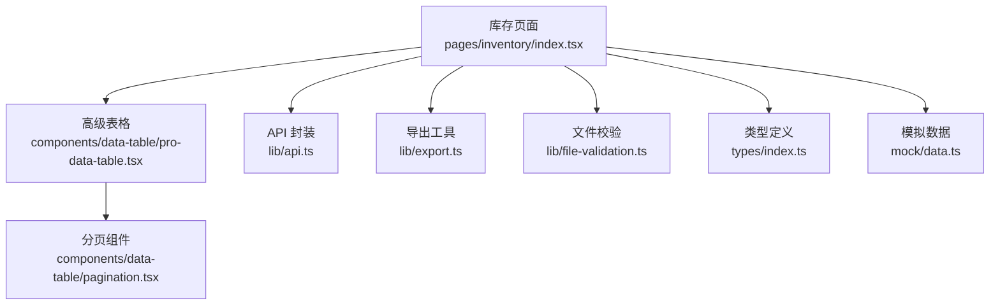
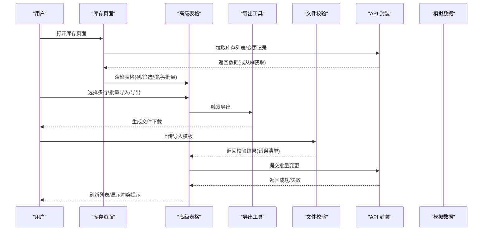
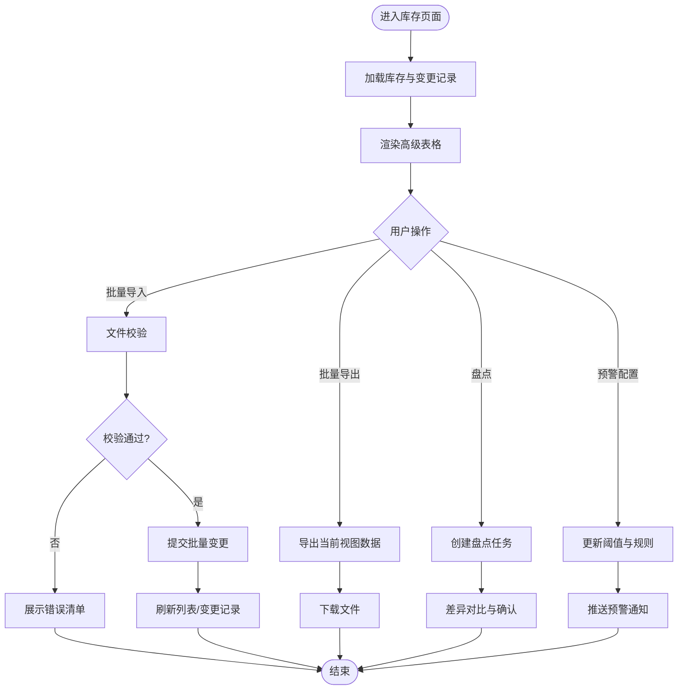
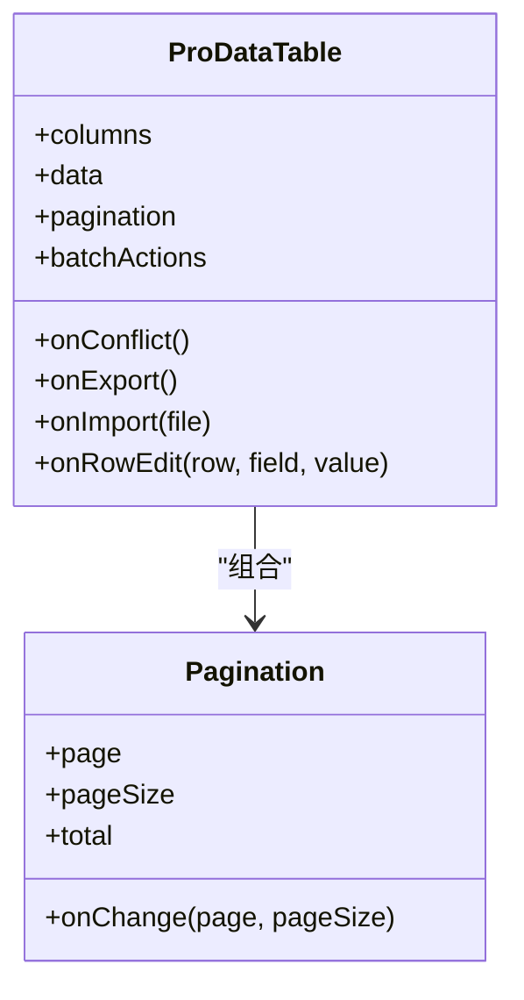
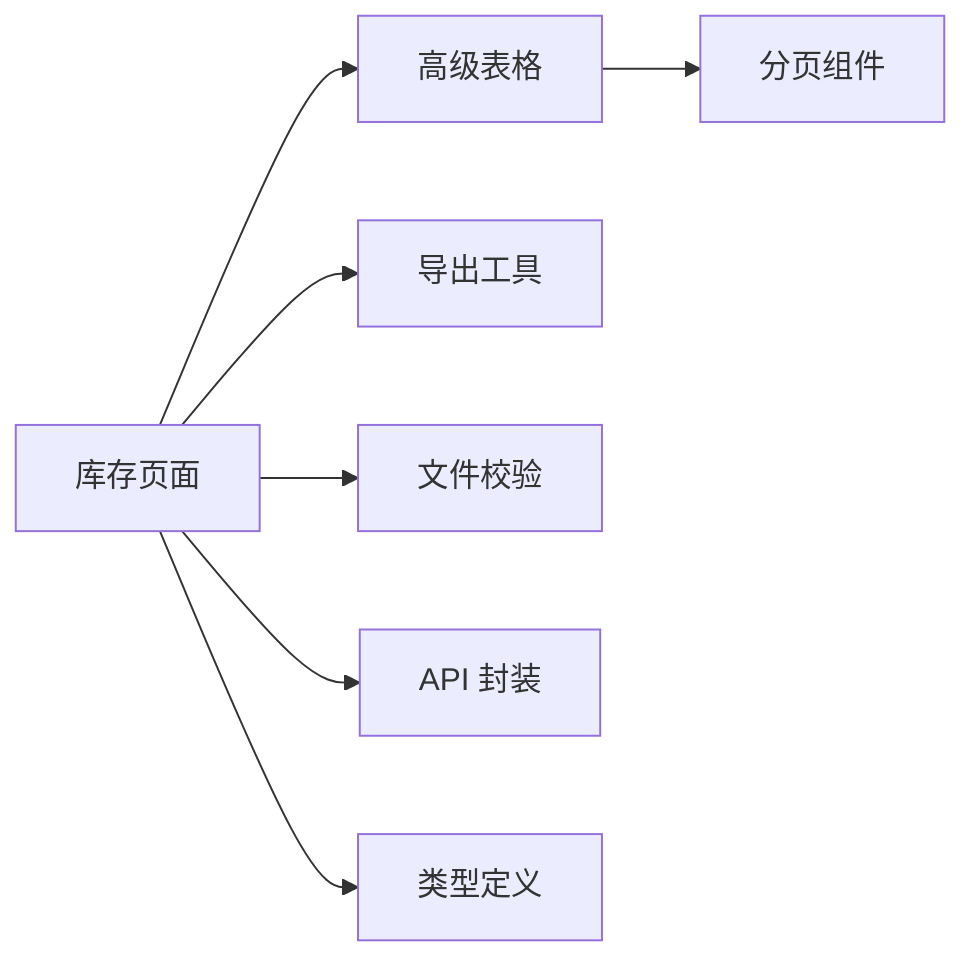

# 库存管理页面

<cite>
**本文引用的文件**   
- [web/src/pages/inventory/index.tsx](file://web/src/pages/inventory/index.tsx)
- [web/src/components/data-table/pro-data-table.tsx](file://web/src/components/data-table/pro-data-table.tsx)
- [web/src/components/data-table/pagination.tsx](file://web/src/components/data-table/pagination.tsx)
- [web/src/lib/export.ts](file://web/src/lib/export.ts)
- [web/src/lib/file-validation.ts](file://web/src/lib/file-validation.ts)
- [web/src/lib/api.ts](file://web/src/lib/api.ts)
- [web/src/types/index.ts](file://web/src/types/index.ts)
- [web/src/mock/data.ts](file://web/src/mock/data.ts)
</cite>

## 目录
1. [简介](#简介)
2. [项目结构](#项目结构)
3. [核心组件](#核心组件)
4. [架构总览](#架构总览)
5. [详细组件分析](#详细组件分析)
6. [依赖关系分析](#依赖关系分析)
7. [性能考虑](#性能考虑)
8. [故障排查指南](#故障排查指南)
9. [结论](#结论)
10. [附录](#附录)

## 简介
本文件面向“库存管理页面”的完整业务流程与实现说明，覆盖库存录入、变更跟踪、盘点管理、预警通知等核心能力；深入讲解库存表格的高级操作（批量导入导出、数据验证、冲突检测）；解释库存状态管理机制（实时库存更新、历史变更记录、版本控制）；提供预警系统配置方法（阈值设置、通知规则、自动处理）；并给出标准化操作流程与最佳实践（入库出库规范、盘点流程、异常处理）。

## 项目结构
库存管理相关的前端代码主要位于 web/src 下，关键路径如下：
- 页面入口：web/src/pages/inventory/index.tsx
- 高级数据表格：web/src/components/data-table/pro-data-table.tsx
- 分页组件：web/src/components/data-table/pagination.tsx
- 导出工具：web/src/lib/export.ts
- 文件校验：web/src/lib/file-validation.ts
- API 封装：web/src/lib/api.ts
- 类型定义：web/src/types/index.ts
- 模拟数据：web/src/mock/data.ts

图表来源
- [web/src/pages/inventory/index.tsx](file://web/src/pages/inventory/index.tsx)
- [web/src/components/data-table/pro-data-table.tsx](file://web/src/components/data-table/pro-data-table.tsx)
- [web/src/components/data-table/pagination.tsx](file://web/src/components/data-table/pagination.tsx)
- [web/src/lib/export.ts](file://web/src/lib/export.ts)
- [web/src/lib/file-validation.ts](file://web/src/lib/file-validation.ts)
- [web/src/lib/api.ts](file://web/src/lib/api.ts)
- [web/src/types/index.ts](file://web/src/types/index.ts)
- [web/src/mock/data.ts](file://web/src/mock/data.ts)

章节来源
- [web/src/pages/inventory/index.tsx](file://web/src/pages/inventory/index.tsx)
- [web/src/components/data-table/pro-data-table.tsx](file://web/src/components/data-table/pro-data-table.tsx)
- [web/src/components/data-table/pagination.tsx](file://web/src/components/data-table/pagination.tsx)
- [web/src/lib/export.ts](file://web/src/lib/export.ts)
- [web/src/lib/file-validation.ts](file://web/src/lib/file-validation.ts)
- [web/src/lib/api.ts](file://web/src/lib/api.ts)
- [web/src/types/index.ts](file://web/src/types/index.ts)
- [web/src/mock/data.ts](file://web/src/mock/data.ts)

## 核心组件
- 库存页面容器：负责聚合业务逻辑、编排表格、导入导出、盘点与预警联动。
- 高级数据表格：提供列定义、筛选、排序、批量操作、行内编辑、冲突提示等能力。
- 分页组件：承载服务端分页或客户端分页的数据加载与页码切换。
- 导出工具：将当前视图数据导出为常用格式（如 CSV/Excel）。
- 文件校验：对导入模板进行结构与字段校验，返回错误清单。
- API 封装：统一请求、重试、错误码映射与缓存策略。
- 类型定义：约束库存实体、变更记录、预警规则等数据结构。
- 模拟数据：在本地开发时提供样例库存与变更记录。

章节来源
- [web/src/pages/inventory/index.tsx](file://web/src/pages/inventory/index.tsx)
- [web/src/components/data-table/pro-data-table.tsx](file://web/src/components/data-table/pro-data-table.tsx)
- [web/src/components/data-table/pagination.tsx](file://web/src/components/data-table/pagination.tsx)
- [web/src/lib/export.ts](file://web/src/lib/export.ts)
- [web/src/lib/file-validation.ts](file://web/src/lib/file-validation.ts)
- [web/src/lib/api.ts](file://web/src/lib/api.ts)
- [web/src/types/index.ts](file://web/src/types/index.ts)
- [web/src/mock/data.ts](file://web/src/mock/data.ts)

## 架构总览
库存管理页面采用“页面容器 + 高级表格 + 工具库”的分层组织方式。页面容器协调数据获取、用户交互与副作用；高级表格聚焦展示与交互；工具库提供通用能力（导出、校验、API）。

图表来源
- [web/src/pages/inventory/index.tsx](file://web/src/pages/inventory/index.tsx)
- [web/src/components/data-table/pro-data-table.tsx](file://web/src/components/data-table/pro-data-table.tsx)
- [web/src/lib/export.ts](file://web/src/lib/export.ts)
- [web/src/lib/file-validation.ts](file://web/src/lib/file-validation.ts)
- [web/src/lib/api.ts](file://web/src/lib/api.ts)
- [web/src/mock/data.ts](file://web/src/mock/data.ts)

## 详细组件分析

### 库存页面容器（pages/inventory/index.tsx）
职责
- 初始化库存数据与变更记录，维护筛选、分页、批量选择状态。
- 编排导入导出、盘点任务、预警规则配置与联动。
- 调用 API 完成增删改查与批量操作，处理冲突与错误提示。

关键流程
- 数据加载：根据筛选条件与分页参数发起查询，合并变更记录用于展示。
- 批量操作：收集选中行，执行批量导入/导出/变更提交。
- 导入校验：使用文件校验器对模板进行结构/字段校验，反馈错误清单。
- 导出：基于当前视图数据生成可下载文件。
- 盘点：创建盘点任务，支持差异对比与确认。
- 预警：读取阈值与规则，计算低库存/超储等告警并展示。

图表来源
- [web/src/pages/inventory/index.tsx](file://web/src/pages/inventory/index.tsx)
- [web/src/lib/file-validation.ts](file://web/src/lib/file-validation.ts)
- [web/src/lib/export.ts](file://web/src/lib/export.ts)
- [web/src/lib/api.ts](file://web/src/lib/api.ts)

章节来源
- [web/src/pages/inventory/index.tsx](file://web/src/pages/inventory/index.tsx)

### 高级数据表格（components/data-table/pro-data-table.tsx）
职责
- 提供列定义、筛选、排序、分页、批量选择、行内编辑、冲突提示等。
- 与页面容器协作，接收数据源与回调函数，驱动 UI 行为。

关键特性
- 批量导入：支持拖拽/选择文件，结合文件校验器返回错误清单。
- 批量导出：按当前筛选与分页范围导出数据。
- 冲突检测：当并发修改导致数据不一致时，高亮冲突行并提供解决建议。
- 行内编辑：对关键字段进行就地修改，提交前进行前端校验。

图表来源
- [web/src/components/data-table/pro-data-table.tsx](file://web/src/components/data-table/pro-data-table.tsx)
- [web/src/components/data-table/pagination.tsx](file://web/src/components/data-table/pagination.tsx)

章节来源
- [web/src/components/data-table/pro-data-table.tsx](file://web/src/components/data-table/pro-data-table.tsx)
- [web/src/components/data-table/pagination.tsx](file://web/src/components/data-table/pagination.tsx)

### 导出工具（lib/export.ts）
职责
- 将内存中的表格数据转换为常见格式（CSV/Excel），触发浏览器下载。
- 支持按当前筛选与分页范围导出，避免全量导出造成性能问题。

章节来源
- [web/src/lib/export.ts](file://web/src/lib/export.ts)

### 文件校验（lib/file-validation.ts）
职责
- 校验导入模板的结构、必填字段、数据类型与取值范围。
- 返回结构化错误清单，便于界面逐条展示与定位。

章节来源
- [web/src/lib/file-validation.ts](file://web/src/lib/file-validation.ts)

### API 封装（lib/api.ts）
职责
- 统一网络请求、错误码映射、重试与缓存策略。
- 暴露库存 CRUD、变更记录、盘点任务、预警规则等接口。

章节来源
- [web/src/lib/api.ts](file://web/src/lib/api.ts)

### 类型定义（types/index.ts）
职责
- 定义库存实体、变更记录、预警规则、导入导出数据结构等类型。
- 保证前后端数据契约一致，减少运行时错误。

章节来源
- [web/src/types/index.ts](file://web/src/types/index.ts)

### 模拟数据（mock/data.ts）
职责
- 提供本地开发所需的样例库存、变更记录与预警规则。
- 便于快速验证功能与交互。

章节来源
- [web/src/mock/data.ts](file://web/src/mock/data.ts)

## 依赖关系分析
- 页面容器依赖高级表格、导出工具、文件校验、API 封装与类型定义。
- 高级表格依赖分页组件与事件回调（由页面容器注入）。
- 导出工具与文件校验为纯函数式工具，无外部状态耦合。
- API 封装作为唯一数据通道，屏蔽后端细节。

图表来源
- [web/src/pages/inventory/index.tsx](file://web/src/pages/inventory/index.tsx)
- [web/src/components/data-table/pro-data-table.tsx](file://web/src/components/data-table/pro-data-table.tsx)
- [web/src/components/data-table/pagination.tsx](file://web/src/components/data-table/pagination.tsx)
- [web/src/lib/export.ts](file://web/src/lib/export.ts)
- [web/src/lib/file-validation.ts](file://web/src/lib/file-validation.ts)
- [web/src/lib/api.ts](file://web/src/lib/api.ts)
- [web/src/types/index.ts](file://web/src/types/index.ts)

章节来源
- [web/src/pages/inventory/index.tsx](file://web/src/pages/inventory/index.tsx)
- [web/src/components/data-table/pro-data-table.tsx](file://web/src/components/data-table/pro-data-table.tsx)
- [web/src/components/data-table/pagination.tsx](file://web/src/components/data-table/pagination.tsx)
- [web/src/lib/export.ts](file://web/src/lib/export.ts)
- [web/src/lib/file-validation.ts](file://web/src/lib/file-validation.ts)
- [web/src/lib/api.ts](file://web/src/lib/api.ts)
- [web/src/types/index.ts](file://web/src/types/index.ts)

## 性能考虑
- 分页与懒加载：优先服务端分页，避免一次性加载大量数据。
- 增量更新：变更记录以追加方式渲染，减少整表重绘。
- 导出优化：仅导出当前视图数据，必要时异步生成大文件。
- 冲突检测：仅在提交时进行后端一致性校验，前端做轻量预检。
- 缓存策略：对静态配置（如预警规则）进行短期缓存，降低重复请求。

## 故障排查指南
常见问题与定位步骤
- 导入失败：检查文件校验错误清单，确认模板字段与数据类型；查看文件校验器的错误返回。
- 导出为空：确认当前筛选与分页范围是否正确；检查导出工具是否接收到有效数据。
- 批量提交冲突：查看冲突提示行与差异信息；回滚到上一版本后重试。
- 预警未触发：核对阈值与规则配置；检查预警规则更新后的生效时间。
- 历史记录缺失：确认变更记录接口是否返回最新条目；检查分页与过滤条件。

章节来源
- [web/src/lib/file-validation.ts](file://web/src/lib/file-validation.ts)
- [web/src/lib/export.ts](file://web/src/lib/export.ts)
- [web/src/lib/api.ts](file://web/src/lib/api.ts)

## 结论
库存管理页面通过“页面容器 + 高级表格 + 工具库”的清晰分层，实现了库存录入、变更跟踪、盘点管理与预警通知的完整闭环。借助批量导入导出、数据验证与冲突检测等高级特性，提升了操作效率与数据质量。配合分页、增量更新与缓存策略，保证了良好的性能体验。建议在生产环境中完善后端一致性校验与审计日志，进一步巩固数据安全与可追溯性。

## 附录

### 库存状态管理机制
- 实时库存更新：通过变更记录流式渲染，确保界面与后端一致。
- 历史变更记录：每次入库/出库/调整均产生记录，支持按时间线回溯。
- 版本控制：对关键库存项维护版本号，提交时携带版本号进行乐观锁校验，避免覆盖。

### 库存预警系统配置
- 阈值设置：为每个品类或仓库设置最低/最高库存阈值。
- 通知规则：配置通知渠道（站内消息/邮件/短信）与频率限制。
- 自动处理：可选自动下单补货或冻结出库，需人工复核后生效。

### 标准化操作流程与最佳实践
- 入库出库规范：明确单据编号、批次号、单位换算与审批流。
- 盘点操作流程：创建盘点任务 → 差异对比 → 确认调整 → 生成报告。
- 异常处理机制：冲突回滚、错误清单展示、重试与人工介入流程。