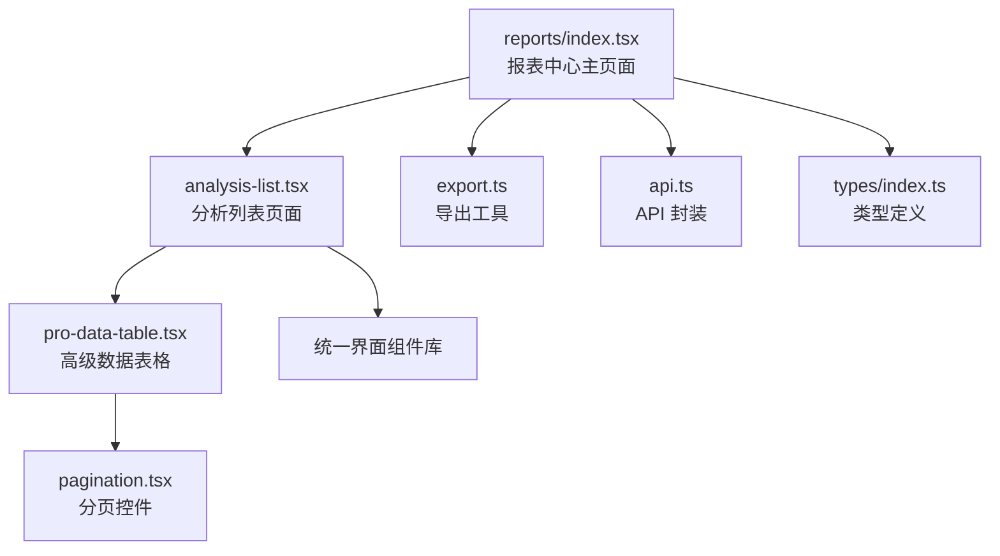
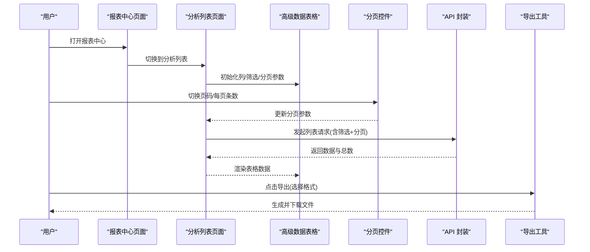
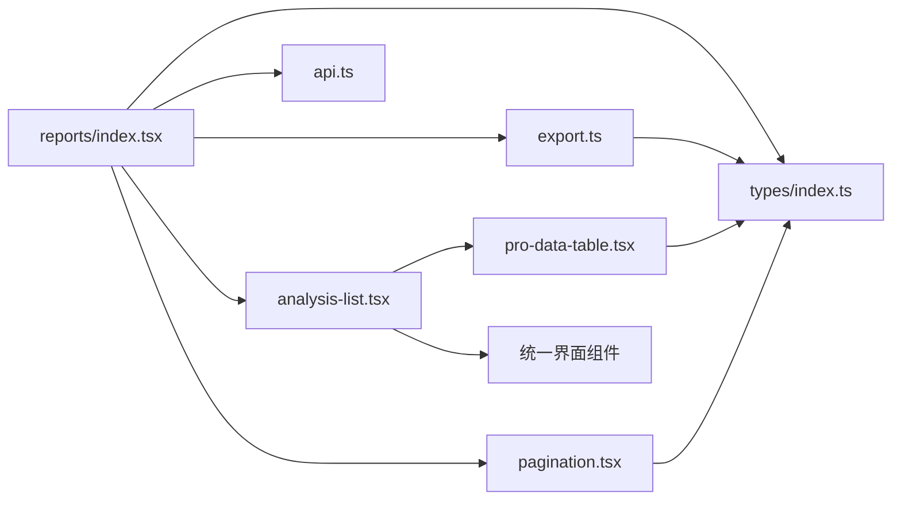

# 报表中心页面

<cite>
**本文引用的文件**   
- [web/src/pages/reports/index.tsx](file://web/src/pages/reports/index.tsx)
- [web/src/pages/reports/analysis-list.tsx](file://web/src/pages/reports/analysis-list.tsx)
- [web/src/components/data-table/pro-data-table.tsx](file://web/src/components/data-table/pro-data-table.tsx)
- [web/src/components/data-table/pagination.tsx](file://web/src/components/data-table/pagination.tsx)
- [web/src/lib/export.ts](file://web/src/lib/export.ts)
- [web/src/lib/api.ts](file://web/src/lib/api.ts)
- [web/src/types/index.ts](file://web/src/types/index.ts)
</cite>

## 更新摘要
**变更内容**   
- 更新了报表中心页面的界面一致性优化相关内容
- 新增了analysis-list.tsx组件的详细分析
- 完善了界面统一性和用户体验相关的技术实现说明

## 目录
1. [简介](#简介)
2. [项目结构](#项目结构)
3. [核心组件](#核心组件)
4. [架构总览](#架构总览)
5. [详细组件分析](#详细组件分析)
6. [依赖关系分析](#依赖关系分析)
7. [性能考量](#性能考量)
8. [故障排查指南](#故障排查指南)
9. [结论](#结论)
10. [附录](#附录)

## 简介
本文件面向"报表中心页面"的文档，聚焦于报表生成系统的整体架构与实现要点，涵盖以下主题：
- 报表模板管理、数据聚合计算、格式化输出等核心能力
- 数据导出机制（Excel、PDF、CSV）
- 复杂报表的数据处理流程（分页加载、异步计算、内存管理）
- 筛选与查询（多条件组合、时间范围、动态字段选择）
- 自定义报表开发指南（新增报表类型、扩展导出格式、配置查询条件）

**更新** 基于最新的界面一致性优化，增强了报表列表页和详情页的交互体验统一性。

说明：由于当前仓库未包含后端实现，本文档基于前端代码结构与通用工程实践进行系统化梳理，并提供可落地的扩展建议。

## 项目结构
报表中心相关的前端代码主要位于 web 子工程中，关键路径如下：
- 页面入口：web/src/pages/reports/index.tsx
- 分析列表页：web/src/pages/reports/analysis-list.tsx
- 表格与分页：web/src/components/data-table/pro-data-table.tsx、web/src/components/data-table/pagination.tsx
- 导出工具：web/src/lib/export.ts
- API 封装：web/src/lib/api.ts
- 类型定义：web/src/types/index.ts

图表来源
- [web/src/pages/reports/index.tsx](file://web/src/pages/reports/index.tsx)
- [web/src/pages/reports/analysis-list.tsx](file://web/src/pages/reports/analysis-list.tsx)
- [web/src/components/data-table/pro-data-table.tsx](file://web/src/components/data-table/pro-data-table.tsx)
- [web/src/components/data-table/pagination.tsx](file://web/src/components/data-table/pagination.tsx)
- [web/src/lib/export.ts](file://web/src/lib/export.ts)
- [web/src/lib/api.ts](file://web/src/lib/api.ts)
- [web/src/types/index.ts](file://web/src/types/index.ts)

章节来源
- [web/src/pages/reports/index.tsx](file://web/src/pages/reports/index.tsx)
- [web/src/pages/reports/analysis-list.tsx](file://web/src/pages/reports/analysis-list.tsx)
- [web/src/components/data-table/pro-data-table.tsx](file://web/src/components/data-table/pro-data-table.tsx)
- [web/src/components/data-table/pagination.tsx](file://web/src/components/data-table/pagination.tsx)
- [web/src/lib/export.ts](file://web/src/lib/export.ts)
- [web/src/lib/api.ts](file://web/src/lib/api.ts)
- [web/src/types/index.ts](file://web/src/types/index.ts)

## 核心组件
- 报表中心页面（reports/index.tsx）
  - 职责：组织筛选区、表格展示、分页、导出入口；协调数据请求与渲染。
  - 关注点：状态管理（筛选参数、分页参数、加载态）、错误提示、导出触发。
- 分析列表页面（analysis-list.tsx）
  - 职责：提供统一的报表分析列表视图，支持多种报表类型的展示和操作。
  - 关注点：界面一致性、响应式布局、用户操作反馈。
- 高级数据表格（pro-data-table.tsx）
  - 职责：列定义、排序/过滤/搜索、虚拟滚动（可选）、行操作、批量操作。
  - 关注点：列配置化、事件回调、大数据量渲染优化。
- 分页控件（pagination.tsx）
  - 职责：页码切换、每页条数设置、总数显示。
  - 关注点：与服务端分页参数对齐、边界保护。
- 导出工具（export.ts）
  - 职责：将表格数据转换为 Excel/PDF/CSV 并下载。
  - 关注点：流式/分块导出、编码与字符集、大文件内存占用控制。
- API 封装（api.ts）
  - 职责：统一请求拦截、错误处理、重试策略、缓存策略（可选）。
  - 关注点：超时、鉴权头、幂等性、错误码映射。
- 类型定义（types/index.ts）
  - 职责：统一定义报表数据模型、筛选条件、分页参数、导出选项等。
  - 关注点：强类型约束、可扩展枚举、向后兼容。

章节来源
- [web/src/pages/reports/index.tsx](file://web/src/pages/reports/index.tsx)
- [web/src/pages/reports/analysis-list.tsx](file://web/src/pages/reports/analysis-list.tsx)
- [web/src/components/data-table/pro-data-table.tsx](file://web/src/components/data-table/pro-data-table.tsx)
- [web/src/components/data-table/pagination.tsx](file://web/src/components/data-table/pagination.tsx)
- [web/src/lib/export.ts](file://web/src/lib/export.ts)
- [web/src/lib/api.ts](file://web/src/lib/api.ts)
- [web/src/types/index.ts](file://web/src/types/index.ts)

## 架构总览
报表中心采用"页面编排 + 组件化 + 工具库"的分层设计：
- 表现层：报表中心页面和分析列表页面负责布局与交互编排
- 组件层：高级表格与分页提供通用 UI 能力
- 工具层：导出工具与 API 封装提供横切能力
- 类型层：集中定义数据结构，保证前后端契约一致

**更新** 新增的分析列表页面提供了统一的报表浏览体验，增强了界面的整体一致性。

图表来源
- [web/src/pages/reports/index.tsx](file://web/src/pages/reports/index.tsx)
- [web/src/pages/reports/analysis-list.tsx](file://web/src/pages/reports/analysis-list.tsx)
- [web/src/components/data-table/pro-data-table.tsx](file://web/src/components/data-table/pro-data-table.tsx)
- [web/src/components/data-table/pagination.tsx](file://web/src/components/data-table/pagination.tsx)
- [web/src/lib/api.ts](file://web/src/lib/api.ts)
- [web/src/lib/export.ts](file://web/src/lib/export.ts)

## 详细组件分析

### 报表中心页面（reports/index.tsx）
- 功能要点
  - 筛选区：支持多条件组合、时间范围、动态字段选择
  - 表格区：绑定高级数据表格，接收列定义与数据源
  - 分页区：与分页控件联动，驱动服务端分页
  - 导出区：调用导出工具，按所选格式生成文件
- 数据流
  - 用户操作 → 更新筛选/分页状态 → 触发 API 请求 → 渲染表格
  - 导出触发 → 组装导出参数 → 调用导出工具 → 下载文件
- 错误处理
  - 网络异常、业务错误码、空数据兜底
- 性能优化
  - 防抖/节流减少重复请求
  - 按需加载列与数据
  - 大列表使用虚拟滚动（由高级表格提供）

**更新** 优化了页面布局和交互逻辑，提升了用户体验的一致性。

章节来源
- [web/src/pages/reports/index.tsx](file://web/src/pages/reports/index.tsx)

### 分析列表页面（analysis-list.tsx）
- 功能要点
  - 统一视图：提供标准化的报表分析列表展示
  - 响应式设计：适配不同屏幕尺寸的显示需求
  - 操作一致性：所有报表类型共享相同的操作模式
  - 状态管理：统一的加载状态、错误处理和成功反馈
- 界面一致性
  - 遵循设计规范的间距、颜色和字体
  - 统一的按钮样式和交互反馈
  - 标准化的表单输入和验证规则
- 性能考虑
  - 懒加载和按需渲染
  - 图片资源的优化处理
  - 内存管理和垃圾回收

**新增** 该组件是本次界面一致性优化的核心，确保了不同报表类型之间的统一体验。

章节来源
- [web/src/pages/reports/analysis-list.tsx](file://web/src/pages/reports/analysis-list.tsx)

### 高级数据表格（pro-data-table.tsx）
- 功能要点
  - 列配置：标题、键名、宽度、排序、过滤、格式化器
  - 行操作：编辑、删除、详情、批量操作
  - 搜索与过滤：全局搜索、列级过滤、组合条件
  - 大数据渲染：虚拟滚动、增量渲染
- 接口约定
  - columns：列定义数组
  - dataSource：数据数组
  - pagination：分页配置
  - onSort/onFilter/onSearch：事件回调
- 扩展点
  - 自定义单元格渲染器
  - 自定义过滤器组件
  - 行操作按钮插槽

**更新** 增强了与统一界面组件的集成，提升了视觉一致性。

章节来源
- [web/src/components/data-table/pro-data-table.tsx](file://web/src/components/data-table/pro-data-table.tsx)

### 分页控件（pagination.tsx）
- 功能要点
  - 页码导航、每页条数选择、跳转
  - 与高级表格联动，同步 total/pageSize/currentPage
- 边界保护
  - 非法页码修正、总数为 0 时禁用翻页
- 服务端分页
  - 通过 onChange 回调通知上层更新分页参数并重新拉取数据

**更新** 优化了分页控件的样式和行为，确保与其他UI组件的一致性。

章节来源
- [web/src/components/data-table/pagination.tsx](file://web/src/components/data-table/pagination.tsx)

### 导出工具（export.ts）
- 支持格式
  - Excel：二进制流或 Blob 下载
  - PDF：文本/表格转 PDF 并下载
  - CSV：UTF-8 编码，含 BOM 以兼容中文
- 大文件策略
  - 分块生成、流式写入、避免一次性构建超大对象
- 错误处理
  - 浏览器兼容性降级、权限拒绝提示、失败重试

**更新** 改进了导出功能的错误处理和用户反馈机制。

章节来源
- [web/src/lib/export.ts](file://web/src/lib/export.ts)

### API 封装（api.ts）
- 功能要点
  - 统一请求拦截（鉴权头、超时、重试）
  - 错误码映射与友好提示
  - 可选缓存与去重
- 报表相关
  - 列表查询、导出任务提交/轮询（如需异步导出）

**更新** 增强了错误处理的统一性和用户友好的提示信息。

章节来源
- [web/src/lib/api.ts](file://web/src/lib/api.ts)

### 类型定义（types/index.ts）
- 关键类型
  - 报表数据项、筛选条件、分页参数、导出选项、列定义
- 扩展方式
  - 新增报表类型：在枚举中追加，并在页面与表格中注册对应列与筛选
  - 新增导出格式：在导出选项中扩展枚举，并在导出工具中实现转换逻辑

**更新** 新增了分析列表相关的类型定义，支持统一的报表展示模式。

章节来源
- [web/src/types/index.ts](file://web/src/types/index.ts)

## 依赖关系分析
- 页面依赖组件与工具
  - reports/index.tsx 依赖 pro-data-table、pagination、export、api、types
  - analysis-list.tsx 依赖统一的界面组件库和基础UI组件
- 组件内部依赖
  - pro-data-table 可能依赖基础 UI 组件与工具函数
  - pagination 仅依赖基础 UI 与 props
- 工具与类型
  - export 依赖 types 中的导出选项
  - api 依赖 types 中的请求/响应结构

**更新** analysis-list.tsx 作为新的核心组件，引入了更多的依赖关系以确保界面一致性。

图表来源
- [web/src/pages/reports/index.tsx](file://web/src/pages/reports/index.tsx)
- [web/src/pages/reports/analysis-list.tsx](file://web/src/pages/reports/analysis-list.tsx)
- [web/src/components/data-table/pro-data-table.tsx](file://web/src/components/data-table/pro-data-table.tsx)
- [web/src/components/data-table/pagination.tsx](file://web/src/components/data-table/pagination.tsx)
- [web/src/lib/export.ts](file://web/src/lib/export.ts)
- [web/src/lib/api.ts](file://web/src/lib/api.ts)
- [web/src/types/index.ts](file://web/src/types/index.ts)

## 性能考量
- 大数据量分页加载
  - 优先服务端分页，限制 pageSize，避免一次性渲染全量数据
  - 结合虚拟滚动提升长列表渲染性能
- 异步计算优化
  - 对耗时计算使用 Web Worker 或后台任务（如后端聚合），前端仅做结果渲染
  - 导出大文件采用分块/流式处理，降低峰值内存
- 内存管理
  - 及时释放不再使用的引用，避免闭包持有大对象
  - 取消未完成请求（AbortController）
- 网络与缓存
  - 合理设置请求超时与重试次数
  - 对不变数据启用缓存，减少重复请求
- 界面渲染优化
  - 使用React.memo和useMemo优化组件重渲染
  - 图片资源的懒加载和压缩处理
  - CSS动画的性能优化

**更新** 针对新的分析列表页面，增加了专门的性能优化策略，包括组件级别的渲染优化和资源管理。

[本节为通用性能建议，不直接分析具体文件]

## 故障排查指南
- 常见问题
  - 导出失败：检查浏览器是否允许下载、文件格式是否正确、文件大小是否超限
  - 列表无数据：确认筛选条件与分页参数是否正确传递、API 返回结构是否符合类型定义
  - 渲染卡顿：检查是否开启虚拟滚动、是否存在不必要的重渲染
  - 界面不一致：检查组件版本是否匹配、CSS样式是否冲突
- 定位步骤
  - 查看控制台错误与网络面板
  - 打印关键状态（筛选、分页、数据长度）
  - 逐步缩小问题范围（关闭筛选/分页/导出逐一验证）
  - 检查浏览器开发者工具的Performance面板

**更新** 新增了界面一致性问题排查的相关指导。

章节来源
- [web/src/lib/api.ts](file://web/src/lib/api.ts)
- [web/src/lib/export.ts](file://web/src/lib/export.ts)

## 结论
报表中心通过清晰的页面编排与组件化设计，实现了筛选、表格、分页与导出的完整链路。借助统一的类型定义与 API 封装，系统具备良好的可扩展性与可维护性。针对大数据量场景，应优先采用服务端分页与流式导出，并结合虚拟滚动与请求取消等手段保障性能与体验。

**更新** 通过本次界面一致性优化，报表中心的用户体验得到了显著提升，各组件间的协作更加紧密，为后续的功能扩展奠定了坚实的基础。

[本节为总结性内容，不直接分析具体文件]

## 附录

### 自定义报表开发指南
- 新增报表类型
  - 在类型定义中扩展报表枚举与数据结构
  - 在报表中心页面注册新报表的列定义与筛选条件
  - 在高级表格中配置列渲染器与过滤器
  - 确保与新分析列表页面的兼容性
- 扩展导出格式
  - 在导出选项中新增格式枚举
  - 在导出工具中实现对应格式的转换与下载逻辑
  - 处理大文件时的分块与内存优化
- 配置查询条件
  - 在筛选区增加新的输入控件，并与 API 参数映射
  - 对时间范围、多选、动态字段等复杂条件进行校验与默认值处理
  - 与分页联动，确保首次加载与后续翻页行为一致
- 界面一致性要求
  - 遵循统一的设计规范和组件库
  - 保持与现有报表页面相同的交互模式
  - 确保响应式布局的正确实现

**更新** 新增了界面一致性相关的开发要求和最佳实践。

章节来源
- [web/src/types/index.ts](file://web/src/types/index.ts)
- [web/src/pages/reports/index.tsx](file://web/src/pages/reports/index.tsx)
- [web/src/pages/reports/analysis-list.tsx](file://web/src/pages/reports/analysis-list.tsx)
- [web/src/components/data-table/pro-data-table.tsx](file://web/src/components/data-table/pro-data-table.tsx)
- [web/src/lib/export.ts](file://web/src/lib/export.ts)
- [web/src/lib/api.ts](file://web/src/lib/api.ts)