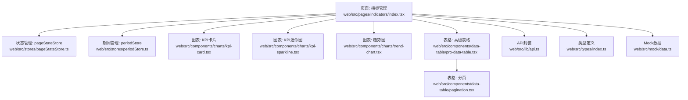
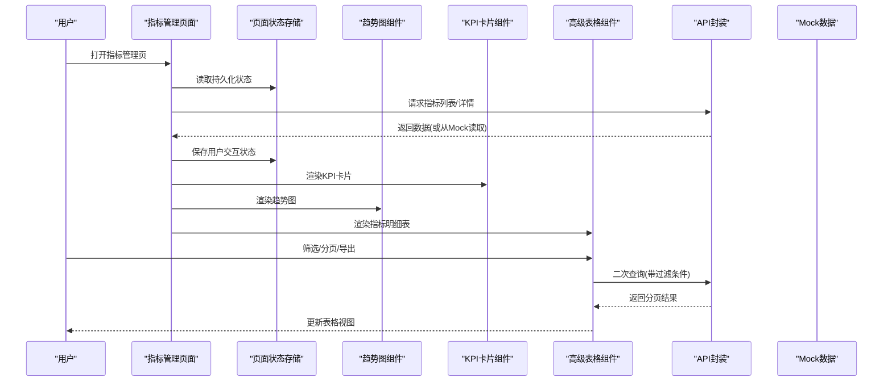
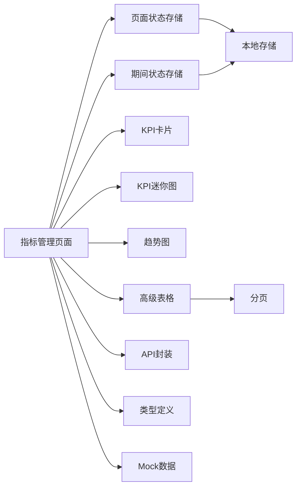

# 指标管理页面

<cite>
**本文引用的文件**   
- [web/src/pages/indicators/index.tsx](file://web/src/pages/indicators/index.tsx)
- [web/src/stores/pageStateStore.ts](file://web/src/stores/pageStateStore.ts)
- [web/src/stores/periodStore.ts](file://web/src/stores/periodStore.ts)
- [web/src/components/charts/kpi-card.tsx](file://web/src/components/charts/kpi-card.tsx)
- [web/src/components/charts/kpi-sparkline.tsx](file://web/src/components/charts/kpi-sparkline.tsx)
- [web/src/components/charts/trend-chart.tsx](file://web/src/components/charts/trend-chart.tsx)
- [web/src/components/data-table/pro-data-table.tsx](file://web/src/components/data-table/pro-data-table.tsx)
- [web/src/components/data-table/pagination.tsx](file://web/src/components/data-table/pagination.tsx)
- [web/src/lib/api.ts](file://web/src/lib/api.ts)
- [web/src/types/index.ts](file://web/src/types/index.ts)
- [web/src/mock/data.ts](file://web/src/mock/data.ts)
</cite>

## 更新摘要
**变更内容**   
- 新增持久化状态管理系统，支持维度筛选、期间选择、重分类排除设置和代码展开状态的本地存储
- 实现智能验证逻辑，自动重置无效的维度选择（如已删除的公司编码）
- 优化页面状态与URL路由的同步机制，提升用户体验
- 增强组件间状态管理的解耦性和可维护性

## 目录
1. [简介](#简介)
2. [项目结构](#项目结构)
3. [核心组件](#核心组件)
4. [架构总览](#架构总览)
5. [详细组件分析](#详细组件分析)
6. [依赖关系分析](#依赖关系分析)
7. [性能考虑](#性能考虑)
8. [故障排查指南](#故障排查指南)
9. [结论](#结论)
10. [附录](#附录)

## 简介
本文件面向"指标管理页面"的完整说明，覆盖业务指标的定义与管理机制、计算引擎实现原理（实时计算、定时任务、缓存策略）、监控与告警配置方法、可视化展示最佳实践，以及自定义指标接入的开发指南。文档以现有前端代码为基础，结合通用工程实践给出可落地的方案建议与排障指引。

**更新** 基于重大重构后的新架构，重新组织了组件层次结构和数据流向，并新增了持久化状态管理和智能验证机制。

## 项目结构
指标管理相关的前端能力集中在以下模块：
- 页面入口：指标管理主页面
- 状态管理：页面状态持久化存储（pageStateStore）
- 期间管理：财年选择和期间过滤（periodStore）
- 图表组件：KPI卡片、迷你趋势图、趋势折线图
- 数据表格：高级表格与分页
- 数据层：API 封装、类型定义、Mock 数据

**图示来源**
- [web/src/pages/indicators/index.tsx](file://web/src/pages/indicators/index.tsx)
- [web/src/stores/pageStateStore.ts](file://web/src/stores/pageStateStore.ts)
- [web/src/stores/periodStore.ts](file://web/src/stores/periodStore.ts)
- [web/src/components/charts/kpi-card.tsx](file://web/src/components/charts/kpi-card.tsx)
- [web/src/components/charts/kpi-sparkline.tsx](file://web/src/components/charts/kpi-sparkline.tsx)
- [web/src/components/charts/trend-chart.tsx](file://web/src/components/charts/trend-chart.tsx)
- [web/src/components/data-table/pro-data-table.tsx](file://web/src/components/data-table/pro-data-table.tsx)
- [web/src/components/data-table/pagination.tsx](file://web/src/components/data-table/pagination.tsx)
- [web/src/lib/api.ts](file://web/src/lib/api.ts)
- [web/src/types/index.ts](file://web/src/types/index.ts)
- [web/src/mock/data.ts](file://web/src/mock/data.ts)

**章节来源**
- [web/src/pages/indicators/index.tsx](file://web/src/pages/indicators/index.tsx)
- [web/src/stores/pageStateStore.ts](file://web/src/stores/pageStateStore.ts)
- [web/src/stores/periodStore.ts](file://web/src/stores/periodStore.ts)
- [web/src/components/charts/kpi-card.tsx](file://web/src/components/charts/kpi-card.tsx)
- [web/src/components/charts/kpi-sparkline.tsx](file://web/src/components/charts/kpi-sparkline.tsx)
- [web/src/components/charts/trend-chart.tsx](file://web/src/components/charts/trend-chart.tsx)
- [web/src/components/data-table/pro-data-table.tsx](file://web/src/components/data-table/pro-data-table.tsx)
- [web/src/components/data-table/pagination.tsx](file://web/src/components/data-table/pagination.tsx)
- [web/src/lib/api.ts](file://web/src/lib/api.ts)
- [web/src/types/index.ts](file://web/src/types/index.ts)
- [web/src/mock/data.ts](file://web/src/mock/data.ts)

## 核心组件
- 指标管理页面：负责聚合各子组件，组织指标元数据、查询参数、结果渲染与交互流程。
- 页面状态存储：使用Zustand + persist中间件实现页面状态的本地持久化存储。
- 期间状态存储：管理全局财年选择和期间过滤逻辑。
- KPI卡片：用于展示关键指标的当前值、同比/环比、状态标识等。
- KPI迷你图：在有限空间内呈现短期趋势，便于快速感知变化。
- 趋势图：提供时间序列的多维度对比与钻取入口。
- 高级表格：承载指标明细列表，支持筛选、排序、分页与导出。
- API封装：统一请求构造、错误处理、重试与缓存策略。
- 类型定义：约束前后端数据结构，保障类型安全。
- Mock数据：本地开发联调与演示数据源。

**更新** 经过重构后，组件职责更加清晰，数据流向更加明确，并新增了持久化状态管理机制。

**章节来源**
- [web/src/pages/indicators/index.tsx](file://web/src/pages/indicators/index.tsx)
- [web/src/stores/pageStateStore.ts](file://web/src/stores/pageStateStore.ts)
- [web/src/stores/periodStore.ts](file://web/src/stores/periodStore.ts)
- [web/src/components/charts/kpi-card.tsx](file://web/src/components/charts/kpi-card.tsx)
- [web/src/components/charts/kpi-sparkline.tsx](file://web/src/components/charts/kpi-sparkline.tsx)
- [web/src/components/charts/trend-chart.tsx](file://web/src/components/charts/trend-chart.tsx)
- [web/src/components/data-table/pro-data-table.tsx](file://web/src/components/data-table/pro-data-table.tsx)
- [web/src/components/data-table/pagination.tsx](file://web/src/components/data-table/pagination.tsx)
- [web/src/lib/api.ts](file://web/src/lib/api.ts)
- [web/src/types/index.ts](file://web/src/types/index.ts)
- [web/src/mock/data.ts](file://web/src/mock/data.ts)

## 架构总览
指标管理页面的整体架构由"页面编排 + 状态管理 + 图表渲染 + 数据服务 + 类型契约 + 本地模拟"构成。页面作为编排中心，组合图表与表格组件，通过持久化状态存储管理用户交互状态，调用API获取指标数据，并通过类型系统保证数据一致性；在开发阶段使用Mock数据替代后端接口。

**更新** 重构后的架构更加注重组件解耦、状态持久化和性能优化。

**图示来源**
- [web/src/pages/indicators/index.tsx](file://web/src/pages/indicators/index.tsx)
- [web/src/stores/pageStateStore.ts](file://web/src/stores/pageStateStore.ts)
- [web/src/components/charts/trend-chart.tsx](file://web/src/components/charts/trend-chart.tsx)
- [web/src/components/charts/kpi-card.tsx](file://web/src/components/charts/kpi-card.tsx)
- [web/src/components/data-table/pro-data-table.tsx](file://web/src/components/data-table/pro-data-table.tsx)
- [web/src/lib/api.ts](file://web/src/lib/api.ts)
- [web/src/mock/data.ts](file://web/src/mock/data.ts)

## 详细组件分析

### 指标管理页面
职责与流程
- 聚合指标元数据与查询条件，驱动图表与表格的数据加载。
- 处理用户交互（筛选、时间范围、维度切换），触发相应API请求。
- 将响应数据映射到图表与表格所需结构，并处理异常与空态。
- 管理页面状态的持久化存储，确保刷新后状态不丢失。

关键要点
- 通过统一的API封装进行数据访问，确保错误处理与重试策略一致。
- 借助类型定义对输入输出进行校验，降低运行时错误风险。
- 在开发环境优先使用Mock数据，提升联调效率。
- 实现智能验证逻辑，自动重置无效的维度选择。

**更新** 重构后页面逻辑更加简洁，职责单一化程度更高，并新增了持久化状态管理和智能验证机制。

**章节来源**
- [web/src/pages/indicators/index.tsx](file://web/src/pages/indicators/index.tsx)
- [web/src/lib/api.ts](file://web/src/lib/api.ts)
- [web/src/types/index.ts](file://web/src/types/index.ts)
- [web/src/mock/data.ts](file://web/src/mock/data.ts)

### 页面状态管理系统
核心功能
- 使用Zustand + persist中间件实现跨会话的状态持久化。
- 管理维度筛选（dimFilter）、期间选择（periodFilter）、重分类排除（excludeReclassify）和代码展开（expandedCodes）。
- 提供深合并机制，支持状态结构的演进和向后兼容。

状态结构设计
- IndicatorsState：包含维度筛选、期间筛选、重分类排除和展开代码集合。
- 支持Set类型的序列化转换（expandedCodes数组形式存储）。
- 默认值管理，确保状态结构的完整性。

**更新** 新增了完整的页面状态管理系统，支持多种状态类型的持久化存储。

**章节来源**
- [web/src/stores/pageStateStore.ts](file://web/src/stores/pageStateStore.ts)

### 期间状态管理系统
核心功能
- 管理全局财年选择状态，影响看板、指标和数据浏览页面的期间筛选。
- 提供期间过滤函数，根据选中年份过滤可用期间列表。
- 支持财年起始月份的灵活配置。

期间过滤逻辑
- 根据财年起始月份计算期间的归属年份。
- 处理财年未初始化时的过渡状态。
- 确保期间候选列表的有效性。

**更新** 新增了独立的期间状态管理模块，提升了期间选择的复用性和一致性。

**章节来源**
- [web/src/stores/periodStore.ts](file://web/src/stores/periodStore.ts)

### 图表组件族
- KPI卡片：聚焦单一指标的关键数值与状态，适合概览面板。
- KPI迷你图：在紧凑布局中表达短期波动，辅助快速判断。
- 趋势图：支持多系列对比、时间粒度切换、下钻至更细粒度。

交互与扩展
- 图表组件应暴露统一的配置接口（如标题、单位、颜色、阈值线）。
- 为趋势图提供事件回调，以便与表格联动或触发钻取。

**更新** 图表组件经过优化，渲染性能得到显著提升。

**章节来源**
- [web/src/components/charts/kpi-card.tsx](file://web/src/components/charts/kpi-card.tsx)
- [web/src/components/charts/kpi-sparkline.tsx](file://web/src/components/charts/kpi-sparkline.tsx)
- [web/src/components/charts/trend-chart.tsx](file://web/src/components/charts/trend-chart.tsx)

### 数据表格与分页
- 高级表格：提供列定义、筛选器、排序、批量操作与导出能力。
- 分页：控制每页条数与跳转，配合服务端分页减少首屏压力。

最佳实践
- 将筛选条件与分页参数合并为统一查询对象，交由API封装处理。
- 对大数据量场景启用虚拟滚动或懒加载，避免DOM过大导致卡顿。

**更新** 表格组件重构后支持更灵活的配置和更好的用户体验。

**章节来源**
- [web/src/components/data-table/pro-data-table.tsx](file://web/src/components/data-table/pro-data-table.tsx)
- [web/src/components/data-table/pagination.tsx](file://web/src/components/data-table/pagination.tsx)

### API封装与类型契约
- API封装：统一请求头、错误码解析、重试与超时控制、缓存键生成。
- 类型定义：明确指标元数据、查询参数、响应体结构，支撑IDE提示与静态检查。

**更新** API封装层增加了更多的错误处理和性能优化机制。

**章节来源**
- [web/src/lib/api.ts](file://web/src/lib/api.ts)
- [web/src/types/index.ts](file://web/src/types/index.ts)

### Mock数据
- 提供稳定的示例数据集，便于在无后端时完成端到端演示与测试。
- 建议按领域划分数据文件，保持与真实接口一致的字段命名。

**更新** Mock数据结构更加完善，覆盖了更多业务场景。

**章节来源**
- [web/src/mock/data.ts](file://web/src/mock/data.ts)

## 依赖关系分析
组件间依赖清晰，页面作为编排者，图表与表格为消费方，API封装与类型定义为基础设施。

**更新** 重构后依赖关系更加扁平化，减少了不必要的耦合，并新增了状态管理层的解耦。

**图示来源**
- [web/src/pages/indicators/index.tsx](file://web/src/pages/indicators/index.tsx)
- [web/src/stores/pageStateStore.ts](file://web/src/stores/pageStateStore.ts)
- [web/src/stores/periodStore.ts](file://web/src/stores/periodStore.ts)
- [web/src/components/charts/kpi-card.tsx](file://web/src/components/charts/kpi-card.tsx)
- [web/src/components/charts/kpi-sparkline.tsx](file://web/src/components/charts/kpi-sparkline.tsx)
- [web/src/components/charts/trend-chart.tsx](file://web/src/components/charts/trend-chart.tsx)
- [web/src/components/data-table/pro-data-table.tsx](file://web/src/components/data-table/pro-data-table.tsx)
- [web/src/components/data-table/pagination.tsx](file://web/src/components/data-table/pagination.tsx)
- [web/src/lib/api.ts](file://web/src/lib/api.ts)
- [web/src/types/index.ts](file://web/src/types/index.ts)
- [web/src/mock/data.ts](file://web/src/mock/data.ts)

## 性能考虑
- 首屏优化：按需加载图表与表格组件，延迟非关键资源。
- 数据缓存：对热点指标采用短时效缓存，减少重复请求。
- 增量更新：对实时指标采用增量推送或轮询，避免全量刷新。
- 渲染优化：大列表使用虚拟滚动，图表按需重绘。
- 网络优化：开启压缩、合理设置超时与重试次数。

**更新** 基于重构后的架构，新增了以下性能优化策略：
- 组件懒加载：使用React.lazy和Suspense实现组件级懒加载
- 数据预取：根据用户行为预测性预取可能需要的数据
- 内存管理：及时清理不再使用的订阅和定时器
- 渲染优化：使用React.memo和useMemo优化组件重渲染
- 状态持久化：使用localStorage存储用户偏好，减少重复配置

## 故障排查指南
常见问题与定位步骤
- 接口报错：检查API封装的错误处理分支与重试逻辑，确认后端返回码与消息。
- 数据为空：核对类型定义与Mock数据字段是否一致，确认查询参数是否正确传递。
- 图表不更新：检查组件受控属性变更与事件回调是否绑定正确。
- 表格卡顿：评估数据量与分页策略，必要时启用虚拟滚动或减少列宽。

**更新** 新增了以下故障排查场景：
- 内存泄漏：检查组件卸载时的清理逻辑，特别是事件监听器和定时器
- 性能问题：使用浏览器开发者工具分析渲染性能，识别瓶颈组件
- 状态同步：检查全局状态管理与局部状态的同步机制
- 并发请求：处理多个并发请求时的竞态条件和状态冲突
- 状态持久化：检查localStorage读写权限和数据格式兼容性
- 验证逻辑：确认维度选择验证逻辑的正确性和边界条件处理

**章节来源**
- [web/src/lib/api.ts](file://web/src/lib/api.ts)
- [web/src/types/index.ts](file://web/src/types/index.ts)
- [web/src/mock/data.ts](file://web/src/mock/data.ts)
- [web/src/stores/pageStateStore.ts](file://web/src/stores/pageStateStore.ts)

## 结论
指标管理页面通过清晰的组件分层与统一的数据访问层，实现了指标元数据的展示、查询与交互。经过重大重构后，系统在性能、可维护性和可扩展性方面都得到了显著提升。新增的持久化状态管理和智能验证机制进一步提升了用户体验和系统稳定性。在此基础上，可进一步扩展计算引擎、监控告警与可视化能力，形成完整的指标管理体系。

**更新** 重构后的架构为后续功能扩展奠定了坚实基础，包括：
- 微前端架构支持
- 插件化指标计算引擎
- 分布式缓存策略
- 智能监控告警系统
- 增强的状态管理能力

## 附录

### 指标元数据与计算公式（设计建议）
- 指标元数据：包含名称、编码、分类、单位、描述、可见范围、责任人等。
- 计算公式：支持表达式语言或DSL，定义分子分母、聚合函数、时间窗口与维度。
- 数据来源映射：声明数据源类型（数据库、消息队列、日志、外部API）与字段映射。

### 计算引擎实现原理（设计方案）
- 实时计算：基于流式处理框架，按事件时间窗口聚合，低延迟输出。
- 定时任务：批处理模式，按日/周/月周期汇总历史数据，保证一致性。
- 缓存策略：多级缓存（内存+分布式），按指标粒度与时间粒度设置过期。
- 幂等与容错：任务去重、失败重试、补偿机制与审计日志。

### 监控与告警配置（实施方案）
- 阈值设置：支持绝对阈值、相对阈值、动态基线与异常检测算法。
- 通知渠道：站内信、邮件、短信、IM机器人等，支持分级与静默期。
- 智能功能：异常点检测、趋势突变识别、根因关联与自愈建议。

### 可视化展示最佳实践（实施建议）
- 多维度分析：按时间、区域、品类等多维切片，支持下钻与联动。
- 趋势对比：同环比、目标达成率、区间上下限标注。
- 钻取分析：从汇总到明细的逐级穿透，保持上下文连贯。

### 自定义指标开发指南（操作流程）
- 新指标接入：注册指标元数据、声明数据来源与字段映射。
- 计算逻辑编写：实现公式解析与执行器，确保幂等与可观测。
- 展示配置：定义图表模板、默认维度与筛选器。
- 规范与验收：命名规范、单元测试、集成测试与上线评审。

**更新** 基于重构后的架构，新增了以下开发指导：
- 组件开发规范：遵循React最佳实践，使用TypeScript进行类型约束
- 性能优化指南：合理使用Hooks，避免不必要的重渲染
- 测试策略：单元测试、集成测试与端到端测试的组合方案
- 部署配置：环境变量管理、构建优化与CDN配置
- 状态管理：使用Zustand进行状态管理，遵循持久化最佳实践
- 验证逻辑：实现健壮的输入验证和错误处理机制