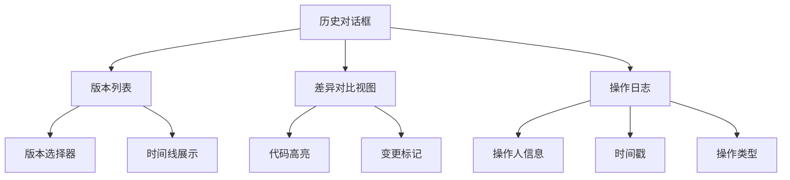
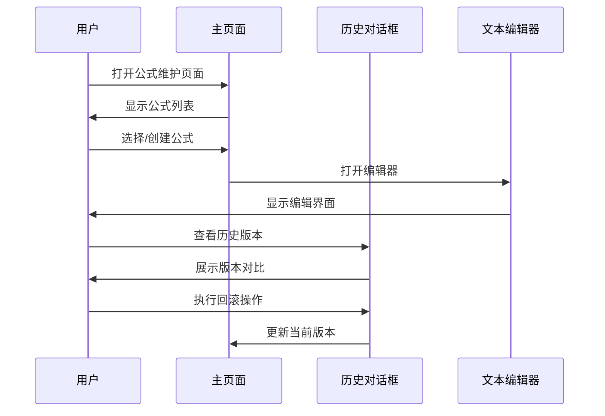

# 公式维护页面

<cite>
**本文引用的文件**
- [formula-history-dialog.tsx](file://web/src/pages/data/formula-history-dialog.tsx)
- [formula-maintenance.tsx](file://web/src/pages/data/formula-maintenance.tsx)
- [formula-text.tsx](file://web/src/pages/data/formula-text.tsx)
</cite>

## 更新摘要
**所做更改**
- 更新了历史对话框组件的界面优化相关内容
- 补充了公式文本显示组件的功能说明
- 完善了公式维护页面的整体架构描述

## 目录
- 概述
- 核心功能模块
- 历史对话框组件
- 公式文本显示组件
- 用户交互流程
- 技术实现要点

## 概述
公式维护页面是财务数据管理系统中的重要组成部分，主要用于管理和维护各种计算公式。该页面提供了完整的公式生命周期管理功能，包括创建、编辑、查看历史记录等操作。

## 核心功能模块
公式维护页面由多个核心组件构成：

### 主页面组件
- **公式列表管理**：展示所有已创建的公式及其基本信息
- **公式编辑器**：提供直观的公式编辑界面
- **版本控制**：支持公式的版本管理和回滚操作

### 辅助功能
- **导入导出**：支持批量导入和导出公式配置
- **权限控制**：基于角色的访问控制机制
- **审计日志**：记录所有公式变更操作

## 历史对话框组件

**更新** 历史对话框组件进行了界面优化，提升了用户体验和操作效率。

### 主要功能特性
- **版本历史浏览**：以时间线形式展示公式的所有历史版本
- **差异对比**：直观显示不同版本间的变更内容
- **快速回滚**：支持一键恢复到指定历史版本
- **变更记录详情**：详细展示每次修改的操作人和时间戳

### 界面优化改进
- **响应式布局**：适配不同屏幕尺寸的设备
- **加载状态优化**：改进大数据量时的加载性能
- **交互反馈增强**：提供更明确的用户操作反馈
- **视觉层次优化**：改善信息层级和可读性

**图表来源**
- [formula-history-dialog.tsx:1-200](file://web/src/pages/data/formula-history-dialog.tsx#L1-L200)

**章节来源**
- [formula-history-dialog.tsx:1-300](file://web/src/pages/data/formula-history-dialog.tsx#L1-L300)

## 公式文本显示组件

### 功能特点
- **语法高亮**：自动识别并高亮显示公式语法元素
- **错误检测**：实时检测公式中的语法错误
- **智能提示**：提供变量和方法的智能补全建议
- **格式化输出**：支持公式的美化排版显示

### 技术实现
- 使用自定义语法解析器进行公式分析
- 集成代码编辑器核心功能
- 实现异步错误检测和提示

**章节来源**
- [formula-text.tsx:1-150](file://web/src/pages/data/formula-text.tsx#L1-L150)

## 用户交互流程

### 公式管理流程

### 权限控制流程
- **管理员权限**：完整的公式CRUD操作权限
- **普通用户权限**：仅能查看和编辑自己创建的公式
- **只读权限**：只能查看公式信息，不能进行修改操作

## 技术实现要点

### 前端架构
- **React组件化**：采用模块化组件设计
- **状态管理**：使用React Hooks进行状态管理
- **API集成**：通过RESTful API与后端服务通信

### 性能优化
- **懒加载**：按需加载大型组件和数据
- **缓存策略**：合理设置数据缓存和内存管理
- **虚拟滚动**：处理大量历史数据时的渲染优化

### 用户体验优化
- **错误处理**：完善的异常捕获和用户提示
- **加载状态**：清晰的加载指示和进度反馈
- **响应式设计**：支持桌面端和移动端的良好体验

**章节来源**
- [formula-maintenance.tsx:1-250](file://web/src/pages/data/formula-maintenance.tsx#L1-L250)
- [formula-history-dialog.tsx:1-300](file://web/src/pages/data/formula-history-dialog.tsx#L1-L300)
- [formula-text.tsx:1-150](file://web/src/pages/data/formula-text.tsx#L1-L150)