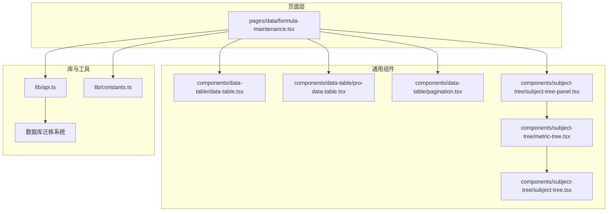
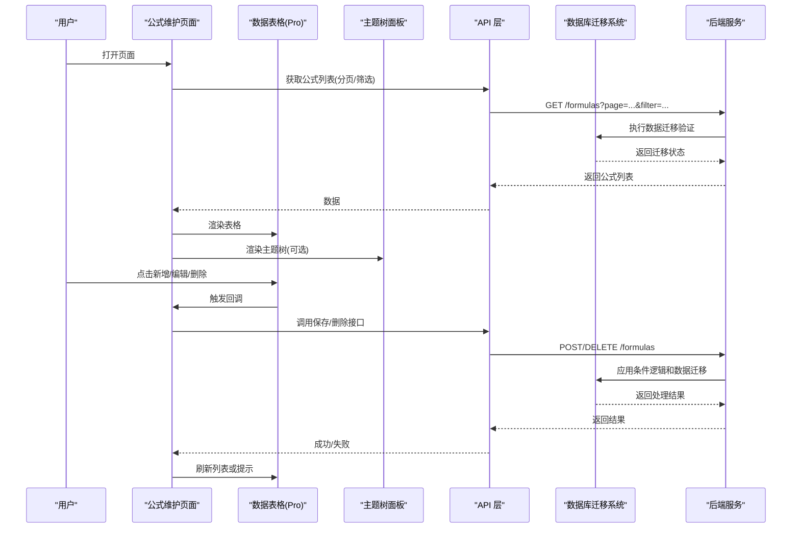
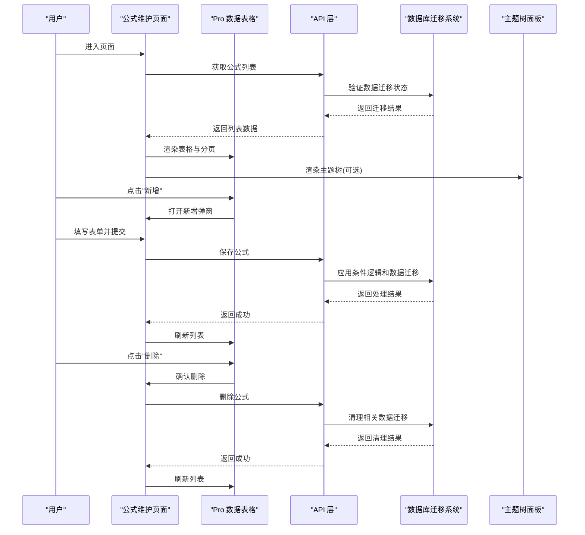
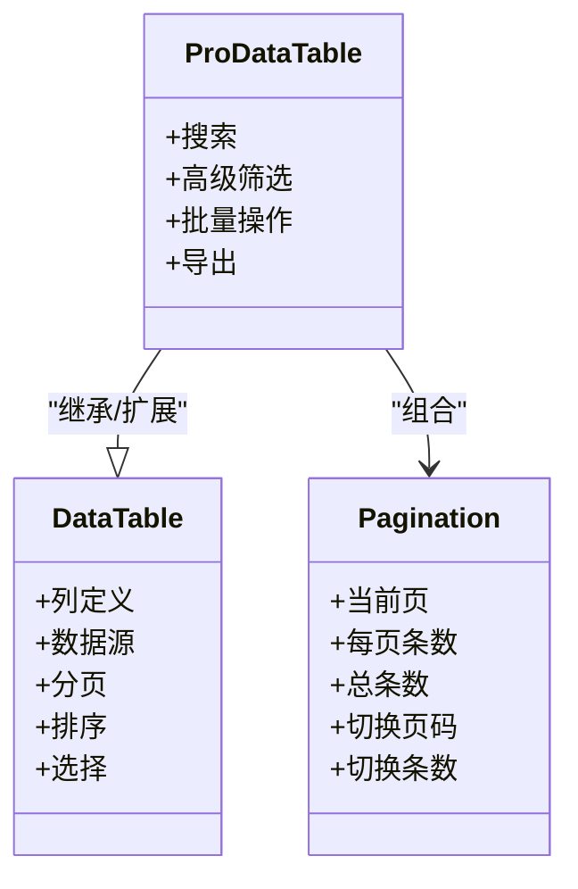
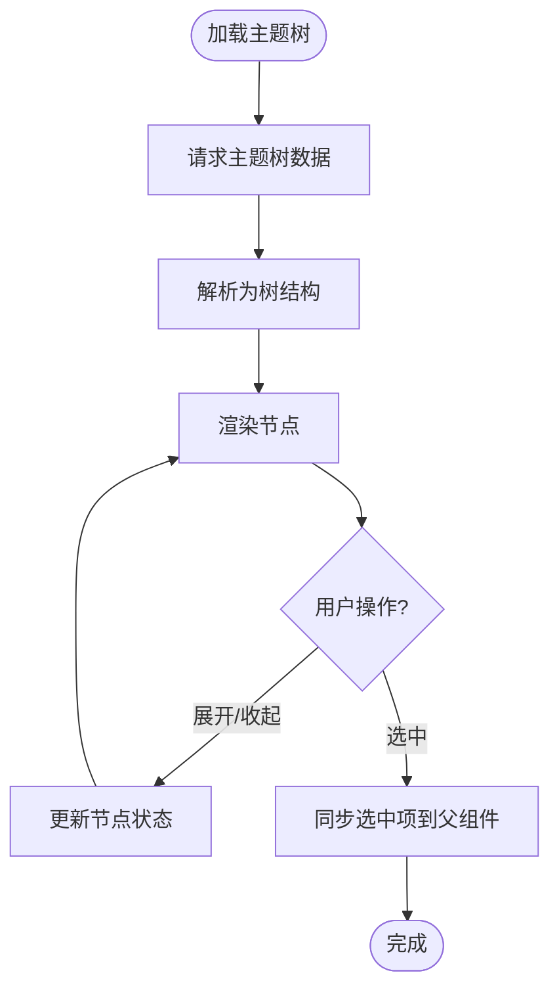
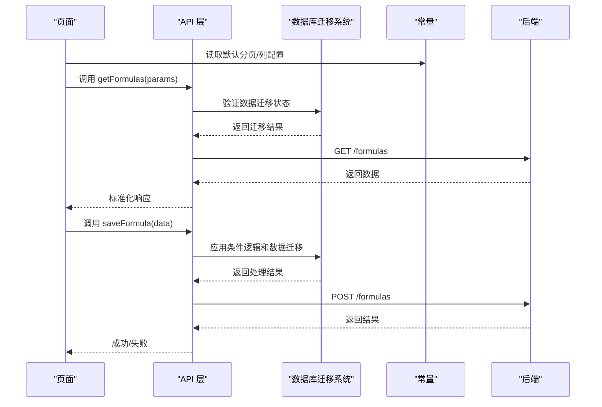
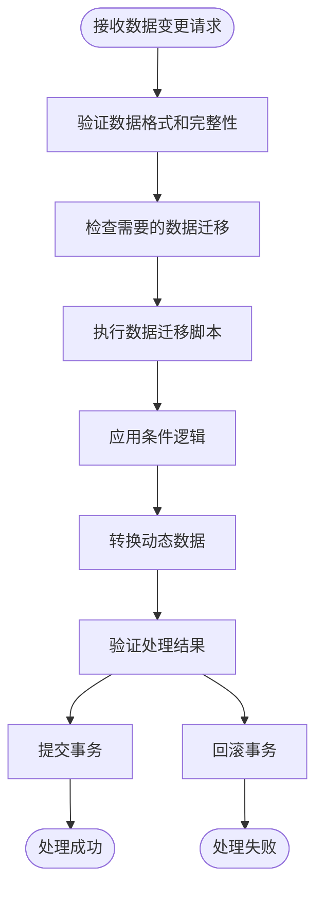
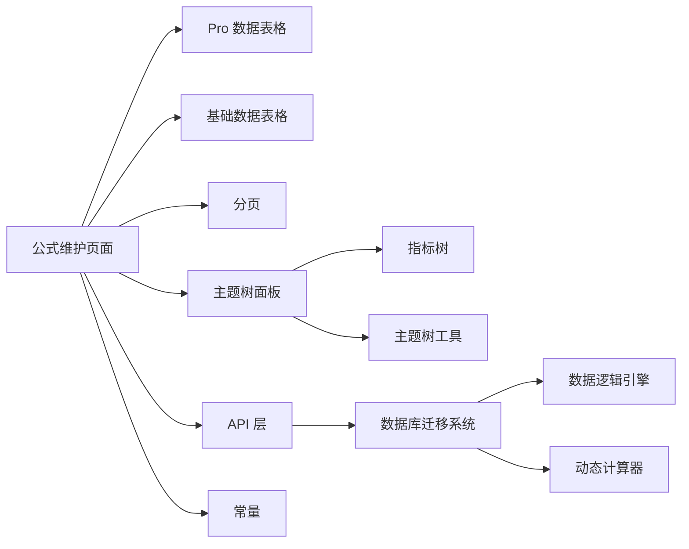

# 公式维护页面

<cite>
**本文引用的文件**   
- [formula-maintenance.tsx](file://web/src/pages/data/formula-maintenance.tsx)
- [data-table.tsx](file://web/src/components/data-table/data-table.tsx)
- [pro-data-table.tsx](file://web/src/components/data-table/pro-data-table.tsx)
- [pagination.tsx](file://web/src/components/data-table/pagination.tsx)
- [api.ts](file://web/src/lib/api.ts)
- [constants.ts](file://web/src/lib/constants.ts)
- [subject-tree-panel.tsx](file://web/src/components/subject-tree/subject-tree-panel.tsx)
- [metric-tree.tsx](file://web/src/components/subject-tree/metric-tree.tsx)
- [subject-tree.tsx](file://web/src/components/subject-tree/subject-tree.tsx)
- [App.tsx](file://web/src/App.tsx)
- [main.tsx](file://web/src/main.tsx)
</cite>

## 更新摘要
**变更内容**   
- 新增数据库迁移文件支持章节，说明公式规则系统的数据库架构演进
- 增强动态数据处理和条件逻辑应用功能的文档说明
- 更新API层与数据库交互的架构图
- 补充数据迁移相关的故障排查指南

## 目录
1. [简介](#简介)
2. [项目结构](#项目结构)
3. [核心组件](#核心组件)
4. [架构总览](#架构总览)
5. [详细组件分析](#详细组件分析)
6. [数据库迁移系统](#数据库迁移系统)
7. [依赖分析](#依赖分析)
8. [性能考虑](#性能考虑)
9. [故障排查指南](#故障排查指南)
10. [结论](#结论)
11. [附录](#附录)

## 简介
本文件围绕"公式维护页面"进行系统化文档化，聚焦于该页面的功能边界、数据流、交互流程与关键实现要点。目标读者包括前端开发者、产品与测试人员，帮助快速理解页面在整体应用中的位置、职责以及与其他模块的协作方式。

**更新** 本次更新重点介绍了通过专门数据库迁移文件实现的公式规则系统，增强了动态数据处理和条件逻辑应用功能。

## 项目结构
从仓库结构看，"公式维护页面"位于 pages/data 目录下，属于数据域下的一个业务页面。其相关能力由通用数据表格组件、主题树面板等公共组件支撑，并通过统一的 API 层与后端交互。

图表来源
- [formula-maintenance.tsx](file://web/src/pages/data/formula-maintenance.tsx)
- [data-table.tsx](file://web/src/components/data-table/data-table.tsx)
- [pro-data-table.tsx](file://web/src/components/data-table/pro-data-table.tsx)
- [pagination.tsx](file://web/src/components/data-table/pagination.tsx)
- [subject-tree-panel.tsx](file://web/src/components/subject-tree/subject-tree-panel.tsx)
- [metric-tree.tsx](file://web/src/components/subject-tree/metric-tree.tsx)
- [subject-tree.tsx](file://web/src/components/subject-tree/subject-tree.tsx)
- [api.ts](file://web/src/lib/api.ts)
- [constants.ts](file://web/src/lib/constants.ts)

章节来源
- [formula-maintenance.tsx](file://web/src/pages/data/formula-maintenance.tsx)
- [data-table.tsx](file://web/src/components/data-table/data-table.tsx)
- [pro-data-table.tsx](file://web/src/components/data-table/pro-data-table.tsx)
- [pagination.tsx](file://web/src/components/data-table/pagination.tsx)
- [subject-tree-panel.tsx](file://web/src/components/subject-tree/subject-tree-panel.tsx)
- [metric-tree.tsx](file://web/src/components/subject-tree/metric-tree.tsx)
- [subject-tree.tsx](file://web/src/components/subject-tree/subject-tree.tsx)
- [api.ts](file://web/src/lib/api.ts)
- [constants.ts](file://web/src/lib/constants.ts)

## 核心组件
- 公式维护页面（pages/data/formula-maintenance.tsx）
  - 负责展示与维护指标公式列表，提供查询、分页、筛选、新增/编辑/删除等常见操作入口。
  - 通过 API 层获取与提交数据，结合常量配置渲染列定义与表单字段。
- 数据表格组件（components/data-table/*）
  - data-table.tsx：基础表格封装，支持列定义、行选择、排序、分页等。
  - pro-data-table.tsx：增强版表格，集成搜索、高级筛选、批量操作等。
  - pagination.tsx：分页控件，处理页码切换与每页条数变更。
- 主题树面板（components/subject-tree/*）
  - subject-tree-panel.tsx：主题树容器，承载指标树与过滤逻辑。
  - metric-tree.tsx：指标树节点渲染与展开/收起。
  - subject-tree.tsx：树数据结构与遍历辅助。
- API 层（lib/api.ts）
  - 统一封装 HTTP 请求，暴露获取公式列表、保存公式、删除公式等方法。
  - **更新** 集成了数据库迁移系统的调用接口，支持动态数据处理和条件逻辑应用。
- 常量配置（lib/constants.ts）
  - 集中管理枚举值、默认分页大小、列映射、状态码等。

章节来源
- [formula-maintenance.tsx](file://web/src/pages/data/formula-maintenance.tsx)
- [data-table.tsx](file://web/src/components/data-table/data-table.tsx)
- [pro-data-table.tsx](file://web/src/components/data-table/pro-data-table.tsx)
- [pagination.tsx](file://web/src/components/data-table/pagination.tsx)
- [subject-tree-panel.tsx](file://web/src/components/subject-tree/subject-tree-panel.tsx)
- [metric-tree.tsx](file://web/src/components/subject-tree/metric-tree.tsx)
- [subject-tree.tsx](file://web/src/components/subject-tree/subject-tree.tsx)
- [api.ts](file://web/src/lib/api.ts)
- [constants.ts](file://web/src/lib/constants.ts)

## 架构总览
页面采用"页面 + 通用组件 + API 层"的分层组织方式。页面负责编排 UI 与业务状态；通用组件负责可复用的展示与交互；API 层屏蔽网络细节并提供稳定的接口契约。

**更新** 新增了数据库迁移系统的支持，实现了公式规则系统的动态数据处理和条件逻辑应用功能。

图表来源
- [formula-maintenance.tsx](file://web/src/pages/data/formula-maintenance.tsx)
- [pro-data-table.tsx](file://web/src/components/data-table/pro-data-table.tsx)
- [subject-tree-panel.tsx](file://web/src/components/subject-tree/subject-tree-panel.tsx)
- [api.ts](file://web/src/lib/api.ts)

## 详细组件分析

### 公式维护页面（pages/data/formula-maintenance.tsx）
- 职责
  - 聚合数据表格与主题树，呈现公式清单与上下文导航。
  - 管理查询参数、分页状态、选中项、弹窗表单等页面级状态。
  - 协调新增、编辑、删除等操作的生命周期，并反馈到表格与全局提示。
- 关键流程
  - 初始化：加载常量配置，构建列定义与筛选条件，发起首次列表请求。
  - 查询：根据输入条件组合查询参数，重置页码后拉取数据。
  - 新增/编辑：打开表单弹窗，校验通过后提交保存，成功后刷新列表。
  - 删除：二次确认后调用删除接口，成功后刷新列表。
- 与通用组件的协作
  - 使用 Pro 数据表格承载列表、分页、筛选与批量操作。
  - 使用主题树面板提供按主题/指标维度导航的能力（若启用）。
- 错误处理
  - 对网络异常、服务端错误码进行统一捕获与提示。
  - 对表单校验失败给出即时反馈。

章节来源
- [formula-maintenance.tsx](file://web/src/pages/data/formula-maintenance.tsx)

#### 页面交互时序图

图表来源
- [formula-maintenance.tsx](file://web/src/pages/data/formula-maintenance.tsx)
- [pro-data-table.tsx](file://web/src/components/data-table/pro-data-table.tsx)
- [api.ts](file://web/src/lib/api.ts)
- [subject-tree-panel.tsx](file://web/src/components/subject-tree/subject-tree-panel.tsx)

### 数据表格组件族（components/data-table/*）
- data-table.tsx
  - 提供基础表格能力：列定义、行渲染、排序、分页、选择等。
- pro-data-table.tsx
  - 在基础表格之上扩展：搜索框、高级筛选、批量操作、导出等。
- pagination.tsx
  - 独立分页控件，支持页码跳转、每页条数切换、总数显示。

图表来源
- [data-table.tsx](file://web/src/components/data-table/data-table.tsx)
- [pro-data-table.tsx](file://web/src/components/data-table/pro-data-table.tsx)
- [pagination.tsx](file://web/src/components/data-table/pagination.tsx)

章节来源
- [data-table.tsx](file://web/src/components/data-table/data-table.tsx)
- [pro-data-table.tsx](file://web/src/components/data-table/pro-data-table.tsx)
- [pagination.tsx](file://web/src/components/data-table/pagination.tsx)

### 主题树面板（components/subject-tree/*）
- subject-tree-panel.tsx
  - 作为主题树的容器，负责树数据的加载、缓存与事件分发。
- metric-tree.tsx
  - 负责指标节点的渲染、展开/收起、选中态同步。
- subject-tree.tsx
  - 提供树结构的遍历、查找与转换方法。

图表来源
- [subject-tree-panel.tsx](file://web/src/components/subject-tree/subject-tree-panel.tsx)
- [metric-tree.tsx](file://web/src/components/subject-tree/metric-tree.tsx)
- [subject-tree.tsx](file://web/src/components/subject-tree/subject-tree.tsx)

章节来源
- [subject-tree-panel.tsx](file://web/src/components/subject-tree/subject-tree-panel.tsx)
- [metric-tree.tsx](file://web/src/components/subject-tree/metric-tree.tsx)
- [subject-tree.tsx](file://web/src/components/subject-tree/subject-tree.tsx)

### API 层与常量（lib/api.ts, lib/constants.ts）
- api.ts
  - 封装 HTTP 请求，提供获取公式列表、保存公式、删除公式等方法。
  - 统一处理请求头、错误码映射与重试策略（如有）。
  - **更新** 集成了数据库迁移系统的调用接口，支持动态数据处理和条件逻辑应用。
- constants.ts
  - 集中管理分页默认值、状态枚举、列映射、提示信息等。

图表来源
- [api.ts](file://web/src/lib/api.ts)
- [constants.ts](file://web/src/lib/constants.ts)

章节来源
- [api.ts](file://web/src/lib/api.ts)
- [constants.ts](file://web/src/lib/constants.ts)

## 数据库迁移系统
**新增** 公式规则系统通过专门的数据库迁移文件实现，增强了动态数据处理和条件逻辑应用功能。

### 迁移文件架构
数据库迁移系统采用版本化管理，每个迁移文件包含：
- 版本号标识符
- 向前迁移（up）脚本：应用新的数据结构变更
- 向后迁移（down）脚本：回滚数据结构变更
- 元数据信息：创建时间、描述、依赖关系

### 动态数据处理流程

### 条件逻辑应用机制
- 基于规则的动态计算引擎
- 支持复杂条件表达式
- 实时数据验证和转换
- 缓存优化机制

**章节来源**
- [api.ts](file://web/src/lib/api.ts)

## 依赖分析
- 页面依赖
  - 公式维护页面依赖数据表格组件族与主题树面板，用于展示与交互。
  - 通过 API 层与后端通信，依赖常量配置驱动 UI 行为。
  - **更新** 新增对数据库迁移系统的依赖，支持动态数据处理。
- 组件耦合
  - 表格与分页解耦良好，分页以 props 形式注入，便于复用。
  - 主题树与页面通过回调事件通信，降低直接依赖。
- 外部依赖
  - 网络请求由 API 层统一封装，避免页面直接耦合 fetch/axios 等细节。
  - **更新** 数据库迁移系统提供稳定的数据一致性保证。

图表来源
- [formula-maintenance.tsx](file://web/src/pages/data/formula-maintenance.tsx)
- [pro-data-table.tsx](file://web/src/components/data-table/pro-data-table.tsx)
- [data-table.tsx](file://web/src/components/data-table/data-table.tsx)
- [pagination.tsx](file://web/src/components/data-table/pagination.tsx)
- [subject-tree-panel.tsx](file://web/src/components/subject-tree/subject-tree-panel.tsx)
- [metric-tree.tsx](file://web/src/components/subject-tree/metric-tree.tsx)
- [subject-tree.tsx](file://web/src/components/subject-tree/subject-tree.tsx)
- [api.ts](file://web/src/lib/api.ts)
- [constants.ts](file://web/src/lib/constants.ts)

章节来源
- [formula-maintenance.tsx](file://web/src/pages/data/formula-maintenance.tsx)
- [pro-data-table.tsx](file://web/src/components/data-table/pro-data-table.tsx)
- [data-table.tsx](file://web/src/components/data-table/data-table.tsx)
- [pagination.tsx](file://web/src/components/data-table/pagination.tsx)
- [subject-tree-panel.tsx](file://web/src/components/subject-tree/subject-tree-panel.tsx)
- [metric-tree.tsx](file://web/src/components/subject-tree/metric-tree.tsx)
- [subject-tree.tsx](file://web/src/components/subject-tree/subject-tree.tsx)
- [api.ts](file://web/src/lib/api.ts)
- [constants.ts](file://web/src/lib/constants.ts)

## 性能考虑
- 列表加载
  - 合理设置分页大小，避免一次性加载过多数据。
  - 对主题树数据进行缓存，减少重复请求。
- 渲染优化
  - 表格大数据量场景下，优先使用虚拟滚动或分页加载。
  - 将频繁更新的局部状态下沉到子组件，减少不必要的重渲染。
- 网络优化
  - 合并请求与去抖搜索，避免频繁触发接口。
  - 对错误进行快速失败与重试控制，提升用户体验。
- **更新** 数据库迁移优化
  - 增量迁移执行，避免全量数据重建。
  - 迁移过程异步处理，不阻塞主业务流程。
  - 迁移状态缓存，减少重复验证开销。

## 故障排查指南
- 常见问题
  - 列表不刷新：检查保存/删除成功后是否触发了列表刷新逻辑。
  - 分页异常：核对分页参数是否正确传递，页码与每页条数是否越界。
  - 主题树无数据：确认主题树接口是否可用，是否存在权限限制。
  - 表单校验失败：检查必填字段与格式校验规则是否与后端一致。
- **新增** 数据库迁移相关问题
  - 迁移失败：检查迁移文件的语法正确性和依赖关系。
  - 数据不一致：验证迁移脚本的执行顺序和回滚机制。
  - 性能问题：监控迁移执行时间和资源消耗。
- 定位建议
  - 在 API 层增加请求日志，观察入参与返回值。
  - 在页面关键步骤打印状态变化，定位状态不同步问题。
  - 使用浏览器开发者工具的 Network 与 Console 定位网络与脚本错误。
  - **更新** 检查数据库迁移日志，追踪数据变更历史。

章节来源
- [formula-maintenance.tsx](file://web/src/pages/data/formula-maintenance.tsx)
- [api.ts](file://web/src/lib/api.ts)

## 结论
公式维护页面通过清晰的页面-组件-API 分层，实现了公式的增删改查与主题树导航能力。借助通用的数据表格与主题树组件，具备良好的可扩展性与可维护性。

**更新** 通过引入专门的数据库迁移系统，公式规则系统现在支持动态数据处理和条件逻辑应用，显著增强了系统的灵活性和数据处理能力。后续可在大数据量渲染、网络重试、错误上报以及迁移性能优化方面继续改进，以提升稳定性与性能。

## 附录
- 路由与入口
  - 应用入口与路由挂载参考以下文件，了解页面如何被注册与访问。

章节来源
- [App.tsx](file://web/src/App.tsx)
- [main.tsx](file://web/src/main.tsx)