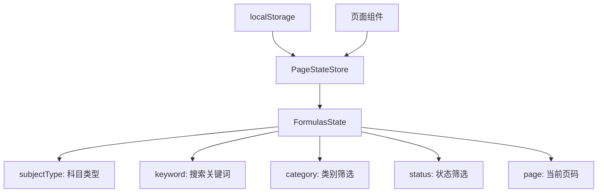
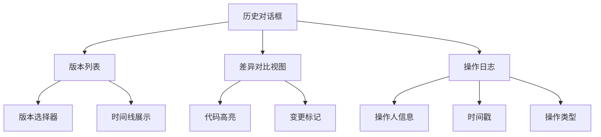
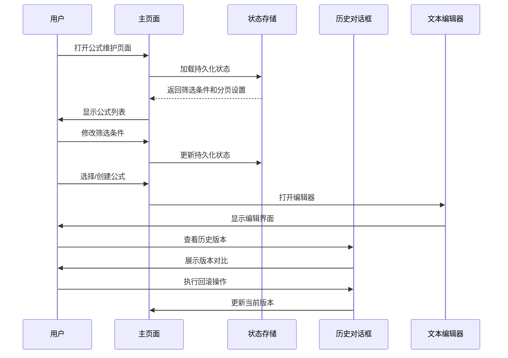

# 公式维护页面

<cite>
**本文引用的文件**
- [formula-history-dialog.tsx](file://web/src/pages/data/formula-history-dialog.tsx)
- [formula-maintenance.tsx](file://web/src/pages/data/formula-maintenance.tsx)
- [formula-text.tsx](file://web/src/pages/data/formula-text.tsx)
- [pageStateStore.ts](file://web/src/stores/pageStateStore.ts)
- [constants.ts](file://web/src/lib/constants.ts)
</cite>

## 更新摘要
**所做更改**
- 新增持久化状态管理功能，支持搜索参数、类别筛选、状态筛选和分页设置的跨会话保存
- 完善了页面状态管理机制，提升用户体验和数据一致性
- 优化了公式维护页面的整体架构描述

## 目录
- 概述
- 核心功能模块
- 持久化状态管理
- 历史对话框组件
- 公式文本显示组件
- 用户交互流程
- 技术实现要点

## 概述
公式维护页面是财务数据管理系统中的重要组成部分，主要用于管理和维护各种计算公式。该页面提供了完整的公式生命周期管理功能，包括创建、编辑、查看历史记录等操作，并支持通过持久化状态管理保持用户的筛选和分页设置。

## 核心功能模块
公式维护页面由多个核心组件构成：

### 主页面组件
- **公式列表管理**：展示所有已创建的公式及其基本信息
- **公式编辑器**：提供直观的公式编辑界面
- **版本控制**：支持公式的版本管理和回滚操作

### 辅助功能
- **导入导出**：支持批量导入和导出公式配置
- **权限控制**：基于角色的访问控制机制
- **审计日志**：记录所有公式变更操作

## 持久化状态管理

**新增** 公式维护页面现在支持持久化状态管理，确保用户在刷新页面或切换路由后能够恢复之前的筛选条件和分页设置。

### 状态管理架构
系统使用 Zustand store 配合 persist 中间件实现状态持久化，主要管理的状态包括：



**图表来源**
- [pageStateStore.ts:126-132](file://web/src/stores/pageStateStore.ts#L126-L132)
- [pageStateStore.ts:253-285](file://web/src/stores/pageStateStore.ts#L253-L285)

### 持久化字段说明
- **subjectType**: 科目类型（经营指标/静态指标）
- **keyword**: 搜索关键词，支持按名称或编码搜索
- **category**: 类别筛选，支持按公式类别过滤
- **status**: 状态筛选，支持按启用/停用状态过滤
- **page**: 当前页码，保持分页位置

### 状态同步机制
页面组件通过 usePageStore hook 与全局状态同步：

```typescript
// 获取持久化状态
const subjectType = usePageStore((s) => s.formulas.subjectType)
const keyword = usePageStore((s) => s.formulas.keyword)
const categoryFilter = usePageStore((s) => s.formulas.category)
const statusFilter = usePageStore((s) => s.formulas.status)
const page = usePageStore((s) => s.formulas.page)

// 更新状态
const setSubjectType = useCallback((v: 'operating' | 'static') => setFormulas({ subjectType: v }), [setFormulas])
const setKeyword = useCallback((v: string) => setFormulas({ keyword: v }), [setFormulas])
const setCategoryFilter = useCallback((v: string) => setFormulas({ category: v }), [setFormulas])
const setStatusFilter = useCallback((v: string) => setFormulas({ status: v }), [setFormulas])
const setPage = useCallback((v: number) => setFormulas({ page: v }), [setFormulas])
```

**章节来源**
- [formula-maintenance.tsx:87-98](file://web/src/pages/data/formula-maintenance.tsx#L87-L98)
- [pageStateStore.ts:126-132](file://web/src/stores/pageStateStore.ts#L126-L132)
- [pageStateStore.ts:253-285](file://web/src/stores/pageStateStore.ts#L253-L285)

## 历史对话框组件

**更新** 历史对话框组件进行了界面优化，提升了用户体验和操作效率。

### 主要功能特性
- **版本历史浏览**：以时间线形式展示公式的所有历史版本
- **差异对比**：直观显示不同版本间的变更内容
- **快速回滚**：支持一键恢复到指定历史版本
- **变更记录详情**：详细展示每次修改的操作人和时间戳

### 界面优化改进
- **响应式布局**：适配不同屏幕尺寸的设备
- **加载状态优化**：改进大数据量时的加载性能
- **交互反馈增强**：提供更明确的用户操作反馈
- **视觉层次优化**：改善信息层级和可读性



**图表来源**
- [formula-history-dialog.tsx:1-193](file://web/src/pages/data/formula-history-dialog.tsx#L1-L193)

**章节来源**
- [formula-history-dialog.tsx:1-193](file://web/src/pages/data/formula-history-dialog.tsx#L1-L193)

## 公式文本显示组件

### 功能特点
- **语法高亮**：自动识别并高亮显示公式语法元素
- **错误检测**：实时检测公式中的语法错误
- **智能提示**：提供变量和方法的智能补全建议
- **格式化输出**：支持公式的美化排版显示

### 技术实现
- 使用自定义语法解析器进行公式分析
- 集成代码编辑器核心功能
- 实现异步错误检测和提示

**章节来源**
- [formula-text.tsx:1-37](file://web/src/pages/data/formula-text.tsx#L1-L37)

## 用户交互流程

### 公式管理流程


### 权限控制流程
- **管理员权限**：完整的公式CRUD操作权限
- **普通用户权限**：仅能查看和编辑自己创建的公式
- **只读权限**：只能查看公式信息，不能进行修改操作

## 技术实现要点

### 前端架构
- **React组件化**：采用模块化组件设计
- **状态管理**：使用 React Hooks 和 Zustand 进行状态管理
- **API集成**：通过RESTful API与后端服务通信

### 性能优化
- **懒加载**：按需加载大型组件和数据
- **缓存策略**：合理设置数据缓存和内存管理
- **虚拟滚动**：处理大量历史数据时的渲染优化
- **持久化存储**：使用 localStorage 保存关键状态

### 用户体验优化
- **错误处理**：完善的异常捕获和用户提示
- **加载状态**：清晰的加载指示和进度反馈
- **响应式设计**：支持桌面端和移动端的良好体验
- **状态持久化**：刷新页面后自动恢复用户设置

**章节来源**
- [formula-maintenance.tsx:1-852](file://web/src/pages/data/formula-maintenance.tsx#L1-L852)
- [formula-history-dialog.tsx:1-193](file://web/src/pages/data/formula-history-dialog.tsx#L1-L193)
- [formula-text.tsx:1-37](file://web/src/pages/data/formula-text.tsx#L1-L37)
- [pageStateStore.ts:1-286](file://web/src/stores/pageStateStore.ts#L1-L286)
- [constants.ts:59-63](file://web/src/lib/constants.ts#L59-L63)