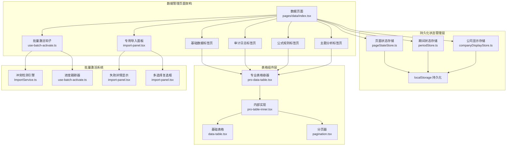
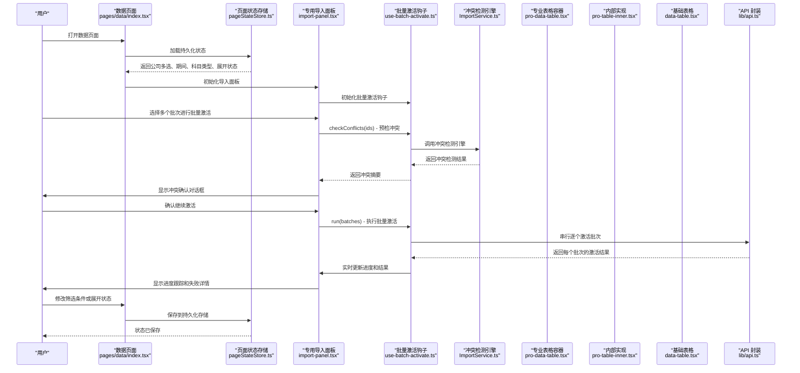
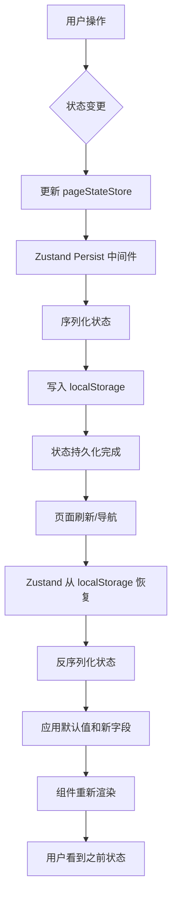
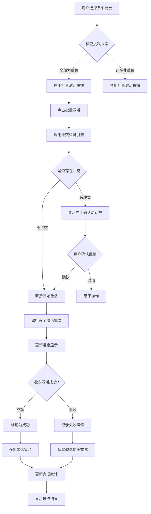
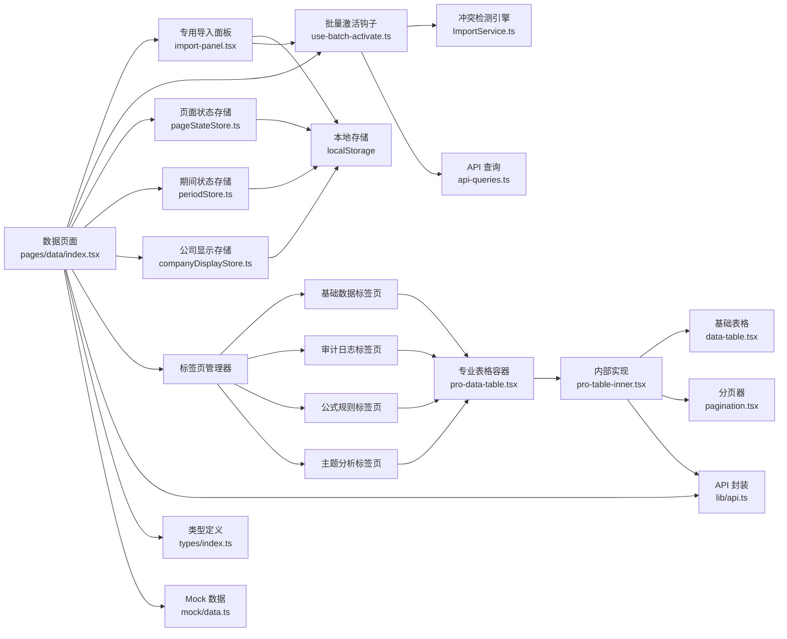

基于我的分析，我现在了解了数据管理页面的持久化状态实现。让我更新文档以反映这些变更：

<cite>
**本文引用的文件**   
- [web/src/stores/pageStateStore.ts](file://web/src/stores/pageStateStore.ts)
- [web/src/stores/periodStore.ts](file://web/src/stores/periodStore.ts)
- [web/src/stores/companyDisplayStore.ts](file://web/src/stores/companyDisplayStore.ts)
- [web/src/pages/data/index.tsx](file://web/src/pages/data/index.tsx)
- [web/src/components/filters/company-select.tsx](file://web/src/components/filters/company-select.tsx)
- [web/src/components/data-table/data-table.tsx](file://web/src/components/data-table/data-table.tsx)
- [web/src/components/data-table/pro-data-table.tsx](file://web/src/components/data-table/pro-data-table.tsx)
- [web/src/components/data-table/pro-table-inner.tsx](file://web/src/components/data-table/pro-table-inner.tsx)
- [web/src/components/data-table/pagination.tsx](file://web/src/components/data-table/pagination.tsx)
- [web/src/pages/data/import-panel.tsx](file://web/src/pages/data/import-panel.tsx)
- [web/src/hooks/use-batch-activate.ts](file://web/src/hooks/use-batch-activate.ts)
- [web/src/lib/api.ts](file://web/src/lib/api.ts)
- [web/src/types/index.ts](file://web/src/types/index.ts)
- [server/src/services/ImportService.ts](file://server/src/services/ImportService.ts)
</cite>

## 更新摘要
**变更内容**   
- **新增持久化状态管理**：实现了公司多选、期间筛选、科目类型选择和行展开状态的持久化存储
- **跨表组件状态保持**：交叉表组件现在在导航和页面刷新后保持行展开状态，提升大数据集可用性
- **Zustand + Persist架构**：采用 zustand/middleware 的 persist 功能实现 localStorage 持久化
- **智能状态验证**：自动校验失效的公司编码和期间，确保数据一致性
- **深合并持久化值**：支持结构演进时的安全状态迁移

## 目录
1. [简介](#简介)
2. [项目结构](#项目结构)
3. [核心组件](#核心组件)
4. [架构总览](#架构总览)
5. [详细组件分析](#详细组件分析)
6. [持久化状态管理系统](#持久化状态管理系统)
7. [批量激活功能详解](#批量激活功能详解)
8. [依赖关系分析](#依赖关系分析)
9. [性能与可访问性](#性能与可访问性)
10. [故障排查指南](#故障排查指南)
11. [结论](#结论)
12. [附录：扩展指南](#附录扩展指南)

## 简介
本文件面向"数据管理页面"的导入面板重构与数据质量概览增强设计，聚焦以下目标：
- 通用数据表格配置、动态列定义、交互式筛选等核心特性
- 增删改查（CRUD）、批量处理、数据校验等常用能力
- **专用导入面板组件**：独立的 import-panel.tsx 组件提供完整的数据导入功能
- **增强的数据质量概览**：支持可折叠部分展示和 localStorage 持久化存储
- **强大的批量激活功能**：包含冲突检测引擎、多选择复选框、进度跟踪和失败详情显示
- **持久化状态管理**：公司多选、期间筛选、科目类型选择和行展开状态的自动保存和恢复
- 搜索与过滤：全文检索、高级筛选、保存查询条件
- 可扩展的数据管理组件：自定义列渲染、操作按钮扩展、数据源适配

经过本次持久化状态管理的增强，数据管理页面现在能够在用户导航、页面刷新后自动恢复之前的筛选条件和视图状态，显著提升用户体验。

## 项目结构
围绕数据管理的导入面板重构，关键代码集中在以下位置：
- 数据表格组件族：data-table、pro-data-table、pro-table-inner、pagination
- **专用导入面板**：import-panel.tsx 组件负责数据导入功能
- **批量激活钩子**：use-batch-activate.ts 提供批量激活的核心逻辑
- **持久化状态存储**：pageStateStore.ts、periodStore.ts、companyDisplayStore.ts
- 四标签页数据页面：pages/data/index.tsx（包含基础数据、审计日志、公式规则、主题分析）
- 类型与 API：types/index.ts、lib/api.ts
- 后端服务：server/src/services/ImportService.ts（冲突检测引擎）

**更新** 新增了完整的持久化状态管理系统，通过 zustand + persist 模式实现公司多选、期间筛选、科目类型选择和行展开状态的自动保存和恢复。

图表来源
- [web/src/stores/pageStateStore.ts](file://web/src/stores/pageStateStore.ts)
- [web/src/stores/periodStore.ts](file://web/src/stores/periodStore.ts)
- [web/src/stores/companyDisplayStore.ts](file://web/src/stores/companyDisplayStore.ts)
- [web/src/pages/data/index.tsx](file://web/src/pages/data/index.tsx)
- [web/src/pages/data/import-panel.tsx](file://web/src/pages/data/import-panel.tsx)
- [web/src/hooks/use-batch-activate.ts](file://web/src/hooks/use-batch-activate.ts)
- [server/src/services/ImportService.ts](file://server/src/services/ImportService.ts)
- [web/src/components/data-table/pro-data-table.tsx](file://web/src/components/data-table/pro-data-table.tsx)
- [web/src/components/data-table/pro-table-inner.tsx](file://web/src/components/data-table/pro-table-inner.tsx)
- [web/src/components/data-table/data-table.tsx](file://web/src/components/data-table/data-table.tsx)
- [web/src/components/data-table/pagination.tsx](file://web/src/components/data-table/pagination.tsx)
- [web/src/lib/api.ts](file://web/src/lib/api.ts)
- [web/src/types/index.ts](file://web/src/types/index.ts)

章节来源
- [web/src/stores/pageStateStore.ts](file://web/src/stores/pageStateStore.ts)
- [web/src/stores/periodStore.ts](file://web/src/stores/periodStore.ts)
- [web/src/stores/companyDisplayStore.ts](file://web/src/stores/companyDisplayStore.ts)
- [web/src/pages/data/index.tsx](file://web/src/pages/data/index.tsx)
- [web/src/pages/data/import-panel.tsx](file://web/src/pages/data/import-panel.tsx)
- [web/src/hooks/use-batch-activate.ts](file://web/src/hooks/use-batch-activate.ts)
- [server/src/services/ImportService.ts](file://server/src/services/ImportService.ts)
- [web/src/components/data-table/pro-data-table.tsx](file://web/src/components/data-table/pro-data-table.tsx)
- [web/src/components/data-table/pro-table-inner.tsx](file://web/src/components/data-table/pro-table-inner.tsx)
- [web/src/components/data-table/data-table.tsx](file://web/src/components/data-table/data-table.tsx)
- [web/src/components/data-table/pagination.tsx](file://web/src/components/data-table/pagination.tsx)
- [web/src/lib/api.ts](file://web/src/lib/api.ts)
- [web/src/types/index.ts](file://web/src/types/index.ts)

## 核心组件
- 基础表格 data-table.tsx：负责行/列渲染、选择、排序、分页展示等基础能力
- 专业表格 pro-data-table.tsx：提供统一配置入口（列定义、筛选、搜索、分页、批量、导出等）
- 内部实现 pro-table-inner.tsx：承载状态、副作用、事件分发与视图切换逻辑
- 分页 pagination.tsx：封装页码、每页条数、跳转等交互
- **专用导入面板 import-panel.tsx**：独立的数据导入功能组件，支持文件上传、数据验证、进度显示等
- **批量激活钩子 use-batch-activate.ts**：提供批量激活的核心逻辑，包括冲突检测、进度跟踪、结果管理
- **持久化状态存储 pageStateStore.ts**：统一管理页面查询条件和视图状态的持久化
- **期间状态存储 periodStore.ts**：管理全局财年选择状态
- **公司显示存储 companyDisplayStore.ts**：管理公司简称显示偏好
- 四标签页数据页面 pages/data/index.tsx：组合上述组件，实现基础数据、审计日志、公式规则、主题分析四大功能模块

**更新** 通过新增的持久化状态管理系统，数据管理页面现在能够自动保存和恢复用户的筛选条件和视图状态，提供更好的用户体验。

章节来源
- [web/src/components/data-table/data-table.tsx](file://web/src/components/data-table/data-table.tsx)
- [web/src/components/data-table/pro-data-table.tsx](file://web/src/components/data-table/pro-data-table.tsx)
- [web/src/components/data-table/pro-table-inner.tsx](file://web/src/components/data-table/pro-table-inner.tsx)
- [web/src/components/data-table/pagination.tsx](file://web/src/components/data-table/pagination.tsx)
- [web/src/pages/data/import-panel.tsx](file://web/src/pages/data/import-panel.tsx)
- [web/src/hooks/use-batch-activate.ts](file://web/src/hooks/use-batch-activate.ts)
- [web/src/stores/pageStateStore.ts](file://web/src/stores/pageStateStore.ts)
- [web/src/stores/periodStore.ts](file://web/src/stores/periodStore.ts)
- [web/src/stores/companyDisplayStore.ts](file://web/src/stores/companyDisplayStore.ts)
- [web/src/pages/data/index.tsx](file://web/src/pages/data/index.tsx)

## 架构总览
下图展示了重构后的数据管理页面架构，包括持久化状态管理、专用导入面板、批量激活系统和数据质量概览功能的端到端调用链路与职责划分：

**更新** 新增了完整的持久化状态管理系统，通过 zustand + persist 模式实现状态的自动保存和恢复，提升了用户体验。

图表来源
- [web/src/pages/data/index.tsx](file://web/src/pages/data/index.tsx)
- [web/src/stores/pageStateStore.ts](file://web/src/stores/pageStateStore.ts)
- [web/src/pages/data/import-panel.tsx](file://web/src/pages/data/import-panel.tsx)
- [web/src/hooks/use-batch-activate.ts](file://web/src/hooks/use-batch-activate.ts)
- [server/src/services/ImportService.ts](file://server/src/services/ImportService.ts)
- [web/src/components/data-table/pro-data-table.tsx](file://web/src/components/data-table/pro-data-table.tsx)
- [web/src/components/data-table/pro-table-inner.tsx](file://web/src/components/data-table/pro-table-inner.tsx)
- [web/src/components/data-table/data-table.tsx](file://web/src/components/data-table/data-table.tsx)
- [web/src/lib/api.ts](file://web/src/lib/api.ts)

## 详细组件分析

### 持久化状态管理系统
- **页面状态存储 pageStateStore.ts**
  - 使用 zustand + persist 中间件实现 localStorage 持久化
  - 管理 DataBrowseState：公司多选、期间、科目类型、行展开状态
  - 支持深合并持久化值，确保结构演进时的安全迁移
  - 提供统一的 setDataBrowse 接口更新状态

- **期间状态存储 periodStore.ts**
  - 管理全局财年选择状态
  - 提供 filterPeriodsByFiscalYear 函数按财年过滤期间列表
  - 支持 null 过渡态处理

- **公司显示存储 companyDisplayStore.ts**
  - 管理公司简称显示偏好
  - 全局开关控制所有公司名称显示格式

- **关键特性**
  - **自动持久化**：状态变化自动保存到 localStorage
  - **智能恢复**：页面刷新或路由切换后自动恢复状态
  - **状态验证**：自动校验失效的公司编码和期间
  - **深合并机制**：支持新增字段的安全迁移

**更新** 全新的持久化状态管理系统为数据管理页面提供了强大的状态管理能力，确保用户操作的连续性。

章节来源
- [web/src/stores/pageStateStore.ts](file://web/src/stores/pageStateStore.ts)
- [web/src/stores/periodStore.ts](file://web/src/stores/periodStore.ts)
- [web/src/stores/companyDisplayStore.ts](file://web/src/stores/companyDisplayStore.ts)

### 专用导入面板 import-panel.tsx
- 职责
  - 实现完整的数据导入功能：文件上传、格式验证、数据预览、批量导入
  - 管理导入状态：上传进度、验证结果、导入历史
  - 提供数据质量概览：统计信息、错误报告、质量指标
  - **集成批量激活功能**：支持多批次选择和批量激活操作
- 关键特性
  - **可折叠部分**：支持展开/收起不同质量概览区域，优化界面空间利用
  - **localStorage 持久化**：保存用户的导入设置和质量偏好
  - **实时验证**：在导入过程中提供即时反馈和错误提示
  - **进度跟踪**：显示导入进度和状态变化
  - **多选择复选框**：智能的多选功能，仅允许草稿状态的批次被选中
  - **批量激活按钮**：根据选中数量动态显示批量激活选项
  - **失败详情显示**：详细展示每个批次的激活结果和错误信息

**更新** 专用的导入面板组件现在集成了完整的批量激活功能和持久化状态管理，提供了更强大的数据管理能力。

章节来源
- [web/src/pages/data/import-panel.tsx](file://web/src/pages/data/import-panel.tsx)

### 批量激活钩子 use-batch-activate.ts
- 职责
  - 管理批量激活的完整生命周期：冲突检测、进度跟踪、结果汇总
  - 提供统一的批量激活接口供各个组件复用
  - 维护激活过程中的状态：进度、结果、忙闲状态
- 关键特性
  - **冲突检测**：调用后端冲突检测引擎，预检激活后将替换的已生效组合
  - **串行激活**：按顺序逐个激活批次，单批失败不中断其余批次
  - **进度跟踪**：实时更新当前处理的批次和整体进度
  - **结果管理**：维护每个批次的激活结果，区分成功和失败
  - **失败详情**：记录失败批次的详细信息，便于用户重试
  - **状态清理**：提供清理机制，重置激活状态

**更新** 新增的批量激活钩子是整个批量激活系统的核心，提供了完整的批量处理能力和状态管理。

章节来源
- [web/src/hooks/use-batch-activate.ts](file://web/src/hooks/use-batch-activate.ts)

### 四标签页数据页面 pages/data/index.tsx
- 职责
  - 实现基础数据、审计日志、公式规则、主题分析四个标签页的组织和切换
  - **集成专用导入面板**：在合适的位置嵌入 import-panel.tsx 组件
  - **集成批量激活钩子**：为导入面板提供批量激活功能支持
  - **集成持久化状态管理**：使用 pageStateStore 管理筛选条件和视图状态
  - 为每个标签页配置独立的列定义、筛选条件、操作按钮和业务逻辑
  - 管理标签页间的状态共享和数据同步
- 关键点
  - 标签页配置集中化：将四个标签页的配置统一管理，便于维护和扩展
  - **导入面板集成**：通过 props 向导入面板传递必要的配置和回调函数
  - **批量激活集成**：为导入面板提供批量激活钩子的实例
  - **持久化状态集成**：使用 usePageStore 获取和更新数据浏览状态
  - 权限控制：结合权限系统控制不同标签页和操作的可访问性
  - 性能优化：懒加载标签页内容，减少初始加载时间

**更新** 重构后的页面集成了新的专用导入面板、批量激活功能和持久化状态管理，移除了原有的内联导入逻辑，使页面结构更加清晰。

章节来源
- [web/src/pages/data/index.tsx](file://web/src/pages/data/index.tsx)

### 冲突检测引擎 ImportService.ts
- 职责
  - 实现复杂的冲突检测逻辑，支持多种数据类型的冲突识别
  - 检测单个批次与现有数据的冲突
  - 检测多个选中批次之间的相互冲突
  - 生成详细的冲突描述信息，用于用户确认
- 关键特性
  - **多类型支持**：支持交易明细、经营数据、静态数据、预算数据等不同类型的冲突检测
  - **三元组检测**：针对交易数据，检测公司、期间、往来类型的三元组冲突
  - **批次间重叠**：检测多个选中批次之间的数据重叠情况
  - **详细冲突信息**：返回具体的冲突项目和影响范围
  - **幂等性保证**：对非草稿状态的批次直接返回无冲突结果

**更新** 新增的冲突检测引擎是批量激活功能的核心，确保数据的一致性和完整性。

章节来源
- [server/src/services/ImportService.ts](file://server/src/services/ImportService.ts)

### 公司多选组件 CompanyMultiSelect
- 职责
  - 提供公司多选筛选功能
  - 支持全选、清空、单选等操作
  - 动态显示选中公司的名称和数量
  - 跟随全局"显示简称"开关切换名称显示格式
- 关键特性
  - **下拉菜单式选择**：使用 DropdownMenu 实现复选框式选择
  - **智能触发器文案**：显示"全部公司"、首选名称或"首选名称 等 N 家"
  - **实体公司过滤**：支持仅列出单体公司（type === 'entity'）
  - **全选范围控制**：支持限定全选范围为实体公司或全部公司
  - **响应式设计**：在小屏设备上自适应宽度

**更新** 公司多选组件与持久化状态系统集成，支持状态的自动保存和恢复。

章节来源
- [web/src/components/filters/company-select.tsx](file://web/src/components/filters/company-select.tsx)

### 专业表格容器 pro-data-table.tsx
- 职责
  - 暴露统一的 props 接口：列定义、筛选器、搜索框、分页、批量操作、导出、权限控制等
  - 将复杂状态与副作用下沉至内部实现，对外保持简洁
- 关键设计点
  - 配置即渲染：通过列定义驱动表头、单元格渲染、排序与筛选
  - 行为开关：是否支持多选、批量删除、导出、树形展开等
  - 与页面解耦：页面仅关心业务数据与回调，不感知内部状态

**更新** 保持了原有的优秀设计，与新导入面板组件和持久化状态系统协同工作，提供一致的用户体验。

章节来源
- [web/src/components/data-table/pro-data-table.tsx](file://web/src/components/data-table/pro-data-table.tsx)

### 内部实现 pro-table-inner.tsx
- 职责
  - 维护筛选、搜索、分页、选中项、加载态、错误态等状态
  - 协调 API 请求与本地缓存，触发重渲染
  - 分发用户交互：排序、筛选、翻页、批量操作、导出
- 关键流程
  - 首次加载：根据初始筛选与分页参数拉取数据
  - 交互更新：搜索/筛选变化时合并参数并重新请求
  - 批量操作：收集选中项，调用批量 API，成功后刷新列表
  - 错误处理：网络异常、业务错误统一提示与降级

**更新** 优化了状态更新逻辑，与新导入面板组件和持久化状态系统配合，提供更好的数据管理体验。

章节来源
- [web/src/components/data-table/pro-table-inner.tsx](file://web/src/components/data-table/pro-table-inner.tsx)

### 基础表格 data-table.tsx
- 职责
  - 基于列定义渲染表头与行内容
  - 支持行选择、排序、展开（树形）等展示能力
- 关键点
  - 列渲染函数化：允许自定义单元格渲染、操作按钮、标签样式等
  - 选择态与行键：通过唯一键关联行数据，保证选择正确性
  - 树形支持：当数据具备父子关系时，可启用树形展示

**更新** 简化了渲染逻辑，与新导入面板的数据展示需求和持久化状态系统更好地兼容。

章节来源
- [web/src/components/data-table/data-table.tsx](file://web/src/components/data-table/data-table.tsx)

### 分页 pagination.tsx
- 职责
  - 提供页码、每页条数、跳转等交互
  - 与内部实现联动，触发分页变更事件
- 关键点
  - 边界保护：防止越界页码
  - 响应式：在小屏下简化展示

章节来源
- [web/src/components/data-table/pagination.tsx](file://web/src/components/data-table/pagination.tsx)

## 持久化状态管理系统

### DataBrowseState 数据结构
数据浏览状态包含以下关键字段：
- **companies**: string[] - 公司多选，空数组表示全部公司
- **period**: string - 期间筛选，空字符串表示最新期间
- **subjectType**: 'operating' | 'static' - 科目类型选择
- **expandedRows**: string[] - 展开行编码数组（Set 序列化为数组便于持久化）

### 状态持久化机制
- **Zustand + Persist 模式**：使用 zustand/middleware 的 persist 功能
- **localStorage 存储**：状态自动序列化到 localStorage
- **版本控制**：支持状态结构的版本管理和迁移
- **深合并策略**：新字段自动补全默认值，旧字段保留

### 状态验证和回退
- **公司编码验证**：检查公司编码是否有效，失效时自动过滤
- **期间验证**：检查期间是否在候选列表中，失效时回退到最新期间
- **财年过滤**：根据全局财年选择过滤可用期间列表

### 跨表组件状态保持
- **行展开状态**：多层级科目的展开/收起状态持久化
- **导航保持**：页面导航和刷新后保持展开状态
- **大数据集优化**：提升大数据集的可用性和用户体验

**更新** 全新的持久化状态管理系统确保了用户操作的连续性和一致性，显著提升了大数据集的处理体验。

图表来源
- [web/src/stores/pageStateStore.ts](file://web/src/stores/pageStateStore.ts)
- [web/src/pages/data/index.tsx](file://web/src/pages/data/index.tsx)

## 批量激活功能详解

### 冲突检测引擎
冲突检测引擎是批量激活功能的核心，负责检测数据激活后可能产生的冲突：

- **交易明细冲突检测**：检测公司、期间、往来类型的三元组冲突，计算现有数据笔数
- **经营数据冲突检测**：检测期间维度的数据冲突
- **静态数据冲突检测**：检测快照日期的月度冲突
- **预算数据冲突检测**：检测财年维度的预算覆盖
- **批次间重叠检测**：检测多个选中批次之间的数据重叠情况

### 多选择复选框系统
批次管理表中的多选择复选框提供了智能化的批量选择功能：

- **状态过滤**：仅允许草稿状态的批次被选中
- **全选功能**：支持对所有可选批次的全选/全取消操作
- **部分选择**：支持部分选择的 indeterminate 状态显示
- **动态禁用**：在批量激活进行中禁用所有复选框

### 进度跟踪系统
实时跟踪批量激活的进度状态：

- **进度显示**：显示当前处理的批次序号和文件名
- **状态统计**：显示已完成和待处理的批次数量
- **忙闲状态**：防止重复操作，确保操作的安全性

### 失败详情显示
详细的失败信息展示，帮助用户快速定位和解决问题：

- **失败列表**：单独展示所有失败的批次及其错误信息
- **保留勾选**：失败的批次保持勾选状态，便于用户处理后重试
- **错误详情**：显示具体的错误消息，指导用户进行问题修复

**更新** 批量激活功能提供了完整的冲突检测、进度跟踪和失败处理机制，确保数据操作的安全性和可靠性。

图表来源
- [web/src/pages/data/import-panel.tsx](file://web/src/pages/data/import-panel.tsx)
- [web/src/hooks/use-batch-activate.ts](file://web/src/hooks/use-batch-activate.ts)
- [server/src/services/ImportService.ts](file://server/src/services/ImportService.ts)

## 依赖关系分析
- 四标签页数据页面依赖标签页管理器与各标签页配置
- **专用导入面板依赖**：import-panel.tsx 依赖 localStorage 进行数据持久化和批量激活钩子
- **批量激活钩子依赖**：use-batch-activate.ts 依赖 API 查询和冲突检测引擎
- **持久化状态依赖**：pageStateStore.ts 依赖 zustand + persist 中间件
- 每个标签页依赖专业表格容器与对应的业务配置
- 专业表格容器依赖内部实现与基础表格
- 内部实现依赖 API 层与类型定义
- 基础表格依赖 UI 原子组件（如按钮、对话框等）

**更新** 新增了持久化状态管理的依赖关系，形成了更加完整的数据管理架构。

图表来源
- [web/src/pages/data/index.tsx](file://web/src/pages/data/index.tsx)
- [web/src/pages/data/import-panel.tsx](file://web/src/pages/data/import-panel.tsx)
- [web/src/hooks/use-batch-activate.ts](file://web/src/hooks/use-batch-activate.ts)
- [web/src/stores/pageStateStore.ts](file://web/src/stores/pageStateStore.ts)
- [web/src/stores/periodStore.ts](file://web/src/stores/periodStore.ts)
- [web/src/stores/companyDisplayStore.ts](file://web/src/stores/companyDisplayStore.ts)
- [server/src/services/ImportService.ts](file://server/src/services/ImportService.ts)
- [web/src/components/data-table/pro-data-table.tsx](file://web/src/components/data-table/pro-data-table.tsx)
- [web/src/components/data-table/pro-table-inner.tsx](file://web/src/components/data-table/pro-table-inner.tsx)
- [web/src/components/data-table/data-table.tsx](file://web/src/components/data-table/data-table.tsx)
- [web/src/components/data-table/pagination.tsx](file://web/src/components/data-table/pagination.tsx)
- [web/src/lib/api.ts](file://web/src/lib/api.ts)
- [web/src/types/index.ts](file://web/src/types/index.ts)

章节来源
- [web/src/pages/data/index.tsx](file://web/src/pages/data/index.tsx)
- [web/src/pages/data/import-panel.tsx](file://web/src/pages/data/import-panel.tsx)
- [web/src/hooks/use-batch-activate.ts](file://web/src/hooks/use-batch-activate.ts)
- [web/src/stores/pageStateStore.ts](file://web/src/stores/pageStateStore.ts)
- [web/src/stores/periodStore.ts](file://web/src/stores/periodStore.ts)
- [web/src/stores/companyDisplayStore.ts](file://web/src/stores/companyDisplayStore.ts)
- [server/src/services/ImportService.ts](file://server/src/services/ImportService.ts)
- [web/src/components/data-table/pro-data-table.tsx](file://web/src/components/data-table/pro-data-table.tsx)
- [web/src/components/data-table/pro-table-inner.tsx](file://web/src/components/data-table/pro-table-inner.tsx)
- [web/src/components/data-table/data-table.tsx](file://web/src/components/data-table/data-table.tsx)
- [web/src/components/data-table/pagination.tsx](file://web/src/components/data-table/pagination.tsx)
- [web/src/lib/api.ts](file://web/src/lib/api.ts)
- [web/src/types/index.ts](file://web/src/types/index.ts)

## 性能与可访问性
- 大数据量
  - 服务端分页与筛选优先，避免一次性加载全量数据
  - 虚拟滚动可在超大数据集场景考虑引入
- 渲染优化
  - 列渲染函数尽量轻量，避免在单元格内执行昂贵计算
  - 使用稳定 key 减少不必要的重渲染
  - **专用导入面板采用独立组件架构**，避免影响主页面的渲染性能
  - **批量激活操作异步执行**，避免阻塞主线程
  - **持久化状态操作异步处理**，避免阻塞主线程
- 标签页优化
  - 标签页状态隔离，避免相互影响
  - 预加载常用标签页数据，提升切换体验
  - 标签页内容缓存，减少重复请求
- 网络与缓存
  - 对相同参数的请求做去抖与缓存，提升交互流畅度
  - **导入面板的 localStorage 操作进行了异步处理**，避免阻塞主线程
  - **批量激活的串行处理避免了并发请求导致的资源竞争**
  - **持久化状态使用 zustand 内存缓存，减少 localStorage 读写频率**
- 可访问性
  - 为关键交互元素提供语义化标签与键盘导航支持
  - 错误提示与加载态需清晰传达给用户
  - **新增导入面板的可访问性支持**，包括屏幕阅读器兼容性和键盘导航
  - **批量激活的进度状态通过 aria-live 区域播报**，提升无障碍体验
  - **公司多选组件支持键盘导航和屏幕阅读器**

## 故障排查指南
- 列表不刷新
  - 检查筛选/搜索参数是否正确合并并触发重新请求
  - 确认 API 返回结构与类型定义一致
- 批量操作无效
  - 核对选中项集合是否为空
  - 检查批量 API 的请求体格式与权限
- 分页异常
  - 验证当前页码与总页数边界
  - 确认后端返回的分页字段映射正确
- 树形展开无数据
  - 检查数据是否包含父子关系字段
  - 确认展开回调与懒加载逻辑
- **导入面板问题**
  - 检查 localStorage 是否可用和存储空间限制
  - 验证导入文件格式和数据结构
  - 确认导入 API 的权限和参数配置
  - 检查可折叠部分的展开/收起状态管理
- **数据质量概览问题**
  - 检查 localStorage 读写权限
  - 验证数据质量指标的准确性
  - 确认可折叠部分的默认状态设置
- **批量激活问题**
  - 检查冲突检测引擎的返回值格式
  - 验证批次状态过滤逻辑（仅草稿状态可激活）
  - 确认串行激活的错误处理机制
  - 检查进度跟踪的状态更新频率
  - 验证失败详情的错误信息捕获
- **持久化状态问题**
  - 检查 zustand persist 中间件配置
  - 验证 localStorage 存储配额限制
  - 确认状态序列化和反序列化正常
  - 检查状态版本兼容性
  - 验证状态验证和回退逻辑
- **性能问题**
  - 检查是否存在不必要的全量数据加载
  - 确认渲染函数中没有重型计算
  - 验证状态更新是否过于频繁
  - 检查标签页缓存策略是否合理
  - **监控导入面板的内存使用和 localStorage 操作频率**
  - **监控批量激活的并发请求和资源占用**
  - **监控持久化状态的读写频率和性能**

章节来源
- [web/src/components/data-table/pro-table-inner.tsx](file://web/src/components/data-table/pro-table-inner.tsx)
- [web/src/pages/data/import-panel.tsx](file://web/src/pages/data/import-panel.tsx)
- [web/src/hooks/use-batch-activate.ts](file://web/src/hooks/use-batch-activate.ts)
- [web/src/stores/pageStateStore.ts](file://web/src/stores/pageStateStore.ts)
- [web/src/stores/periodStore.ts](file://web/src/stores/periodStore.ts)
- [web/src/stores/companyDisplayStore.ts](file://web/src/stores/companyDisplayStore.ts)
- [server/src/services/ImportService.ts](file://server/src/services/ImportService.ts)
- [web/src/lib/api.ts](file://web/src/lib/api.ts)
- [web/src/types/index.ts](file://web/src/types/index.ts)
- [web/src/pages/data/index.tsx](file://web/src/pages/data/index.tsx)

## 结论
通过"专用导入面板 + 四标签页架构 + 专业表格容器 + 内部实现 + 基础表格 + 批量激活系统 + 持久化状态管理"的分层设计，数据管理页面实现了高内聚、低耦合的可复用方案。**新增的持久化状态管理系统**通过 zustand + persist 模式实现了公司多选、期间筛选、科目类型选择和行展开状态的自动保存和恢复，显著提升了用户体验。**新增的批量激活功能**包括冲突检测引擎、多选择复选框、进度跟踪和失败详情显示，进一步增强了数据操作的效率和安全性。专用导入面板组件的引入使得数据导入功能更加模块化和可维护，同时增强的数据质量概览功能提供了更好的用户体验。配合类型定义与 API 封装，能够快速搭建具备筛选、搜索、分页、批量、导出、树形等多能力的通用数据界面。经过本次持久化状态管理和批量激活功能增强，界面结构更加清晰，功能模块化程度更高，性能表现更佳，可维护性显著提升。后续可按扩展指南按需定制列渲染、操作按钮与数据源适配。

## 附录：扩展指南

### 持久化状态管理扩展
- **新增状态字段**：在 pageStateStore.ts 中扩展 DataBrowseState 接口
- **默认值配置**：为新字段添加合适的默认值
- **状态验证**：实现新字段的验证和回退逻辑
- **版本迁移**：处理状态结构的版本升级

章节来源
- [web/src/stores/pageStateStore.ts](file://web/src/stores/pageStateStore.ts)

### 批量激活功能扩展
- **冲突检测扩展**：在 ImportService.ts 中添加新的数据类型冲突检测逻辑
- **进度跟踪定制**：修改 use-batch-activate.ts 中的进度更新策略
- **失败处理增强**：扩展失败详情的显示格式和错误分类
- **批量操作集成**：在其他页面中复用 use-batch-activate 钩子

章节来源
- [web/src/hooks/use-batch-activate.ts](file://web/src/hooks/use-batch-activate.ts)
- [server/src/services/ImportService.ts](file://server/src/services/ImportService.ts)

### 专用导入面板扩展
- **组件集成**：在需要的页面中直接引入 import-panel.tsx 组件
- **配置选项**：通过 props 配置导入模式、验证规则、回调函数等
- **样式定制**：支持自定义导入面板的外观和行为
- **事件监听**：监听导入进度、完成、错误等事件
- **交互改进**：利用新的交互接口提供更流畅的用户体验

章节来源
- [web/src/pages/data/import-panel.tsx](file://web/src/pages/data/import-panel.tsx)

### 自定义列渲染
- 在列定义中提供单元格渲染函数，按字段值返回不同 UI（如标签、进度条、链接等）
- 注意性能：避免在渲染函数中进行异步或重型计算
- **重构后提供了更清晰的渲染接口**，便于扩展和定制，更好地支持四标签页的不同展示需求

章节来源
- [web/src/components/data-table/data-table.tsx](file://web/src/components/data-table/data-table.tsx)
- [web/src/types/index.ts](file://web/src/types/index.ts)

### 操作按钮扩展
- 在列定义中注册操作按钮，支持编辑、删除、查看等
- 结合权限系统控制按钮可见性与可用性
- 批量操作可通过容器提供的批量回调实现
- **操作按钮的注册和配置更加简洁明了**，支持四标签页的差异化操作需求

章节来源
- [web/src/components/data-table/pro-data-table.tsx](file://web/src/components/data-table/pro-data-table.tsx)
- [web/src/pages/data/index.tsx](file://web/src/pages/data/index.tsx)

### 数据源适配
- 在 API 层统一封装请求与响应转换，屏蔽后端差异
- 在内部实现中处理错误与重试策略，确保用户体验一致
- 使用 Mock 数据快速联调与演示
- **数据源适配接口更加标准化**，便于集成不同的后端服务，支持四标签页的多数据源需求

章节来源
- [web/src/lib/api.ts](file://web/src/lib/api.ts)
- [web/src/mock/data.ts](file://web/src/mock/data.ts)
- [web/src/components/data-table/pro-table-inner.tsx](file://web/src/components/data-table/pro-table-inner.tsx)

### 多标签页架构扩展
- 基础数据标签页：传统的数据表格管理功能
- 审计日志标签页：系统操作记录查询、筛选和导出
- 公式规则标签页：业务公式配置、验证和管理
- 主题分析标签页：数据分析图表和可视化展示
- **新增标签页扩展机制**，支持动态添加新的功能标签页

章节来源
- [web/src/pages/data/index.tsx](file://web/src/pages/data/index.tsx)

### 搜索与过滤
- 全文检索：在搜索框输入关键词，触发服务端或客户端检索
- 高级筛选：通过筛选器组合多个条件，生成查询参数
- 保存查询条件：将筛选与搜索参数持久化，支持分享与恢复
- **搜索和过滤逻辑更加高效**，支持更复杂的查询场景，每个标签页都有独立的筛选配置

章节来源
- [web/src/components/data-table/pro-data-table.tsx](file://web/src/components/data-table/pro-data-table.tsx)
- [web/src/components/data-table/pro-table-inner.tsx](file://web/src/components/data-table/pro-table-inner.tsx)

### 数据校验
- 表单校验：新增/编辑时使用规则引擎进行必填、格式、范围等校验
- 批量校验：批量导入或批量修改前进行预校验，失败则定位问题行
- 错误反馈：统一错误提示与定位，帮助用户快速修正
- **校验逻辑更加完善**，错误提示更加友好，支持四标签页的差异化校验需求

章节来源
- [web/src/pages/data/index.tsx](file://web/src/pages/data/index.tsx)
- [web/src/lib/api.ts](file://web/src/lib/api.ts)

### 标签页状态管理
- 标签页配置管理：集中管理四个标签页的配置信息
- 状态隔离：确保各标签页状态互不影响
- 懒加载：按需加载标签页内容，提升性能
- 缓存策略：合理缓存标签页数据，减少重复请求
- **新增标签页状态管理机制**，提供更好的用户体验和性能表现

章节来源
- [web/src/pages/data/index.tsx](file://web/src/pages/data/index.tsx)

### 数据质量概览扩展
- **可折叠部分管理**：支持动态添加和配置不同的质量概览区域
- **localStorage 持久化**：自动保存用户的界面偏好和设置
- **实时更新**：监听数据变化，自动更新质量指标
- **自定义指标**：支持添加业务特定的质量评估指标
- **数据质量概览功能提供了灵活的扩展机制**，便于根据业务需求定制质量监控界面

章节来源
- [web/src/pages/data/import-panel.tsx](file://web/src/pages/data/import-panel.tsx)

### 冲突检测引擎扩展
- **新数据类型支持**：在 ImportService.ts 中添加新的数据类型冲突检测逻辑
- **冲突规则定制**：根据业务需求调整冲突检测规则和严重程度
- **批量冲突优化**：优化大规模批次的冲突检测性能
- **冲突信息丰富化**：提供更详细的冲突描述和影响分析

章节来源
- [server/src/services/ImportService.ts](file://server/src/services/ImportService.ts)

### 多选择复选框扩展
- **自定义选择规则**：根据业务需求定制可选择的数据行
- **选择状态持久化**：保存用户的选择状态，刷新后恢复
- **选择性能优化**：大量数据时的选择性能优化
- **选择反馈增强**：提供更直观的选择状态反馈

章节来源
- [web/src/components/filters/company-select.tsx](file://web/src/components/filters/company-select.tsx)
- [web/src/pages/data/import-panel.tsx](file://web/src/pages/data/import-panel.tsx)

### 跨表组件状态保持扩展
- **行展开状态管理**：支持多层级数据的展开/收起状态持久化
- **导航状态保持**：页面导航和刷新后保持用户操作状态
- **大数据集优化**：提升大数据集的处理性能和用户体验
- **状态同步机制**：确保状态在不同组件间的同步一致性

章节来源
- [web/src/pages/data/index.tsx](file://web/src/pages/data/index.tsx)
- [web/src/stores/pageStateStore.ts](file://web/src/stores/pageStateStore.ts)