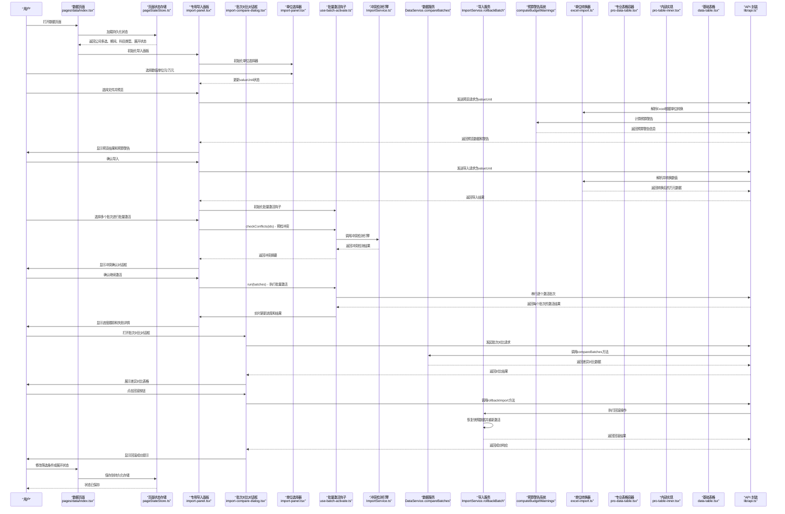
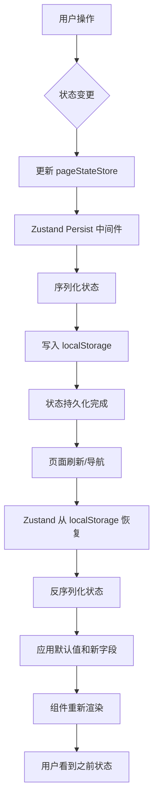
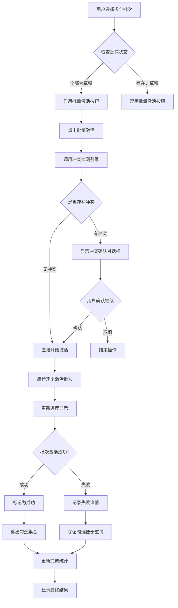
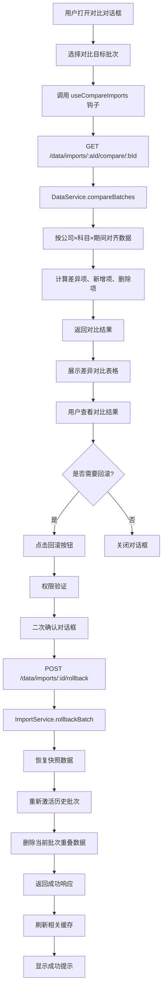
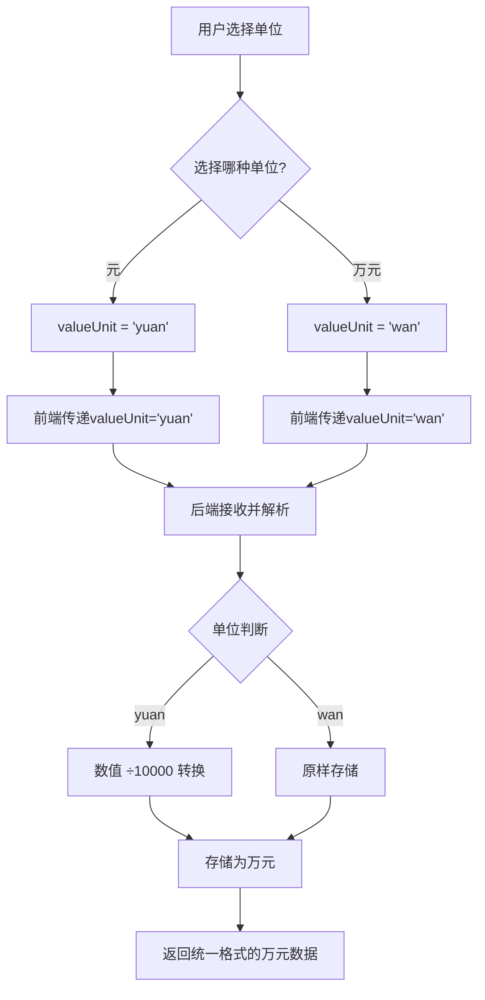
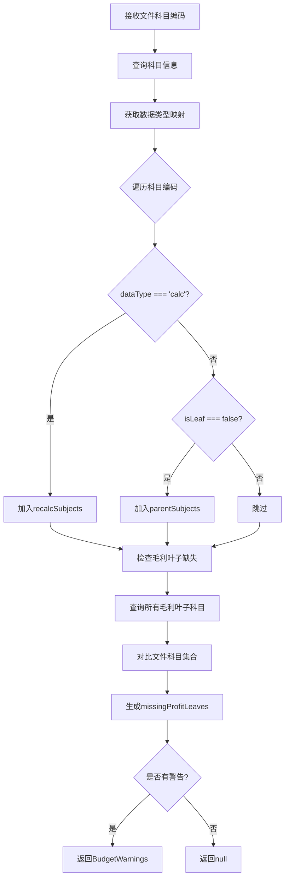
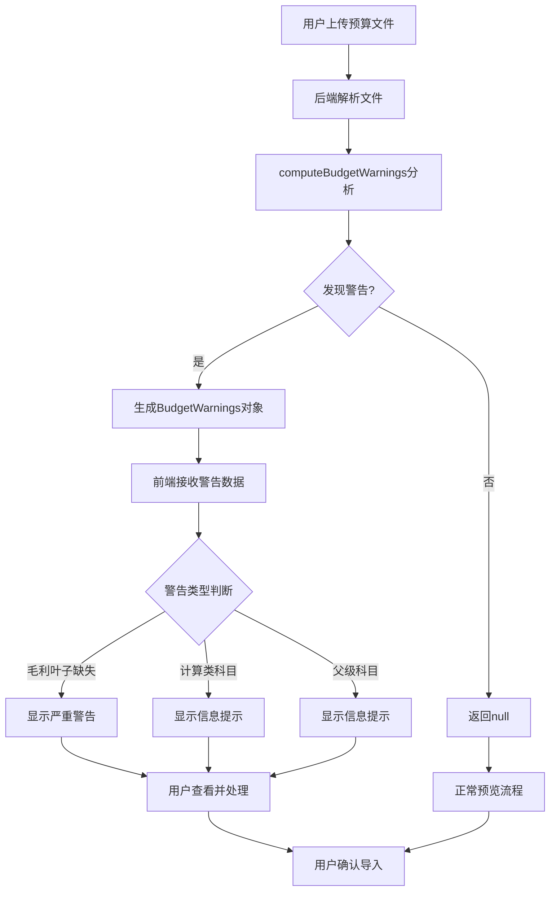
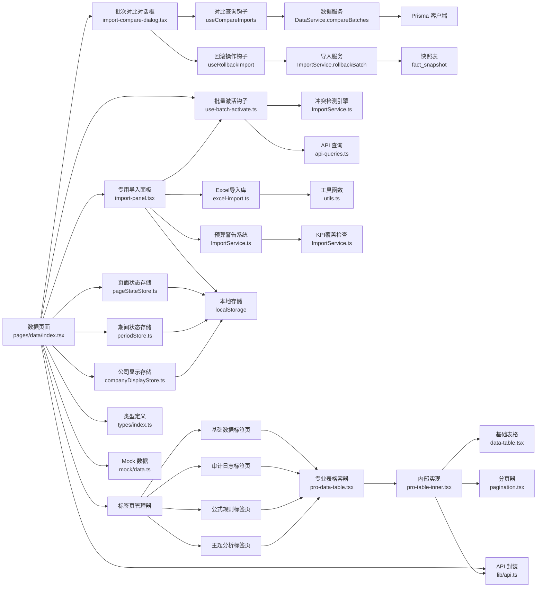

# 数据管理页面

<cite>
**本文引用的文件**   
- [web/src/stores/pageStateStore.ts](file://web/src/stores/pageStateStore.ts)
- [web/src/stores/periodStore.ts](file://web/src/stores/periodStore.ts)
- [web/src/stores/companyDisplayStore.ts](file://web/src/stores/companyDisplayStore.ts)
- [web/src/pages/data/index.tsx](file://web/src/pages/data/index.tsx)
- [web/src/components/filters/company-select.tsx](file://web/src/components/filters/company-select.tsx)
- [web/src/components/data-table/data-table.tsx](file://web/src/components/data-table/data-table.tsx)
- [web/src/components/data-table/pro-data-table.tsx](file://web/src/components/data-table/pro-data-table.tsx)
- [web/src/components/data-table/pro-table-inner.tsx](file://web/src/components/data-table/pro-table-inner.tsx)
- [web/src/components/data-table/pagination.tsx](file://web/src/components/data-table/pagination.tsx)
- [web/src/pages/data/import-panel.tsx](file://web/src/pages/data/import-panel.tsx)
- [web/src/pages/data/import-compare-dialog.tsx](file://web/src/pages/data/import-compare-dialog.tsx)
- [web/src/hooks/use-batch-activate.ts](file://web/src/hooks/use-batch-activate.ts)
- [web/src/hooks/api-queries.ts](file://web/src/hooks/api-queries.ts)
- [web/src/lib/api.ts](file://web/src/lib/api.ts)
- [web/src/types/index.ts](file://web/src/types/index.ts)
- [server/src/services/ImportService.ts](file://server/src/services/ImportService.ts)
- [server/src/services/DataService.ts](file://server/src/services/DataService.ts)
- [server/src/routes/data.ts](file://server/src/routes/data.ts)
- [server/prisma/migrations/20260804090000_add_fact_snapshot/migration.sql](file://server/prisma/migrations/20260804090000_add_fact_snapshot/migration.sql)
- [web/src/lib/utils.ts](file://web/src/lib/utils.ts)
- [server/src/lib/excel-import.ts](file://server/src/lib/excel-import.ts)
</cite>

## 更新摘要
**变更内容**   
- **批次差异对比与快照回滚系统**：新增 import-compare-dialog 组件，支持两个批次的指标值差异对比（按公司×科目×期间对齐）
- **增强 ImportService 回滚功能**：实现 rollbackBatch 方法，支持恢复快照数据并重新激活历史批次
- **新增 fact_snapshot 表**：用于存储被覆盖数据的快照，支撑批次回滚功能
- **前后端对比接口**：新增 compareBatches 方法和 /data/imports/:aId/compare/:bId 路由
- **权限控制**：回滚操作需要 data:import:rollback 权限，仅 superadmin 可执行
- **用户界面增强**：提供差异对比表格、汇总统计和一键回滚功能

## 目录
1. [简介](#简介)
2. [项目结构](#项目结构)
3. [核心组件](#核心组件)
4. [架构总览](#架构总览)
5. [详细组件分析](#详细组件分析)
6. [持久化状态管理系统](#持久化状态管理系统)
7. [批量激活功能详解](#批量激活功能详解)
8. **批次差异对比与快照回滚系统**
9. [金额单位选择功能](#金额单位选择功能)
10. [预算导入警告系统](#预算导入警告系统)
11. [依赖关系分析](#依赖关系分析)
12. [性能与可访问性](#性能与可访问性)
13. [故障排查指南](#故障排查指南)
14. [结论](#结论)
15. [附录：扩展指南](#附录扩展指南)

## 简介
本文件面向"数据管理页面"的导入面板重构与数据质量概览增强设计，聚焦以下目标：
- 通用数据表格配置、动态列定义、交互式筛选等核心特性
- 增删改查（CRUD）、批量处理、数据校验等常用能力
- **专用导入面板组件**：独立的 import-panel.tsx 组件提供完整的数据导入功能
- **批次差异对比与快照回滚**：新增 import-compare-dialog 组件，支持批次间数据对比和安全回滚
- **增强的数据质量概览**：支持可折叠部分展示和 localStorage 持久化存储
- **强大的批量激活功能**：包含冲突检测引擎、多选择复选框、进度跟踪和失败详情显示
- **持久化状态管理**：公司多选、期间筛选、科目类型选择和行展开状态的自动保存和恢复
- **金额单位选择功能**：支持用户在导入时选择"元"或"万元"单位，系统自动处理数值转换
- **预算导入警告系统**：在预览阶段提供详细的预算口径告警，确保数据导入的正确性
- 搜索与过滤：全文检索、高级筛选、保存查询条件
- 可扩展的数据管理组件：自定义列渲染、操作按钮扩展、数据源适配

经过本次批次差异对比与快照回滚系统的增强，数据管理页面现在能够在导入后验证数据变更，并提供安全的数据回滚机制，显著提升数据管理的可靠性和用户体验。

## 项目结构
围绕数据管理的导入面板重构，关键代码集中在以下位置：
- 数据表格组件族：data-table、pro-data-table、pro-table-inner、pagination
- **专用导入面板**：import-panel.tsx 组件负责数据导入功能
- **批次差异对比对话框**：import-compare-dialog.tsx 组件提供批次对比和回滚功能
- **批量激活钩子**：use-batch-activate.ts 提供批量激活的核心逻辑
- **API 查询封装**：api-queries.ts 包含 useCompareImports 和 useRollbackImport 钩子
- **持久化状态存储**：pageStateStore.ts、periodStore.ts、companyDisplayStore.ts
- 四标签页数据页面：pages/data/index.tsx（包含基础数据、审计日志、公式规则、主题分析）
- 类型与 API：types/index.ts、lib/api.ts
- 后端服务：server/src/services/ImportService.ts（冲突检测引擎、快照管理和回滚功能）
- **数据服务**：server/src/services/DataService.ts（批次对比逻辑）
- **数据库迁移**：fact_snapshot 表用于快照存储
- **金额单位处理**：server/src/lib/excel-import.ts（ValueUnit类型定义和处理逻辑）
- **工具函数**：web/src/lib/utils.ts（数值格式化函数）

```mermaid
graph TB
subgraph "持久化状态管理层"
PageStore["页面状态存储<br/>pageStateStore.ts"]
PeriodStore["期间状态存储<br/>periodStore.ts"]
CompanyStore["公司显示存储<br/>companyDisplayStore.ts"]
LocalStorage["localStorage 持久化"]
end
subgraph "数据管理页面架构"
DataPage["数据页面<br/>pages/data/index.tsx"]
ImportPanel["专用导入面板<br/>import-panel.tsx"]
CompareDialog["批次对比对话框<br/>import-compare-dialog.tsx"]
BatchHook["批量激活钩子<br/>use-batch-activate.ts"]
Tab1["基础数据标签页"]
Tab2["审计日志标签页"]
Tab3["公式规则标签页"]
Tab4["主题分析标签页"]
end
subgraph "表格组件层"
DataTable["基础表格<br/>data-table.tsx"]
ProTable["专业表格容器<br/>pro-data-table.tsx"]
Inner["内部实现<br/>pro-table-inner.tsx"]
Pagination["分页器<br/>pagination.tsx"]
end
subgraph "批次对比与回滚系统"
CompareDialog["批次对比对话框<br/>import-compare-dialog.tsx"]
UseCompare["对比查询钩子<br/>useCompareImports"]
UseRollback["回滚操作钩子<br/>useRollbackImport"]
DataService["数据服务<br/>DataService.compareBatches"]
ImportService["导入服务<br/>ImportService.rollbackBatch"]
FactSnapshot["快照表<br/>fact_snapshot"]
end
subgraph "批量激活系统"
ConflictEngine["冲突检测引擎<br/>ImportService.ts"]
ProgressTracker["进度跟踪器<br/>use-batch-activate.ts"]
FailureDisplay["失败详情显示<br/>import-panel.tsx"]
MultiSelect["多选择复选框<br/>import-panel.tsx"]
end
subgraph "预算警告系统"
WarningLogic["预算警告逻辑<br/>computeBudgetWarnings"]
PreviewDisplay["预览警告展示<br/>import-panel.tsx"]
KpiCoverage["KPI覆盖检查<br/>ImportService.ts"]
BudgetWarnings["BudgetWarnings类型<br/>ImportService.ts"]
end
subgraph "金额单位处理系统"
UnitSelector["单位选择器<br/>import-panel.tsx"]
ValueUnitType["ValueUnit类型<br/>excel-import.ts"]
UnitConverter["单位转换器<br/>excel-import.ts"]
FormatUtils["格式化工具<br/>utils.ts"]
end
PageStore --> LocalStorage
PeriodStore --> LocalStorage
CompanyStore --> LocalStorage
DataPage --> PageStore
DataPage --> PeriodStore
DataPage --> CompanyStore
DataPage --> ImportPanel
DataPage --> CompareDialog
DataPage --> BatchHook
DataPage --> Tab1
DataPage --> Tab2
DataPage --> Tab3
DataPage --> Tab4
ImportPanel --> MultiSelect
ImportPanel --> FailureDisplay
ImportPanel --> UnitSelector
ImportPanel --> PreviewDisplay
CompareDialog --> UseCompare
CompareDialog --> UseRollback
UseCompare --> DataService
UseRollback --> ImportService
ImportService --> FactSnapshot
BatchHook --> ProgressTracker
BatchHook --> ConflictEngine
PreviewDisplay --> BudgetWarnings
BudgetWarnings --> WarningLogic
WarningLogic --> KpiCoverage
UnitSelector --> ValueUnitType
UnitSelector --> UnitConverter
UnitConverter --> FormatUtils
Tab1 --> ProTable
Tab2 --> ProTable
Tab3 --> ProTable
Tab4 --> ProTable
ProTable --> Inner
Inner --> DataTable
Inner --> Pagination
```



**更新** 新增了完整的批次差异对比与快照回滚系统，通过前后端协同工作，实现了智能化的批次数据对比和安全回滚机制。

图表来源
- [web/src/stores/pageStateStore.ts](file://web/src/stores/pageStateStore.ts)
- [web/src/stores/periodStore.ts](file://web/src/stores/periodStore.ts)
- [web/src/stores/companyDisplayStore.ts](file://web/src/stores/companyDisplayStore.ts)
- [web/src/pages/data/index.tsx](file://web/src/pages/data/index.tsx)
- [web/src/pages/data/import-panel.tsx](file://web/src/pages/data/import-panel.tsx)
- [web/src/pages/data/import-compare-dialog.tsx](file://web/src/pages/data/import-compare-dialog.tsx)
- [web/src/hooks/use-batch-activate.ts](file://web/src/hooks/use-batch-activate.ts)
- [web/src/hooks/api-queries.ts](file://web/src/hooks/api-queries.ts)
- [server/src/services/ImportService.ts](file://server/src/services/ImportService.ts)
- [server/src/services/DataService.ts](file://server/src/services/DataService.ts)
- [server/src/routes/data.ts](file://server/src/routes/data.ts)
- [server/prisma/migrations/20260804090000_add_fact_snapshot/migration.sql](file://server/prisma/migrations/20260804090000_add_fact_snapshot/migration.sql)
- [web/src/components/data-table/pro-data-table.tsx](file://web/src/components/data-table/pro-data-table.tsx)
- [web/src/components/data-table/pro-table-inner.tsx](file://web/src/components/data-table/pro-table-inner.tsx)
- [web/src/components/data-table/data-table.tsx](file://web/src/components/data-table/data-table.tsx)
- [web/src/components/data-table/pagination.tsx](file://web/src/components/data-table/pagination.tsx)
- [web/src/lib/api.ts](file://web/src/lib/api.ts)
- [web/src/types/index.ts](file://web/src/types/index.ts)
- [web/src/lib/utils.ts](file://web/src/lib/utils.ts)
- [server/src/lib/excel-import.ts](file://server/src/lib/excel-import.ts)

章节来源
- [web/src/stores/pageStateStore.ts](file://web/src/stores/pageStateStore.ts)
- [web/src/stores/periodStore.ts](file://web/src/stores/periodStore.ts)
- [web/src/stores/companyDisplayStore.ts](file://web/src/stores/companyDisplayStore.ts)
- [web/src/pages/data/index.tsx](file://web/src/pages/data/index.tsx)
- [web/src/pages/data/import-panel.tsx](file://web/src/pages/data/import-panel.tsx)
- [web/src/pages/data/import-compare-dialog.tsx](file://web/src/pages/data/import-compare-dialog.tsx)
- [web/src/hooks/use-batch-activate.ts](file://web/src/hooks/use-batch-activate.ts)
- [web/src/hooks/api-queries.ts](file://web/src/hooks/api-queries.ts)
- [server/src/services/ImportService.ts](file://server/src/services/ImportService.ts)
- [server/src/services/DataService.ts](file://server/src/services/DataService.ts)
- [server/src/routes/data.ts](file://server/src/routes/data.ts)
- [server/prisma/migrations/20260804090000_add_fact_snapshot/migration.sql](file://server/prisma/migrations/20260804090000_add_fact_snapshot/migration.sql)
- [web/src/components/data-table/pro-data-table.tsx](file://web/src/components/data-table/pro-data-table.tsx)
- [web/src/components/data-table/pro-table-inner.tsx](file://web/src/components/data-table/pro-table-inner.tsx)
- [web/src/components/data-table/data-table.tsx](file://web/src/components/data-table/data-table.tsx)
- [web/src/components/data-table/pagination.tsx](file://web/src/components/data-table/pagination.tsx)
- [web/src/lib/api.ts](file://web/src/lib/api.ts)
- [web/src/types/index.ts](file://web/src/types/index.ts)
- [web/src/lib/utils.ts](file://web/src/lib/utils.ts)
- [server/src/lib/excel-import.ts](file://server/src/lib/excel-import.ts)

## 核心组件
- 基础表格 data-table.tsx：负责行/列渲染、选择、排序、分页展示等基础能力
- 专业表格 pro-data-table.tsx：提供统一配置入口（列定义、筛选、搜索、分页、批量、导出等）
- 内部实现 pro-table-inner.tsx：承载状态、副作用、事件分发与视图切换逻辑
- 分页 pagination.tsx：封装页码、每页条数、跳转等交互
- **专用导入面板 import-panel.tsx**：独立的数据导入功能组件，支持文件上传、数据验证、进度显示等
- **批次差异对比对话框 import-compare-dialog.tsx**：提供批次间数据对比和安全回滚功能
- **批量激活钩子 use-batch-activate.ts**：提供批量激活的核心逻辑，包括冲突检测、进度跟踪、结果管理
- **持久化状态存储 pageStateStore.ts**：统一管理页面查询条件和视图状态的持久化
- **期间状态存储 periodStore.ts**：管理全局财年选择状态
- **公司显示存储 companyDisplayStore.ts**：管理公司简称显示偏好
- **金额单位选择器**：在导入面板中提供"元"和"万元"单位选择功能
- **预算警告系统**：在预览阶段提供详细的预算口径告警和用户友好的警告展示
- 四标签页数据页面 pages/data/index.tsx：组合上述组件，实现基础数据、审计日志、公式规则、主题分析四大功能模块

**更新** 通过新增的批次差异对比与快照回滚系统，数据管理页面现在能够在导入后验证数据变更，并提供安全的数据回滚机制，进一步提升数据管理的可靠性。

章节来源
- [web/src/components/data-table/data-table.tsx](file://web/src/components/data-table/data-table.tsx)
- [web/src/components/data-table/pro-data-table.tsx](file://web/src/components/data-table/pro-data-table.tsx)
- [web/src/components/data-table/pro-table-inner.tsx](file://web/src/components/data-table/pro-table-inner.tsx)
- [web/src/components/data-table/pagination.tsx](file://web/src/components/data-table/pagination.tsx)
- [web/src/pages/data/import-panel.tsx](file://web/src/pages/data/import-panel.tsx)
- [web/src/pages/data/import-compare-dialog.tsx](file://web/src/pages/data/import-compare-dialog.tsx)
- [web/src/hooks/use-batch-activate.ts](file://web/src/hooks/use-batch-activate.ts)
- [web/src/stores/pageStateStore.ts](file://web/src/stores/pageStateStore.ts)
- [web/src/stores/periodStore.ts](file://web/src/stores/periodStore.ts)
- [web/src/stores/companyDisplayStore.ts](file://web/src/stores/companyDisplayStore.ts)
- [web/src/pages/data/index.tsx](file://web/src/pages/data/index.tsx)

## 架构总览
下图展示了重构后的数据管理页面架构，包括持久化状态管理、专用导入面板、批次差异对比与快照回滚系统、批量激活系统和预算导入警告系统的端到端调用链路与职责划分：



**更新** 新增了完整的批次差异对比与快照回滚系统，通过前后端协同工作，实现了智能化的批次数据对比和安全回滚机制。

图表来源
- [web/src/pages/data/index.tsx](file://web/src/pages/data/index.tsx)
- [web/src/stores/pageStateStore.ts](file://web/src/stores/pageStateStore.ts)
- [web/src/pages/data/import-panel.tsx](file://web/src/pages/data/import-panel.tsx)
- [web/src/pages/data/import-compare-dialog.tsx](file://web/src/pages/data/import-compare-dialog.tsx)
- [web/src/hooks/use-batch-activate.ts](file://web/src/hooks/use-batch-activate.ts)
- [web/src/hooks/api-queries.ts](file://web/src/hooks/api-queries.ts)
- [server/src/services/ImportService.ts](file://server/src/services/ImportService.ts)
- [server/src/services/DataService.ts](file://server/src/services/DataService.ts)
- [server/src/routes/data.ts](file://server/src/routes/data.ts)
- [web/src/components/data-table/pro-data-table.tsx](file://web/src/components/data-table/pro-data-table.tsx)
- [web/src/components/data-table/pro-table-inner.tsx](file://web/src/components/data-table/pro-table-inner.tsx)
- [web/src/components/data-table/data-table.tsx](file://web/src/components/data-table/data-table.tsx)
- [web/src/lib/api.ts](file://web/src/lib/api.ts)
- [server/src/lib/excel-import.ts](file://server/src/lib/excel-import.ts)

## 详细组件分析

### 持久化状态管理系统
- **页面状态存储 pageStateStore.ts**
  - 使用 zustand + persist 中间件实现 localStorage 持久化
  - 管理 DataBrowseState：公司多选、期间、科目类型、行展开状态
  - 支持深合并持久化值，确保结构演进时的安全迁移
  - 提供统一的 setDataBrowse 接口更新状态

- **期间状态存储 periodStore.ts**
  - 管理全局财年选择状态
  - 提供 filterPeriodsByFiscalYear 函数按财年过滤期间列表
  - 支持 null 过渡态处理

- **公司显示存储 companyDisplayStore.ts**
  - 管理公司简称显示偏好
  - 全局开关控制所有公司名称显示格式

- **关键特性**
  - **自动持久化**：状态变化自动保存到 localStorage
  - **智能恢复**：页面刷新或路由切换后自动恢复状态
  - **状态验证**：自动校验失效的公司编码和期间
  - **深合并机制**：支持新增字段的安全迁移

**更新** 全新的持久化状态管理系统为数据管理页面提供了强大的状态管理能力，确保用户操作的连续性。

章节来源
- [web/src/stores/pageStateStore.ts](file://web/src/stores/pageStateStore.ts)
- [web/src/stores/periodStore.ts](file://web/src/stores/periodStore.ts)
- [web/src/stores/companyDisplayStore.ts](file://web/src/stores/companyDisplayStore.ts)

### 专用导入面板 import-panel.tsx
- 职责
  - 实现完整的数据导入功能：文件上传、格式验证、数据预览、批量导入
  - 管理导入状态：上传进度、验证结果、导入历史
  - 提供数据质量概览：统计信息、错误报告、质量指标
  - **集成批量激活功能**：支持多批次选择和批量激活操作
  - **集成金额单位选择**：提供"元"和"万元"单位选择功能
  - **集成预算警告展示**：在预览阶段显示详细的预算口径告警
- 关键特性
  - **可折叠部分**：支持展开/收起不同质量概览区域，优化界面空间利用
  - **localStorage 持久化**：保存用户的导入设置和质量偏好
  - **实时验证**：在导入过程中提供即时反馈和错误提示
  - **进度跟踪**：显示导入进度和状态变化
  - **多选择复选框**：智能的多选功能，仅允许草稿状态的批次被选中
  - **批量激活按钮**：根据选中数量动态显示批量激活选项
  - **失败详情显示**：详细展示每个批次的激活结果和错误信息
  - **金额单位选择器**：在模板类型选择旁边提供数值单位下拉选择器
  - **预算警告展示**：区分严重警告（黄色）和信息提示（蓝色），提供清晰的指导信息

**更新** 专用的导入面板组件现在集成了完整的批量激活功能、金额单位选择功能和预算警告系统，提供了更强大的数据管理能力。

章节来源
- [web/src/pages/data/import-panel.tsx](file://web/src/pages/data/import-panel.tsx)

### 批次差异对比对话框 import-compare-dialog.tsx
- 职责
  - 实现批次间数据对比功能：选择对比目标、展示差异详情、执行回滚操作
  - 管理对比状态：目标批次选择、对比结果展示、回滚操作状态
  - 提供差异可视化：变化项、新增项、删除项的分类展示
  - **权限控制**：基于 data:import:rollback 权限控制回滚操作
  - **安全确认**：高危操作前的二次确认机制
- 关键特性
  - **目标批次选择**：支持下拉选择同类型的候选批次进行对比
  - **差异分类展示**：按变化、新增、删除三个维度展示对比结果
  - **详细数据表格**：显示科目、公司、期间、旧值、新值、差值和变化百分比
  - **汇总统计**：展示变化总数、新增总数、删除总数和合计变动金额
  - **一键回滚**：提供安全的回滚操作，恢复历史批次数据
  - **错误处理**：完善的错误提示和异常处理机制
  - **权限验证**：仅授权用户可执行回滚操作

**更新** 新增的批次差异对比对话框是快照回滚系统的核心前端组件，提供了直观的数据对比和安全回滚功能。

章节来源
- [web/src/pages/data/import-compare-dialog.tsx](file://web/src/pages/data/import-compare-dialog.tsx)

### 批量激活钩子 use-batch-activate.ts
- 职责
  - 管理批量激活的完整生命周期：冲突检测、进度跟踪、结果汇总
  - 提供统一的批量激活接口供各个组件复用
  - 维护激活过程中的状态：进度、结果、忙闲状态
- 关键特性
  - **冲突检测**：调用后端冲突检测引擎，预检激活后将替换的已生效组合
  - **串行激活**：按顺序逐个激活批次，单批失败不中断其余批次
  - **进度跟踪**：实时更新当前处理的批次和整体进度
  - **结果管理**：维护每个批次的激活结果，区分成功和失败
  - **失败详情**：记录失败批次的详细信息，便于用户重试
  - **状态清理**：提供清理机制，重置激活状态

**更新** 新增的批量激活钩子是整个批量激活系统的核心，提供了完整的批量处理能力和状态管理。

章节来源
- [web/src/hooks/use-batch-activate.ts](file://web/src/hooks/use-batch-activate.ts)

### API 查询封装 api-queries.ts
- 职责
  - 集中封装批次对比和回滚相关的 React Query 钩子
  - 管理对比查询的生命周期和缓存策略
  - 处理回滚操作的缓存失效和数据刷新
- 关键特性
  - **useCompareImports**：批次对比查询钩子，支持条件启用和重试机制
  - **useRollbackImport**：回滚操作钩子，成功后自动刷新相关缓存
  - **缓存管理**：智能失效 imports、cross-table、indicators、dashboard 等相关缓存
  - **错误处理**：统一的错误处理和状态管理

**更新** 新增的 API 查询封装为批次对比和回滚功能提供了标准化的数据访问接口。

章节来源
- [web/src/hooks/api-queries.ts](file://web/src/hooks/api-queries.ts)

### 四标签页数据页面 pages/data/index.tsx
- 职责
  - 实现基础数据、审计日志、公式规则、主题分析四个标签页的组织和切换
  - **集成专用导入面板**：在合适的位置嵌入 import-panel.tsx 组件
  - **集成批次对比对话框**：为导入面板提供批次对比功能支持
  - **集成批量激活钩子**：为导入面板提供批量激活功能支持
  - **集成持久化状态管理**：使用 pageStateStore 管理筛选条件和视图状态
  - 为每个标签页配置独立的列定义、筛选条件、操作按钮和业务逻辑
  - 管理标签页间的状态共享和数据同步
- 关键点
  - 标签页配置集中化：将四个标签页的配置统一管理，便于维护和扩展
  - **导入面板集成**：通过 props 向导入面板传递必要的配置和回调函数
  - **批次对比集成**：为导入面板提供批次对比对话框的集成支持
  - **批量激活集成**：为导入面板提供批量激活钩子的实例
  - **持久化状态集成**：使用 usePageStore 获取和更新数据浏览状态
  - 权限控制：结合权限系统控制不同标签页和操作的可访问性
  - 性能优化：懒加载标签页内容，减少初始加载时间

**更新** 重构后的页面集成了新的专用导入面板、批次对比对话框、批量激活功能和持久化状态管理，移除了原有的内联导入逻辑，使页面结构更加清晰。

章节来源
- [web/src/pages/data/index.tsx](file://web/src/pages/data/index.tsx)

### 冲突检测引擎 ImportService.ts
- 职责
  - 实现复杂的冲突检测逻辑，支持多种数据类型的冲突识别
  - 检测单个批次与现有数据的冲突
  - 检测多个选中批次之间的相互冲突
  - 生成详细的冲突描述信息，用于用户确认
  - **批次回滚功能**：实现 rollbackBatch 方法，支持恢复快照数据并重新激活历史批次
- 关键特性
  - **多类型支持**：支持交易明细、经营数据、静态数据、预算数据等不同类型的冲突检测
  - **三元组检测**：针对交易数据，检测公司、期间、往来类型的三元组冲突
  - **批次间重叠**：检测多个选中批次之间的数据重叠情况
  - **详细冲突信息**：返回具体的冲突项目和影响范围
  - **幂等性保证**：对非草稿状态的批次直接返回无冲突结果
  - **快照管理**：激活覆盖前备份将被物理删除的行到 fact_snapshot 表
  - **回滚逻辑**：从快照恢复数据并重新激活历史批次

**更新** 新增的批次回滚功能是快照回滚系统的核心，确保数据的一致性和完整性。

章节来源
- [server/src/services/ImportService.ts](file://server/src/services/ImportService.ts)

### 数据服务 DataService.ts
- 职责
  - 实现批次间数据对比的核心逻辑
  - 按公司×科目×期间键对齐两个批次的事实数据
  - 计算差异项、新增项、删除项和汇总统计
  - 支持数据范围过滤和权限控制
- 关键特性
  - **多维度对比**：支持 operating、static、budget 三类数据的对比
  - **差异计算**：精确计算数值差异和变化百分比
  - **结果截断**：大数据集时限制返回行数，提升性能
  - **权限验证**：基于用户数据范围过滤对比结果
  - **类型检查**：确保对比的两个批次属于相同数据类型

**更新** 新增的批次对比功能是快照回滚系统的前置功能，为用户提供数据变更的可视化展示。

章节来源
- [server/src/services/DataService.ts](file://server/src/services/DataService.ts)

### 公司多选组件 CompanyMultiSelect
- 职责
  - 提供公司多选筛选功能
  - 支持全选、清空、单选等操作
  - 动态显示选中公司的名称和数量
  - 跟随全局"显示简称"开关切换名称显示格式
- 关键特性
  - **下拉菜单式选择**：使用 DropdownMenu 实现复选框式选择
  - **智能触发器文案**：显示"全部公司"、首选名称或"首选名称 等 N 家"
  - **实体公司过滤**：支持仅列出单体公司（type === 'entity'）
  - **全选范围控制**：支持限定全选范围为实体公司或全部公司
  - **响应式设计**：在小屏设备上自适应宽度

**更新** 公司多选组件与持久化状态系统集成，支持状态的自动保存和恢复。

章节来源
- [web/src/components/filters/company-select.tsx](file://web/src/components/filters/company-select.tsx)

### 专业表格容器 pro-data-table.tsx
- 职责
  - 暴露统一的 props 接口：列定义、筛选器、搜索框、分页、批量操作、导出、权限控制等
  - 将复杂状态与副作用下沉至内部实现，对外保持简洁
- 关键设计点
  - 配置即渲染：通过列定义驱动表头、单元格渲染、排序与筛选
  - 行为开关：是否支持多选、批量删除、导出、树形展开等
  - 与页面解耦：页面仅关心业务数据与回调，不感知内部状态

**更新** 保持了原有的优秀设计，与新导入面板组件、批次对比对话框和持久化状态系统协同工作，提供一致的用户体验。

章节来源
- [web/src/components/data-table/pro-data-table.tsx](file://web/src/components/data-table/pro-data-table.tsx)

### 内部实现 pro-table-inner.tsx
- 职责
  - 维护筛选、搜索、分页、选中项、加载态、错误态等状态
  - 协调 API 请求与本地缓存，触发重渲染
  - 分发用户交互：排序、筛选、翻页、批量操作、导出
- 关键流程
  - 首次加载：根据初始筛选与分页参数拉取数据
  - 交互更新：搜索/筛选变化时合并参数并重新请求
  - 批量操作：收集选中项，调用批量 API，成功后刷新列表
  - 错误处理：网络异常、业务错误统一提示与降级

**更新** 优化了状态更新逻辑，与新导入面板组件、批次对比对话框和持久化状态系统配合，提供更好的数据管理体验。

章节来源
- [web/src/components/data-table/pro-table-inner.tsx](file://web/src/components/data-table/pro-table-inner.tsx)

### 基础表格 data-table.tsx
- 职责
  - 基于列定义渲染表头与行内容
  - 支持行选择、排序、展开（树形）等展示能力
- 关键点
  - 列渲染函数化：允许自定义单元格渲染、操作按钮、标签样式等
  - 选择态与行键：通过唯一键关联行数据，保证选择正确性
  - 树形支持：当数据具备父子关系时，可启用树形展示

**更新** 简化了渲染逻辑，与新导入面板的数据展示需求和持久化状态系统更好地兼容。

章节来源
- [web/src/components/data-table/data-table.tsx](file://web/src/components/data-table/data-table.tsx)

### 分页 pagination.tsx
- 职责
  - 提供页码、每页条数、跳转等交互
  - 与内部实现联动，触发分页变更事件
- 关键点
  - 边界保护：防止越界页码
  - 响应式：在小屏下简化展示

章节来源
- [web/src/components/data-table/pagination.tsx](file://web/src/components/data-table/pagination.tsx)

## 持久化状态管理系统

### DataBrowseState 数据结构
数据浏览状态包含以下关键字段：
- **companies**: string[] - 公司多选，空数组表示全部公司
- **period**: string - 期间筛选，空字符串表示最新期间
- **subjectType**: 'operating' | 'static' - 科目类型选择
- **expandedRows**: string[] - 展开行编码数组（Set 序列化为数组便于持久化）

### 状态持久化机制
- **Zustand + Persist 模式**：使用 zustand/middleware 的 persist 功能
- **localStorage 存储**：状态自动序列化到 localStorage
- **版本控制**：支持状态结构的版本管理和迁移
- **深合并策略**：新字段自动补全默认值，旧字段保留

### 状态验证和回退
- **公司编码验证**：检查公司编码是否有效，失效时自动过滤
- **期间验证**：检查期间是否在候选列表中，失效时回退到最新期间
- **财年过滤**：根据全局财年选择过滤可用期间列表

### 跨表组件状态保持
- **行展开状态**：多层级科目的展开/收起状态持久化
- **导航保持**：页面导航和刷新后保持展开状态
- **大数据集优化**：提升大数据集的可用性和用户体验



**更新** 全新的持久化状态管理系统确保了用户操作的连续性和一致性，显著提升了大数据集的处理体验。

图表来源
- [web/src/stores/pageStateStore.ts](file://web/src/stores/pageStateStore.ts)
- [web/src/pages/data/index.tsx](file://web/src/pages/data/index.tsx)

## 批量激活功能详解

### 冲突检测引擎
冲突检测引擎是批量激活功能的核心，负责检测数据激活后可能产生的冲突：

- **交易明细冲突检测**：检测公司、期间、往来类型的三元组冲突，计算现有数据笔数
- **经营数据冲突检测**：检测期间维度的数据冲突
- **静态数据冲突检测**：检测快照日期的月度冲突
- **预算数据冲突检测**：检测财年维度的预算覆盖
- **批次间重叠检测**：检测多个选中批次之间的数据重叠情况

### 多选择复选框系统
批次管理表中的多选择复选框提供了智能化的批量选择功能：

- **状态过滤**：仅允许草稿状态的批次被选中
- **全选功能**：支持对所有可选批次的全选/全取消操作
- **部分选择**：支持部分选择的 indeterminate 状态显示
- **动态禁用**：在批量激活进行中禁用所有复选框

### 进度跟踪系统
实时跟踪批量激活的进度状态：

- **进度显示**：显示当前处理的批次序号和文件名
- **状态统计**：显示已完成和待处理的批次数量
- **忙闲状态**：防止重复操作，确保操作的安全性

### 失败详情显示
详细的失败信息展示，帮助用户快速定位和解决问题：

- **失败列表**：单独展示所有失败的批次及其错误信息
- **保留勾选**：失败的批次保持勾选状态，便于用户处理后重试
- **错误详情**：显示具体的错误消息，指导用户进行问题修复



**更新** 批量激活功能提供了完整的冲突检测、进度跟踪和失败处理机制，确保数据操作的安全性和可靠性。

图表来源
- [web/src/pages/data/import-panel.tsx](file://web/src/pages/data/import-panel.tsx)
- [web/src/hooks/use-batch-activate.ts](file://web/src/hooks/use-batch-activate.ts)
- [server/src/services/ImportService.ts](file://server/src/services/ImportService.ts)

## 批次差异对比与快照回滚系统

### 功能概述
批次差异对比与快照回滚系统是数据管理页面的重要增强功能，专门针对导入批次的数据变更验证和安全回滚。该系统支持两个批次间的指标值差异对比，并提供安全的回滚机制来恢复历史数据。

### 核心功能特性
- **批次对比**：按公司×科目×期间键对齐两个批次的事实数据进行对比
- **差异分类**：将差异分为变化、新增、删除三类进行展示
- **详细对比表格**：显示科目、公司、期间、旧值、新值、差值和变化百分比
- **汇总统计**：展示变化总数、新增总数、删除总数和合计变动金额
- **安全回滚**：恢复历史批次的快照数据并重新激活，删除当前生效批次中重叠期间的数据
- **权限控制**：仅 superadmin 用户可执行回滚操作

### 技术实现架构
- **前端对比对话框**：import-compare-dialog.tsx 提供用户界面和交互逻辑
- **后端对比服务**：DataService.compareBatches 实现数据对比算法
- **快照管理机制**：ImportService.rollbackBatch 处理数据回滚逻辑
- **数据库快照表**：fact_snapshot 表存储被覆盖数据的快照信息
- **权限验证**：基于 data:import:rollback 权限控制回滚操作

### 批次对比流程


### 快照管理机制
- **快照创建**：激活覆盖前将被物理删除的行备份到 fact_snapshot 表
- **快照追溯**：通过 archived_by_batch_id 字段追溯被哪个批次覆盖
- **快照恢复**：回滚时从快照表恢复原始数据到事实表
- **快照清理**：回滚完成后清理已使用的快照数据

### 权限控制与安全
- **权限验证**：回滚操作需要 data:import:rollback 权限，仅 superadmin 可执行
- **二次确认**：高危操作前显示确认对话框，防止误操作
- **数据验证**：回滚前验证批次状态和快照数据可用性
- **事务保证**：回滚操作在数据库事务中执行，确保数据一致性

### 用户体验优化
- **渐进式展示**：先展示对比结果，再决定是否执行回滚
- **实时反馈**：对比查询和回滚操作的状态实时反馈
- **错误处理**：完善的错误提示和异常处理机制
- **缓存优化**：智能缓存对比结果，避免重复查询

```mermaid
flowchart TD
A[批次 A 激活] --> B[备份被覆盖数据到 fact_snapshot]
B --> C[批次 B 激活]
C --> D[备份被覆盖数据到 fact_snapshot]
D --> E[用户发现数据问题]
E --> F[打开批次对比对话框]
F --> G[选择批次 A 作为对比目标]
G --> H[展示差异对比结果]
H --> I[用户决定回滚到批次 A]
I --> J[权限验证和二次确认]
J --> K[调用 rollbackBatch(A.id)]
K --> L[从 fact_snapshot 恢复 A 的快照数据]
L --> M[重新激活批次 A]
M --> N[删除批次 B 中重叠期间的数据]
N --> O[清理已使用的快照数据]
O --> P[刷新相关缓存]
P --> Q[显示回滚成功提示]
```

**更新** 批次差异对比与快照回滚系统为用户提供了完善的数据变更验证和安全回滚机制，确保数据管理的准确性和可靠性。

图表来源
- [web/src/pages/data/import-compare-dialog.tsx](file://web/src/pages/data/import-compare-dialog.tsx)
- [web/src/hooks/api-queries.ts](file://web/src/hooks/api-queries.ts)
- [server/src/services/DataService.ts](file://server/src/services/DataService.ts)
- [server/src/services/ImportService.ts](file://server/src/services/ImportService.ts)
- [server/src/routes/data.ts](file://server/src/routes/data.ts)
- [server/prisma/migrations/20260804090000_add_fact_snapshot/migration.sql](file://server/prisma/migrations/20260804090000_add_fact_snapshot/migration.sql)

### 相关类型定义
- **ImportDiffRow 接口**：定义了差异对比行的数据结构，包含公司、科目、期间、新旧值等信息
- **ImportDiff 接口**：定义了批次对比结果的完整结构，包含 a、b 批次信息和差异数组
- **权限类型**：data:import:rollback 权限用于控制回滚操作的访问

### 界面集成
- **对比对话框布局**：顶部显示批次信息，中部展示对比结果，底部提供回滚操作
- **差异表格设计**：支持滚动查看大量对比数据，颜色标识变化趋势
- **权限按钮控制**：根据用户权限动态显示或隐藏回滚按钮
- **错误提示集成**：统一的错误提示样式和交互体验

章节来源
- [web/src/pages/data/import-compare-dialog.tsx](file://web/src/pages/data/import-compare-dialog.tsx)
- [web/src/hooks/api-queries.ts](file://web/src/hooks/api-queries.ts)
- [web/src/lib/api.ts](file://web/src/lib/api.ts)
- [web/src/types/index.ts](file://web/src/types/index.ts)
- [server/src/services/DataService.ts](file://server/src/services/DataService.ts)
- [server/src/services/ImportService.ts](file://server/src/services/ImportService.ts)
- [server/src/routes/data.ts](file://server/src/routes/data.ts)
- [server/prisma/migrations/20260804090000_add_fact_snapshot/migration.sql](file://server/prisma/migrations/20260804090000_add_fact_snapshot/migration.sql)

## 金额单位选择功能

### 功能概述
金额单位选择功能是数据管理页面导入面板的重要增强，允许用户在导入数据时选择数值的计量单位。系统支持两种单位：
- **元（yuan）**：原始元单位，导入时自动转换为万元存储
- **万元（wan）**：万元单位，直接以万元形式存储

### 技术实现
- **前端状态管理**：在 import-panel.tsx 中使用 useState 管理 valueUnit 状态
- **用户界面**：在模板类型选择旁边添加 Select 组件作为单位选择器
- **API 传输**：通过 FormData 将 valueUnit 参数传递给后端
- **后端处理**：在 excel-import.ts 中根据单位进行数值转换

### 数值转换逻辑
- **元转万元**：当选择"元"单位时，后端自动将数值 ÷10000 转换为万元
- **精度保留**：转换过程保留四位小数精度，确保数据准确性
- **统一存储**：无论选择何种单位，系统内部统一以万元存储

### 用户体验优化
- **默认选择**：默认选择"元"单位，符合大多数用户的输入习惯
- **即时反馈**：选择单位后立即应用到预览和导入流程
- **提示信息**：在界面下方显示单位转换说明，帮助用户理解数据处理方式



**更新** 金额单位选择功能为用户提供了灵活的数值输入方式，同时保证了数据存储的统一性和准确性。

图表来源
- [web/src/pages/data/import-panel.tsx](file://web/src/pages/data/import-panel.tsx)
- [server/src/lib/excel-import.ts](file://server/src/lib/excel-import.ts)
- [web/src/lib/api.ts](file://web/src/lib/api.ts)

### 相关类型定义
- **ValueUnit 类型**：在 excel-import.ts 中定义了 `'yuan' | 'wan'` 的类型约束
- **状态管理**：在 import-panel.tsx 中使用 `useState('yuan')` 初始化默认值
- **API 参数**：在 api.ts 的 uploadImport 和 previewImport 方法中传递 valueUnit 参数

### 界面集成
- **布局设计**：单位选择器与模板类型选择器并列显示，保持界面整洁
- **交互设计**：使用 Select 组件提供下拉选择，符合用户操作习惯
- **视觉反馈**：选择器状态变化时立即反映在后续的数据处理中

章节来源
- [web/src/pages/data/import-panel.tsx](file://web/src/pages/data/import-panel.tsx)
- [server/src/lib/excel-import.ts](file://server/src/lib/excel-import.ts)
- [web/src/lib/api.ts](file://web/src/lib/api.ts)

## 预算导入警告系统

### 功能概述
预算导入警告系统是数据管理页面的重要增强功能，专门针对预算数据导入的质量控制。该系统能够在预览阶段识别潜在的预算口径问题，为用户提供详细的警告信息和处理建议。

### 核心功能特性
- **计算类型科目识别**：检测文件中包含的计算类科目，这些科目的导入值将被公式层重算
- **父级科目检测**：识别父级科目行，其导入值将被子级求和覆盖
- **毛利直导叶子缺失**：检测缺失的毛利类数据类叶子科目，这些科目的预算金额将为 0
- **KPI覆盖检查**：检查看板 KPI 类别的科目覆盖情况

### 技术实现架构
- **后端预警逻辑**：computeBudgetWarnings 函数基于科目类型和数据类型进行智能分析
- **前端警告展示**：区分严重警告（黄色）和信息提示（蓝色），提供清晰的指导信息
- **类型定义**：BudgetWarnings 接口定义了警告信息的标准结构

### 警告类型详解

#### 严重警告（黄色边框）
- **毛利直导叶子缺失**：预算文件未包含特定毛利科目的预算行，激活后其预算金额为 0
- **显示方式**：使用 AlertTriangle 图标和黄色边框，突出显示缺失的具体科目名称

#### 信息提示（蓝色边框）
- **计算类科目重算**：计算类科目的导入值将被公式重算（毛利=收入-成本）
- **父级科目覆盖**：父级科目的导入值将被子级求和覆盖
- **显示方式**：使用 CheckCircle 图标和蓝色边框，提供详细说明

### 预算警告算法逻辑


### 前端展示实现
- **警告分类显示**：严重警告使用红色边框和警告图标，信息提示使用蓝色边框和确认图标
- **动态内容渲染**：根据警告类型动态显示相应的科目列表和说明文字
- **用户友好提示**：提供明确的处理建议和预期效果说明

### 用户体验优化
- **预览阶段提示**：在数据预览阶段就显示警告信息，避免用户导入后才发现数据问题
- **分类展示**：不同类型的警告使用不同的视觉样式，便于用户快速识别问题严重程度
- **详细科目列表**：具体列出受影响的科目名称，帮助用户快速定位问题
- **处理建议**：提供明确的处理建议，指导用户如何修正数据



**更新** 预算导入警告系统为用户提供了智能化的预算数据质量检查，确保导入数据的准确性和完整性。

图表来源
- [server/src/services/ImportService.ts](file://server/src/services/ImportService.ts)
- [web/src/pages/data/import-panel.tsx](file://web/src/pages/data/import-panel.tsx)
- [web/src/lib/api.ts](file://web/src/lib/api.ts)

### 相关类型定义
- **BudgetWarnings 接口**：定义了 recalcSubjects、parentSubjects、missingProfitLeaves 三个字段
- **PreviewSummaryDto**：包含 budgetWarnings 字段的预览结果类型
- **KpiCoverage 接口**：用于看板 KPI 覆盖检查

### 界面集成
- **警告区域布局**：在预览结果区域下方添加专门的警告展示区域
- **视觉层次**：使用不同的边框颜色和图标区分警告类型
- **交互设计**：警告信息可折叠，不影响主要预览内容的查看

章节来源
- [server/src/services/ImportService.ts](file://server/src/services/ImportService.ts)
- [web/src/pages/data/import-panel.tsx](file://web/src/pages/data/import-panel.tsx)
- [web/src/lib/api.ts](file://web/src/lib/api.ts)

## 依赖关系分析
- 四标签页数据页面依赖标签页管理器与各标签页配置
- **专用导入面板依赖**：import-panel.tsx 依赖 localStorage 进行数据持久化和批量激活钩子
- **批次对比对话框依赖**：import-compare-dialog.tsx 依赖 useCompareImports 和 useRollbackImport 钩子
- **批量激活钩子依赖**：use-batch-activate.ts 依赖 API 查询和冲突检测引擎
- **API 查询依赖**：api-queries.ts 依赖 lib/api.ts 进行 HTTP 请求封装
- **持久化状态依赖**：pageStateStore.ts 依赖 zustand + persist 中间件
- **金额单位选择依赖**：import-panel.tsx 依赖 excel-import.ts 中的 ValueUnit 类型和单位转换逻辑
- **预算警告系统依赖**：import-panel.tsx 依赖 ImportService.ts 中的预算警告逻辑和类型定义
- **数据服务依赖**：DataService.ts 依赖 Prisma 客户端进行数据库操作
- 每个标签页依赖专业表格容器与对应的业务配置
- 专业表格容器依赖内部实现与基础表格
- 内部实现依赖 API 层与类型定义
- 基础表格依赖 UI 原子组件（如按钮、对话框等）



**更新** 新增了批次差异对比与快照回滚系统的依赖关系，形成了更加完整的数据管理架构。

图表来源
- [web/src/pages/data/index.tsx](file://web/src/pages/data/index.tsx)
- [web/src/pages/data/import-panel.tsx](file://web/src/pages/data/import-panel.tsx)
- [web/src/pages/data/import-compare-dialog.tsx](file://web/src/pages/data/import-compare-dialog.tsx)
- [web/src/hooks/use-batch-activate.ts](file://web/src/hooks/use-batch-activate.ts)
- [web/src/hooks/api-queries.ts](file://web/src/hooks/api-queries.ts)
- [web/src/stores/pageStateStore.ts](file://web/src/stores/pageStateStore.ts)
- [web/src/stores/periodStore.ts](file://web/src/stores/periodStore.ts)
- [web/src/stores/companyDisplayStore.ts](file://web/src/stores/companyDisplayStore.ts)
- [server/src/services/ImportService.ts](file://server/src/services/ImportService.ts)
- [server/src/services/DataService.ts](file://server/src/services/DataService.ts)
- [server/src/routes/data.ts](file://server/src/routes/data.ts)
- [web/src/components/data-table/pro-data-table.tsx](file://web/src/components/data-table/pro-data-table.tsx)
- [web/src/components/data-table/pro-table-inner.tsx](file://web/src/components/data-table/pro-table-inner.tsx)
- [web/src/components/data-table/data-table.tsx](file://web/src/components/data-table/data-table.tsx)
- [web/src/components/data-table/pagination.tsx](file://web/src/components/data-table/pagination.tsx)
- [web/src/lib/api.ts](file://web/src/lib/api.ts)
- [web/src/types/index.ts](file://web/src/types/index.ts)
- [server/src/lib/excel-import.ts](file://server/src/lib/excel-import.ts)
- [web/src/lib/utils.ts](file://web/src/lib/utils.ts)

章节来源
- [web/src/pages/data/index.tsx](file://web/src/pages/data/index.tsx)
- [web/src/pages/data/import-panel.tsx](file://web/src/pages/data/import-panel.tsx)
- [web/src/pages/data/import-compare-dialog.tsx](file://web/src/pages/data/import-compare-dialog.tsx)
- [web/src/hooks/use-batch-activate.ts](file://web/src/hooks/use-batch-activate.ts)
- [web/src/hooks/api-queries.ts](file://web/src/hooks/api-queries.ts)
- [web/src/stores/pageStateStore.ts](file://web/src/stores/pageStateStore.ts)
- [web/src/stores/periodStore.ts](file://web/src/stores/periodStore.ts)
- [web/src/stores/companyDisplayStore.ts](file://web/src/stores/companyDisplayStore.ts)
- [server/src/services/ImportService.ts](file://server/src/services/ImportService.ts)
- [server/src/services/DataService.ts](file://server/src/services/DataService.ts)
- [server/src/routes/data.ts](file://server/src/routes/data.ts)
- [web/src/components/data-table/pro-data-table.tsx](file://web/src/components/data-table/pro-data-table.tsx)
- [web/src/components/data-table/pro-table-inner.tsx](file://web/src/components/data-table/pro-table-inner.tsx)
- [web/src/components/data-table/data-table.tsx](file://web/src/components/data-table/data-table.tsx)
- [web/src/components/data-table/pagination.tsx](file://web/src/components/data-table/pagination.tsx)
- [web/src/lib/api.ts](file://web/src/lib/api.ts)
- [web/src/types/index.ts](file://web/src/types/index.ts)
- [server/src/lib/excel-import.ts](file://server/src/lib/excel-import.ts)
- [web/src/lib/utils.ts](file://web/src/lib/utils.ts)

## 性能与可访问性
- 大数据量
  - 服务端分页与筛选优先，避免一次性加载全量数据
  - 虚拟滚动可在超大数据集场景考虑引入
- 渲染优化
  - 列渲染函数尽量轻量，避免在单元格内执行昂贵计算
  - **专用导入面板采用独立组件架构**，避免影响主页面的渲染性能
  - **批次对比对话框按需加载**，仅在用户主动打开时渲染
  - **批量激活操作异步执行**，避免阻塞主线程
  - **持久化状态操作异步处理**，避免阻塞主线程
  - **金额单位选择操作轻量高效**，不影响整体性能
  - **预算警告计算在后端执行**，避免前端性能损耗
  - **批次对比结果缓存**，避免重复查询
- 标签页优化
  - 标签页状态隔离，避免相互影响
  - 预加载常用标签页数据，提升切换体验
  - 标签页内容缓存，减少重复请求
- 网络与缓存
  - 对相同参数的请求做去抖与缓存，提升交互流畅度
  - **导入面板的 localStorage 操作进行了异步处理**，避免阻塞主线程
  - **批量激活的串行处理避免了并发请求导致的资源竞争**
  - **持久化状态使用 zustand 内存缓存，减少 localStorage 读写频率**
  - **金额单位选择的状态更新及时且高效**
  - **预算警告计算结果缓存**，避免重复计算
  - **批次对比结果缓存**，提升对比操作的性能
  - **回滚操作后智能缓存失效**，确保数据一致性
- 可访问性
  - 为关键交互元素提供语义化标签与键盘导航支持
  - 错误提示与加载态需清晰传达给用户
  - **新增导入面板的可访问性支持**，包括屏幕阅读器兼容性和键盘导航
  - **批次对比对话框支持键盘导航和屏幕阅读器**
  - **批量激活的进度状态通过 aria-live 区域播报**，提升无障碍体验
  - **公司多选组件支持键盘导航和屏幕阅读器**
  - **金额单位选择器支持键盘操作和屏幕阅读器**
  - **预算警告信息提供适当的 ARIA 标签**，便于屏幕阅读器读取
  - **权限控制按钮提供适当的禁用状态**，提升用户体验

## 故障排查指南
- 列表不刷新
  - 检查筛选/搜索参数是否正确合并并触发重新请求
  - 确认 API 返回结构与类型定义一致
- 批量操作无效
  - 核对选中项集合是否为空
  - 检查批量 API 的请求体格式与权限
- 分页异常
  - 验证当前页码与总页数边界
  - 确认后端返回的分页字段映射正确
- 树形展开无数据
  - 检查数据是否包含父子关系字段
  - 确认展开回调与懒加载逻辑
- **导入面板问题**
  - 检查 localStorage 是否可用和存储空间限制
  - 验证导入文件格式和数据结构
  - 确认导入 API 的权限和参数配置
  - 检查可折叠部分的展开/收起状态管理
  - **检查金额单位选择器的状态管理**
  - **检查预算警告系统的警告显示逻辑**
- **批次对比对话框问题**
  - **检查 useCompareImports 钩子的参数传递**
  - **验证对比接口的权限和参数配置**
  - **检查差异数据的格式和完整性**
  - **确认权限验证逻辑是否正确**
  - **检查回滚操作的二次确认流程**
- **快照回滚问题**
  - **检查 fact_snapshot 表的数据完整性**
  - **验证 rollbackBatch 方法的执行逻辑**
  - **确认权限验证和二次确认流程**
  - **检查缓存失效逻辑是否正确**
  - **验证事务回滚机制是否正常**
- **数据质量概览问题**
  - 检查 localStorage 读写权限
  - 验证数据质量指标的准确性
  - 确认可折叠部分的默认状态设置
- **批量激活问题**
  - 检查冲突检测引擎的返回值格式
  - 验证批次状态过滤逻辑（仅草稿状态可激活）
  - 确认串行激活的错误处理机制
  - 检查进度跟踪的状态更新频率
  - 验证失败详情的错误信息捕获
- **持久化状态问题**
  - 检查 zustand persist 中间件配置
  - 验证 localStorage 存储配额限制
  - 确认状态序列化和反序列化正常
  - 检查状态版本兼容性
  - 验证状态验证和回退逻辑
- **金额单位选择问题**
  - **检查 valueUnit 状态是否正确传递到 API**
  - **验证后端单位转换逻辑是否正常工作**
  - **确认数值精度处理是否符合预期**
  - **检查单位选择器的默认值和用户交互**
- **预算警告问题**
  - **检查 computeBudgetWarnings 函数的执行逻辑**
  - **验证 BudgetWarnings 类型定义与实际返回数据的一致性**
  - **确认前端警告展示的条件判断逻辑**
  - **检查科目类型和数据类型的映射关系**
  - **验证毛利叶子科目的识别逻辑**
- **性能问题**
  - 检查是否存在不必要的全量数据加载
  - 确认渲染函数中没有重型计算
  - 验证状态更新是否过于频繁
  - 检查标签页缓存策略是否合理
  - **监控导入面板的内存使用和 localStorage 操作频率**
  - **监控批量激活的并发请求和资源占用**
  - **监控持久化状态的读写频率和性能**
  - **监控金额单位选择的状态更新频率**
  - **监控预算警告计算的执行时间和数据库查询性能**
  - **监控批次对比对话框的渲染性能和内存使用**
  - **监控快照回滚操作的数据库事务性能**
- **权限问题**
  - **检查 data:import:rollback 权限配置**
  - **验证用户角色和权限继承关系**
  - **确认权限检查逻辑的实现**
  - **检查权限变更后的缓存刷新**

章节来源
- [web/src/components/data-table/pro-table-inner.tsx](file://web/src/components/data-table/pro-table-inner.tsx)
- [web/src/pages/data/import-panel.tsx](file://web/src/pages/data/import-panel.tsx)
- [web/src/pages/data/import-compare-dialog.tsx](file://web/src/pages/data/import-compare-dialog.tsx)
- [web/src/hooks/use-batch-activate.ts](file://web/src/hooks/use-batch-activate.ts)
- [web/src/hooks/api-queries.ts](file://web/src/hooks/api-queries.ts)
- [web/src/stores/pageStateStore.ts](file://web/src/stores/pageStateStore.ts)
- [web/src/stores/periodStore.ts](file://web/src/stores/periodStore.ts)
- [web/src/stores/companyDisplayStore.ts](file://web/src/stores/companyDisplayStore.ts)
- [server/src/services/ImportService.ts](file://server/src/services/ImportService.ts)
- [server/src/services/DataService.ts](file://server/src/services/DataService.ts)
- [server/src/routes/data.ts](file://server/src/routes/data.ts)
- [web/src/lib/api.ts](file://web/src/lib/api.ts)
- [web/src/types/index.ts](file://web/src/types/index.ts)
- [web/src/pages/data/index.tsx](file://web/src/pages/data/index.tsx)
- [server/src/lib/excel-import.ts](file://server/src/lib/excel-import.ts)

## 结论
通过"专用导入面板 + 批次差异对比对话框 + 四标签页架构 + 专业表格容器 + 内部实现 + 基础表格 + 批量激活系统 + 持久化状态管理 + 金额单位选择功能 + 预算导入警告系统 + 快照回滚系统"的分层设计，数据管理页面实现了高内聚、低耦合的可复用方案。**新增的持久化状态管理系统**通过 zustand + persist 模式实现了公司多选、期间筛选、科目类型选择和行展开状态的自动保存和恢复，显著提升了用户体验。**新增的批量激活功能**包括冲突检测引擎、多选择复选框、进度跟踪和失败详情显示，进一步增强了数据操作的效率和安全性。**新增的金额单位选择功能**允许用户灵活选择"元"或"万元"单位，系统自动处理数值转换，提升了数据导入的准确性和易用性。**新增的预算导入警告系统**能够在预览阶段识别计算类型科目、父级科目和缺失利润边际科目的问题，提供详细的警告信息和处理建议，确保预算数据导入的正确性。**新增的批次差异对比与快照回滚系统**提供了完善的数据变更验证和安全回滚机制，支持两个批次间的指标值差异对比，并通过 fact_snapshot 表实现数据的快照管理和安全回滚。专用导入面板组件的引入使得数据导入功能更加模块化和可维护，同时增强的数据质量概览功能提供了更好的用户体验。配合类型定义与 API 封装，能够快速搭建具备筛选、搜索、分页、批量、导出、树形等多能力的通用数据界面。经过本次批次差异对比与快照回滚系统的增强，界面结构更加清晰，功能模块化程度更高，性能表现更佳，可维护性显著提升。后续可按扩展指南按需定制列渲染、操作按钮与数据源适配。

## 附录：扩展指南

### 持久化状态管理扩展
- **新增状态字段**：在 pageStateStore.ts 中扩展 DataBrowseState 接口
- **默认值配置**：为新字段添加合适的默认值
- **状态验证**：实现新字段的验证和回退逻辑
- **版本迁移**：处理状态结构的版本升级

章节来源
- [web/src/stores/pageStateStore.ts](file://web/src/stores/pageStateStore.ts)

### 批量激活功能扩展
- **冲突检测扩展**：在 ImportService.ts 中添加新的数据类型冲突检测逻辑
- **进度跟踪定制**：修改 use-batch-activate.ts 中的进度更新策略
- **失败处理增强**：扩展失败详情的显示格式和错误分类
- **批量操作集成**：在其他页面中复用 use-batch-activate 钩子

章节来源
- [web/src/hooks/use-batch-activate.ts](file://web/src/hooks/use-batch-activate.ts)
- [server/src/services/ImportService.ts](file://server/src/services/ImportService.ts)

### 批次差异对比与快照回滚扩展
- **新增数据类型支持**：在 DataService.compareBatches 中添加新的数据类型对比逻辑
- **快照策略定制**：在 ImportService.rollbackBatch 中调整快照备份和恢复策略
- **对比算法优化**：优化批次对比的算法性能和内存使用
- **回滚权限扩展**：扩展回滚操作的权限控制和审批流程
- **对比结果缓存**：实现对比结果的缓存策略，提升重复对比的性能

章节来源
- [web/src/pages/data/import-compare-dialog.tsx](file://web/src/pages/data/import-compare-dialog.tsx)
- [web/src/hooks/api-queries.ts](file://web/src/hooks/api-queries.ts)
- [server/src/services/DataService.ts](file://server/src/services/DataService.ts)
- [server/src/services/ImportService.ts](file://server/src/services/ImportService.ts)

### 专用导入面板扩展
- **组件集成**：在需要的页面中直接引入 import-panel.tsx 组件
- **配置选项**：通过 props 配置导入模式、验证规则、回调函数等
- **样式定制**：支持自定义导入面板的外观和行为
- **事件监听**：监听导入进度、完成、错误等事件
- **交互改进**：利用新的交互接口提供更流畅的用户体验

章节来源
- [web/src/pages/data/import-panel.tsx](file://web/src/pages/data/import-panel.tsx)

### 金额单位选择功能扩展
- **新增单位类型**：在 excel-import.ts 中扩展 ValueUnit 类型定义
- **转换逻辑增强**：在导入服务中添加新的单位转换规则
- **界面定制**：自定义单位选择器的外观和行为
- **精度控制**：调整数值转换的精度和小数位数
- **国际化支持**：为不同地区提供相应的单位显示格式

章节来源
- [server/src/lib/excel-import.ts](file://server/src/lib/excel-import.ts)
- [web/src/pages/data/import-panel.tsx](file://web/src/pages/data/import-panel.tsx)

### 预算导入警告系统扩展
- **新增警告类型**：在 BudgetWarnings 接口中添加新的警告字段
- **警告逻辑增强**：在 computeBudgetWarnings 函数中添加新的检测规则
- **前端展示定制**：扩展警告信息的展示样式和用户交互
- **国际化支持**：为不同语言环境提供相应的警告信息
- **性能优化**：优化警告计算的数据库查询和缓存策略

章节来源
- [server/src/services/ImportService.ts](file://server/src/services/ImportService.ts)
- [web/src/pages/data/import-panel.tsx](file://web/src/pages/data/import-panel.tsx)
- [web/src/lib/api.ts](file://web/src/lib/api.ts)

### 自定义列渲染
- 在列定义中提供单元格渲染函数，按字段值返回不同 UI（如标签、进度条、链接等）
- 注意性能：避免在渲染函数中进行异步或重型计算
- **重构后提供了更清晰的渲染接口**，便于扩展和定制，更好地支持四标签页的不同展示需求

章节来源
- [web/src/components/data-table/data-table.tsx](file://web/src/components/data-table/data-table.tsx)
- [web/src/types/index.ts](file://web/src/types/index.ts)

### 操作按钮扩展
- 在列定义中注册操作按钮，支持编辑、删除、查看等
- 结合权限系统控制按钮可见性与可用性
- 批量操作可通过容器提供的批量回调实现
- **操作按钮的注册和配置更加简洁明了**，支持四标签页的差异化操作需求

章节来源
- [web/src/components/data-table/pro-data-table.tsx](file://web/src/components/data-table/pro-data-table.tsx)
- [web/src/pages/data/index.tsx](file://web/src/pages/data/index.tsx)

### 数据源适配
- 在 API 层统一封装请求与响应转换，屏蔽后端差异
- 在内部实现中处理错误与重试策略，确保用户体验一致
- 使用 Mock 数据快速联调与演示
- **数据源适配接口更加标准化**，便于集成不同的后端服务，支持四标签页的多数据源需求

章节来源
- [web/src/lib/api.ts](file://web/src/lib/api.ts)
- [web/src/mock/data.ts](file://web/src/mock/data.ts)
- [web/src/components/data-table/pro-table-inner.tsx](file://web/src/components/data-table/pro-table-inner.tsx)

### 多标签页架构扩展
- 基础数据标签页：传统的数据表格管理功能
- 审计日志标签页：系统操作记录查询、筛选和导出
- 公式规则标签页：业务公式配置、验证和管理
- 主题分析标签页：数据分析图表和可视化展示
- **新增标签页扩展机制**，支持动态添加新的功能标签页

章节来源
- [web/src/pages/data/index.tsx](file://web/src/pages/data/index.tsx)

### 搜索与过滤
- 全文检索：在搜索框输入关键词，触发服务端或客户端检索
- 高级筛选：通过筛选器组合多个条件，生成查询参数
- 保存查询条件：将筛选与搜索参数持久化，支持分享与恢复
- **搜索和过滤逻辑更加高效**，支持更复杂的查询场景，每个标签页都有独立的筛选配置

章节来源
- [web/src/components/data-table/pro-data-table.tsx](file://web/src/components/data-table/pro-data-table.tsx)
- [web/src/components/data-table/pro-table-inner.tsx](file://web/src/components/data-table/pro-table-inner.tsx)

### 数据校验
- 表单校验：新增/编辑时使用规则引擎进行必填、格式、范围等校验
- 批量校验：批量导入或批量修改前进行预校验，失败则定位问题行
- 错误反馈：统一错误提示与定位，帮助用户快速修正
- **校验逻辑更加完善**，错误提示更加友好，支持四标签页的差异化校验需求

章节来源
- [web/src/pages/data/index.tsx](file://web/src/pages/data/index.tsx)
- [web/src/lib/api.ts](file://web/src/lib/api.ts)

### 标签页状态管理
- 标签页配置管理：集中管理四个标签页的配置信息
- 状态隔离：确保各标签页状态互不影响
- 懒加载：按需加载标签页内容，提升性能
- 缓存策略：合理缓存标签页数据，减少重复请求
- **新增标签页状态管理机制**，提供更好的用户体验和性能表现

章节来源
- [web/src/pages/data/index.tsx](file://web/src/pages/data/index.tsx)

### 数据质量概览扩展
- **可折叠部分管理**：支持动态添加和配置不同的质量概览区域
- **localStorage 持久化**：自动保存用户的界面偏好和设置
- **实时更新**：监听数据变化，自动更新质量指标
- **自定义指标**：支持添加业务特定的质量评估指标
- **数据质量概览功能提供了灵活的扩展机制**，便于根据业务需求定制质量监控界面

章节来源
- [web/src/pages/data/import-panel.tsx](file://web/src/pages/data/import-panel.tsx)

### 冲突检测引擎扩展
- **新数据类型支持**：在 ImportService.ts 中添加新的数据类型冲突检测逻辑
- **冲突规则定制**：根据业务需求调整冲突检测规则和严重程度
- **批量冲突优化**：优化大规模批次的冲突检测性能
- **冲突信息丰富化**：提供更详细的冲突描述和影响分析

章节来源
- [server/src/services/ImportService.ts](file://server/src/services/ImportService.ts)

### 多选择复选框扩展
- **自定义选择规则**：根据业务需求定制可选择的数据行
- **选择状态持久化**：保存用户的选择状态，刷新后恢复
- **选择性能优化**：大量数据时的选择性能优化
- **选择反馈增强**：提供更直观的选择状态反馈

章节来源
- [web/src/components/filters/company-select.tsx](file://web/src/components/filters/company-select.tsx)
- [web/src/pages/data/import-panel.tsx](file://web/src/pages/data/import-panel.tsx)

### 跨表组件状态保持扩展
- **行展开状态管理**：支持多层级数据的展开/收起状态持久化
- **导航状态保持**：页面导航和刷新后保持用户操作状态
- **大数据集优化**：提升大数据集的处理性能和用户体验
- **状态同步机制**：确保状态在不同组件间的同步一致性

章节来源
- [web/src/pages/data/index.tsx](file://web/src/pages/data/index.tsx)
- [web/src/stores/pageStateStore.ts](file://web/src/stores/pageStateStore.ts)

### 金额单位选择功能扩展
- **新增单位类型**：在 ValueUnit 类型中添加新的单位选项
- **转换规则定制**：根据业务需求调整数值转换逻辑
- **精度控制增强**：支持不同精度的数值处理
- **国际化支持**：为不同地区提供相应的单位显示格式
- **用户偏好记忆**：记住用户的单位选择偏好

章节来源
- [server/src/lib/excel-import.ts](file://server/src/lib/excel-import.ts)
- [web/src/pages/data/import-panel.tsx](file://web/src/pages/data/import-panel.tsx)
- [web/src/lib/utils.ts](file://web/src/lib/utils.ts)

### 预算导入警告系统扩展
- **新增警告类型**：在 BudgetWarnings 接口中添加新的警告字段
- **警告逻辑增强**：在 computeBudgetWarnings 函数中添加新的检测规则
- **前端展示定制**：扩展警告信息的展示样式和用户交互
- **国际化支持**：为不同语言环境提供相应的警告信息
- **性能优化**：优化警告计算的数据库查询和缓存策略

章节来源
- [server/src/services/ImportService.ts](file://server/src/services/ImportService.ts)
- [web/src/pages/data/import-panel.tsx](file://web/src/pages/data/import-panel.tsx)
- [web/src/lib/api.ts](file://web/src/lib/api.ts)

### 批次差异对比与快照回滚系统扩展
- **新增数据类型支持**：在 DataService.compareBatches 中添加新的数据类型对比逻辑
- **快照策略定制**：在 ImportService.rollbackBatch 中调整快照备份和恢复策略
- **对比算法优化**：优化批次对比的算法性能和内存使用
- **回滚权限扩展**：扩展回滚操作的权限控制和审批流程
- **对比结果缓存**：实现对比结果的缓存策略，提升重复对比的性能
- **快照表扩展**：在 fact_snapshot 表中添加新的字段和索引
- **回滚日志记录**：记录回滚操作的详细日志，便于审计和追踪

章节来源
- [web/src/pages/data/import-compare-dialog.tsx](file://web/src/pages/data/import-compare-dialog.tsx)
- [web/src/hooks/api-queries.ts](file://web/src/hooks/api-queries.ts)
- [server/src/services/DataService.ts](file://server/src/services/DataService.ts)
- [server/src/services/ImportService.ts](file://server/src/services/ImportService.ts)
- [server/prisma/migrations/20260804090000_add_fact_snapshot/migration.sql](file://server/prisma/migrations/20260804090000_add_fact_snapshot/migration.sql)