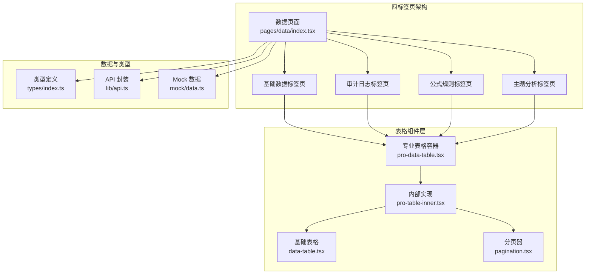
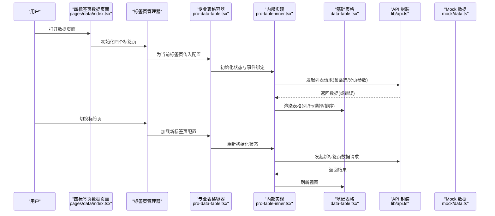
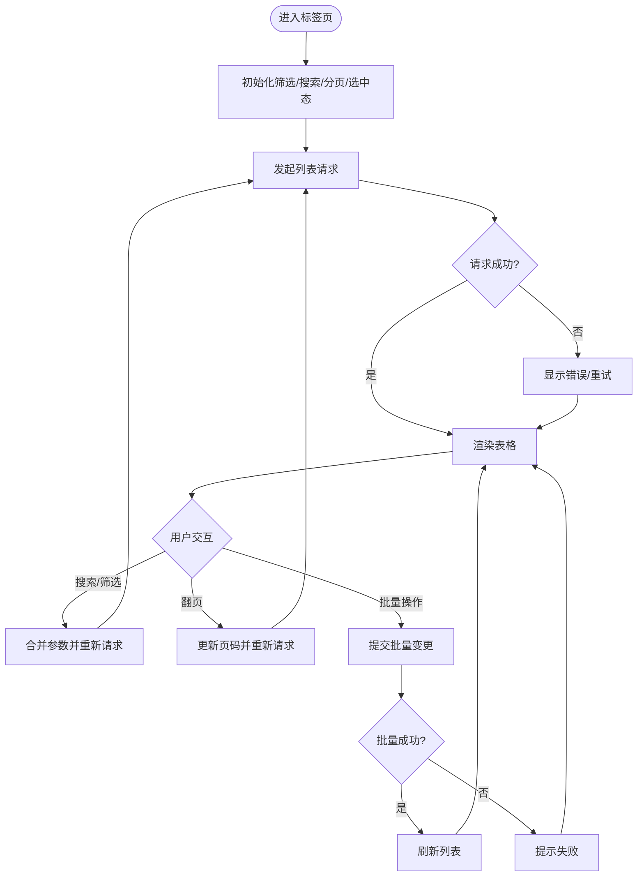
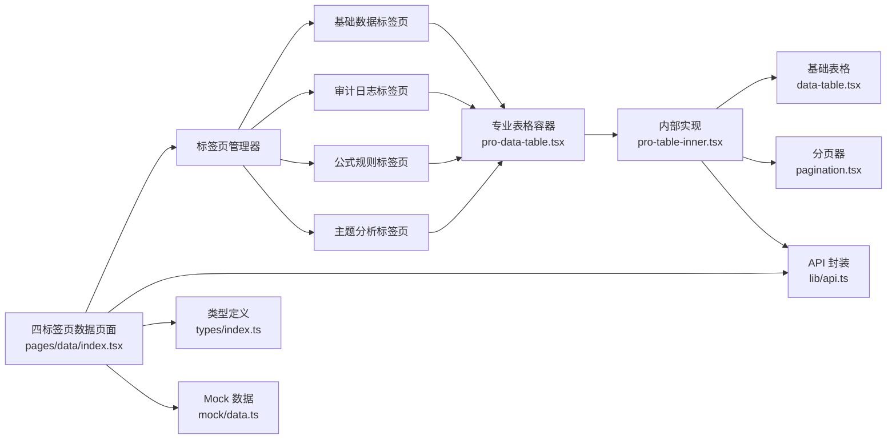

# 数据管理页面

<cite>
**本文引用的文件**   
- [web/src/components/data-table/data-table.tsx](file://web/src/components/data-table/data-table.tsx)
- [web/src/components/data-table/pro-data-table.tsx](file://web/src/components/data-table/pro-data-table.tsx)
- [web/src/components/data-table/pro-table-inner.tsx](file://web/src/components/data-table/pro-table-inner.tsx)
- [web/src/components/data-table/pagination.tsx](file://web/src/components/data-table/pagination.tsx)
- [web/src/pages/data/index.tsx](file://web/src/pages/data/index.tsx)
- [web/src/lib/api.ts](file://web/src/lib/api.ts)
- [web/src/types/index.ts](file://web/src/types/index.ts)
- [web/src/mock/data.ts](file://web/src/mock/data.ts)
</cite>

## 更新摘要
**变更内容**   
- 基于代码优化更新：数据页面进行了四标签页重构，新增了审计日志、公式规则和主题分析功能
- 整体界面结构从单一表格视图升级为多标签页架构，支持不同业务场景的独立管理
- 新增审计日志标签页：提供系统操作记录查询、筛选和导出功能
- 新增公式规则标签页：支持业务公式配置、验证和管理
- 新增主题分析标签页：集成数据分析图表和可视化展示
- 优化了标签页切换机制和状态管理逻辑
- 改进了各标签页间的组件复用和数据共享

## 目录
1. [简介](#简介)
2. [项目结构](#项目结构)
3. [核心组件](#核心组件)
4. [架构总览](#架构总览)
5. [详细组件分析](#详细组件分析)
6. [依赖关系分析](#依赖关系分析)
7. [性能与可访问性](#性能与可访问性)
8. [故障排查指南](#故障排查指南)
9. [结论](#结论)
10. [附录：扩展指南](#附录扩展指南)

## 简介
本文件面向"数据管理页面"的四标签页优化设计与实现，聚焦以下目标：
- 通用数据表格配置、动态列定义、交互式筛选等核心特性
- 增删改查（CRUD）、批量处理、数据校验等常用能力
- 多标签页架构：基础数据、审计日志、公式规则、主题分析四大功能模块
- 搜索与过滤：全文检索、高级筛选、保存查询条件
- 可扩展的数据管理组件：自定义列渲染、操作按钮扩展、数据源适配

文档以仓库中 data-table 相关组件与四标签页数据页为蓝本，结合类型定义、API 封装与 Mock 数据，给出从架构到落地的完整说明。经过本次四标签页优化，界面结构更加清晰，功能模块化程度更高，用户体验显著提升。

## 项目结构
围绕数据管理的四标签页架构，关键代码集中在以下位置：
- 数据表格组件族：data-table、pro-data-table、pro-table-inner、pagination
- 四标签页数据页面：pages/data/index.tsx（包含基础数据、审计日志、公式规则、主题分析）
- 类型与 API：types/index.ts、lib/api.ts
- 示例数据：mock/data.ts

**更新** 新增四标签页架构，每个标签页都有独立的业务逻辑和配置，通过统一的表格组件族实现数据展示和管理功能。

图表来源
- [web/src/pages/data/index.tsx](file://web/src/pages/data/index.tsx)
- [web/src/components/data-table/pro-data-table.tsx](file://web/src/components/data-table/pro-data-table.tsx)
- [web/src/components/data-table/pro-table-inner.tsx](file://web/src/components/data-table/pro-table-inner.tsx)
- [web/src/components/data-table/data-table.tsx](file://web/src/components/data-table/data-table.tsx)
- [web/src/components/data-table/pagination.tsx](file://web/src/components/data-table/pagination.tsx)
- [web/src/lib/api.ts](file://web/src/lib/api.ts)
- [web/src/types/index.ts](file://web/src/types/index.ts)
- [web/src/mock/data.ts](file://web/src/mock/data.ts)

章节来源
- [web/src/pages/data/index.tsx](file://web/src/pages/data/index.tsx)
- [web/src/components/data-table/pro-data-table.tsx](file://web/src/components/data-table/pro-data-table.tsx)
- [web/src/components/data-table/pro-table-inner.tsx](file://web/src/components/data-table/pro-table-inner.tsx)
- [web/src/components/data-table/data-table.tsx](file://web/src/components/data-table/data-table.tsx)
- [web/src/components/data-table/pagination.tsx](file://web/src/components/data-table/pagination.tsx)
- [web/src/lib/api.ts](file://web/src/lib/api.ts)
- [web/src/types/index.ts](file://web/src/types/index.ts)
- [web/src/mock/data.ts](file://web/src/mock/data.ts)

## 核心组件
- 基础表格 data-table.tsx：负责行/列渲染、选择、排序、分页展示等基础能力
- 专业表格 pro-data-table.tsx：提供统一配置入口（列定义、筛选、搜索、分页、批量、导出等）
- 内部实现 pro-table-inner.tsx：承载状态、副作用、事件分发与视图切换逻辑
- 分页 pagination.tsx：封装页码、每页条数、跳转等交互
- 四标签页数据页面 pages/data/index.tsx：组合上述组件，实现基础数据、审计日志、公式规则、主题分析四大功能模块

**更新** 经过四标签页重构后，各标签页职责更加明确，组件复用率更高，状态管理更加高效，减少了重复代码和维护成本。

章节来源
- [web/src/components/data-table/data-table.tsx](file://web/src/components/data-table/data-table.tsx)
- [web/src/components/data-table/pro-data-table.tsx](file://web/src/components/data-table/pro-data-table.tsx)
- [web/src/components/data-table/pro-table-inner.tsx](file://web/src/components/data-table/pro-table-inner.tsx)
- [web/src/components/data-table/pagination.tsx](file://web/src/components/data-table/pagination.tsx)
- [web/src/pages/data/index.tsx](file://web/src/pages/data/index.tsx)

## 架构总览
下图展示了四标签页数据管理页面的端到端调用链路与职责划分：页面通过标签页管理器组织四个功能模块，每个标签页使用专业表格容器传入各自的配置，内部维护筛选、搜索、分页、选中态等状态，并驱动基础表格渲染；数据请求由 API 层发起，返回数据后更新对应标签页视图。

**更新** 新增标签页管理机制，支持四个功能模块的独立配置和状态管理，提高了系统的可扩展性和可维护性。

图表来源
- [web/src/pages/data/index.tsx](file://web/src/pages/data/index.tsx)
- [web/src/components/data-table/pro-data-table.tsx](file://web/src/components/data-table/pro-data-table.tsx)
- [web/src/components/data-table/pro-table-inner.tsx](file://web/src/components/data-table/pro-table-inner.tsx)
- [web/src/components/data-table/data-table.tsx](file://web/src/components/data-table/data-table.tsx)
- [web/src/lib/api.ts](file://web/src/lib/api.ts)
- [web/src/mock/data.ts](file://web/src/mock/data.ts)

## 详细组件分析

### 四标签页数据页面 pages/data/index.tsx
- 职责
  - 实现基础数据、审计日志、公式规则、主题分析四个标签页的组织和切换
  - 为每个标签页配置独立的列定义、筛选条件、操作按钮和业务逻辑
  - 管理标签页间的状态共享和数据同步
- 关键点
  - 标签页配置集中化：将四个标签页的配置统一管理，便于维护和扩展
  - 权限控制：结合权限系统控制不同标签页和操作的可访问性
  - 性能优化：懒加载标签页内容，减少初始加载时间

**更新** 重构后的四标签页架构提供了更清晰的界面组织，每个标签页都有独立的业务逻辑和配置，提高了代码的可维护性和可扩展性。

章节来源
- [web/src/pages/data/index.tsx](file://web/src/pages/data/index.tsx)

### 专业表格容器 pro-data-table.tsx
- 职责
  - 暴露统一的 props 接口：列定义、筛选器、搜索框、分页、批量操作、导出、权限控制等
  - 将复杂状态与副作用下沉至内部实现，对外保持简洁
- 关键设计点
  - 配置即渲染：通过列定义驱动表头、单元格渲染、排序与筛选
  - 行为开关：是否支持多选、批量删除、导出、树形展开等
  - 与页面解耦：页面仅关心业务数据与回调，不感知内部状态

**更新** 重构后移除了冗余的状态管理代码，提高了组件的可维护性和性能表现，更好地支持四标签页架构的需求。

章节来源
- [web/src/components/data-table/pro-data-table.tsx](file://web/src/components/data-table/pro-data-table.tsx)

### 内部实现 pro-table-inner.tsx
- 职责
  - 维护筛选、搜索、分页、选中项、加载态、错误态等状态
  - 协调 API 请求与本地缓存，触发重渲染
  - 分发用户交互：排序、筛选、翻页、批量操作、导出
- 关键流程
  - 首次加载：根据初始筛选与分页参数拉取数据
  - 交互更新：搜索/筛选变化时合并参数并重新请求
  - 批量操作：收集选中项，调用批量 API，成功后刷新列表
  - 错误处理：网络异常、业务错误统一提示与降级

**更新** 优化了状态更新逻辑，减少了不必要的重渲染，提升了大数据量场景下的性能表现，更好地支持多标签页的数据管理需求。

图表来源
- [web/src/components/data-table/pro-table-inner.tsx](file://web/src/components/data-table/pro-table-inner.tsx)
- [web/src/lib/api.ts](file://web/src/lib/api.ts)

章节来源
- [web/src/components/data-table/pro-table-inner.tsx](file://web/src/components/data-table/pro-table-inner.tsx)

### 基础表格 data-table.tsx
- 职责
  - 基于列定义渲染表头与行内容
  - 支持行选择、排序、展开（树形）等展示能力
- 关键点
  - 列渲染函数化：允许自定义单元格渲染、操作按钮、标签样式等
  - 选择态与行键：通过唯一键关联行数据，保证选择正确性
  - 树形支持：当数据具备父子关系时，可启用树形展示

**更新** 简化了渲染逻辑，移除了冗余的条件判断，提高了渲染效率，更好地适应四标签页的不同展示需求。

章节来源
- [web/src/components/data-table/data-table.tsx](file://web/src/components/data-table/data-table.tsx)

### 分页 pagination.tsx
- 职责
  - 提供页码、每页条数、跳转等交互
  - 与内部实现联动，触发分页变更事件
- 关键点
  - 边界保护：防止越界页码
  - 响应式：在小屏下简化展示

章节来源
- [web/src/components/data-table/pagination.tsx](file://web/src/components/data-table/pagination.tsx)

## 依赖关系分析
- 四标签页数据页面依赖标签页管理器与各标签页配置
- 每个标签页依赖专业表格容器与对应的业务配置
- 专业表格容器依赖内部实现与基础表格
- 内部实现依赖 API 层与类型定义
- 基础表格依赖 UI 原子组件（如按钮、对话框等）

**更新** 新增标签页管理器作为核心协调组件，统一管理四个标签页的生命周期和状态，提高了系统的整体架构清晰度。

图表来源
- [web/src/pages/data/index.tsx](file://web/src/pages/data/index.tsx)
- [web/src/components/data-table/pro-data-table.tsx](file://web/src/components/data-table/pro-data-table.tsx)
- [web/src/components/data-table/pro-table-inner.tsx](file://web/src/components/data-table/pro-table-inner.tsx)
- [web/src/components/data-table/data-table.tsx](file://web/src/components/data-table/data-table.tsx)
- [web/src/components/data-table/pagination.tsx](file://web/src/components/data-table/pagination.tsx)
- [web/src/lib/api.ts](file://web/src/lib/api.ts)
- [web/src/types/index.ts](file://web/src/types/index.ts)
- [web/src/mock/data.ts](file://web/src/mock/data.ts)

章节来源
- [web/src/pages/data/index.tsx](file://web/src/pages/data/index.tsx)
- [web/src/components/data-table/pro-data-table.tsx](file://web/src/components/data-table/pro-data-table.tsx)
- [web/src/components/data-table/pro-table-inner.tsx](file://web/src/components/data-table/pro-table-inner.tsx)
- [web/src/components/data-table/data-table.tsx](file://web/src/components/data-table/data-table.tsx)
- [web/src/components/data-table/pagination.tsx](file://web/src/components/data-table/pagination.tsx)
- [web/src/lib/api.ts](file://web/src/lib/api.ts)
- [web/src/types/index.ts](file://web/src/types/index.ts)
- [web/src/mock/data.ts](file://web/src/mock/data.ts)

## 性能与可访问性
- 大数据量
  - 服务端分页与筛选优先，避免一次性加载全量数据
  - 虚拟滚动可在超大数据集场景考虑引入
- 渲染优化
  - 列渲染函数尽量轻量，避免在单元格内执行昂贵计算
  - 使用稳定 key 减少不必要的重渲染
  - **更新** 四标签页架构采用懒加载策略，只加载当前激活标签页的内容，显著提升了首屏加载性能
- 标签页优化
  - 标签页状态隔离，避免相互影响
  - 预加载常用标签页数据，提升切换体验
  - 标签页内容缓存，减少重复请求
- 网络与缓存
  - 对相同参数的请求做去抖与缓存，提升交互流畅度
- 可访问性
  - 为关键交互元素提供语义化标签与键盘导航支持
  - 错误提示与加载态需清晰传达给用户
  - **更新** 新增标签页切换的键盘导航支持和屏幕阅读器兼容性

## 故障排查指南
- 列表不刷新
  - 检查筛选/搜索参数是否正确合并并触发重新请求
  - 确认 API 返回结构与类型定义一致
- 批量操作无效
  - 核对选中项集合是否为空
  - 检查批量 API 的请求体格式与权限
- 分页异常
  - 验证当前页码与总页数边界
  - 确认后端返回的分页字段映射正确
- 树形展开无数据
  - 检查数据是否包含父子关系字段
  - 确认展开回调与懒加载逻辑
- **新增** 标签页切换问题
  - 检查标签页配置是否正确初始化
  - 确认标签页间状态隔离是否生效
  - 验证标签页懒加载逻辑是否正常
- **新增** 性能问题
  - 检查是否存在不必要的全量数据加载
  - 确认渲染函数中没有重型计算
  - 验证状态更新是否过于频繁
  - 检查标签页缓存策略是否合理

章节来源
- [web/src/components/data-table/pro-table-inner.tsx](file://web/src/components/data-table/pro-table-inner.tsx)
- [web/src/lib/api.ts](file://web/src/lib/api.ts)
- [web/src/types/index.ts](file://web/src/types/index.ts)
- [web/src/pages/data/index.tsx](file://web/src/pages/data/index.tsx)

## 结论
通过"四标签页架构 + 专业表格容器 + 内部实现 + 基础表格"的分层设计，数据管理页面实现了高内聚、低耦合的可复用方案。配合类型定义与 API 封装，能够快速搭建具备筛选、搜索、分页、批量、导出、树形等多能力的通用数据界面。经过本次四标签页优化，界面结构更加清晰，功能模块化程度更高，性能表现更佳，可维护性显著提升。后续可按扩展指南按需定制列渲染、操作按钮与数据源适配。

## 附录：扩展指南

### 自定义列渲染
- 在列定义中提供单元格渲染函数，按字段值返回不同 UI（如标签、进度条、链接等）
- 注意性能：避免在渲染函数中进行异步或重型计算
- **更新** 重构后提供了更清晰的渲染接口，便于扩展和定制，更好地支持四标签页的不同展示需求

章节来源
- [web/src/components/data-table/data-table.tsx](file://web/src/components/data-table/data-table.tsx)
- [web/src/types/index.ts](file://web/src/types/index.ts)

### 操作按钮扩展
- 在列定义中注册操作按钮，支持编辑、删除、查看等
- 结合权限系统控制按钮可见性与可用性
- 批量操作可通过容器提供的批量回调实现
- **更新** 操作按钮的注册和配置更加简洁明了，支持四标签页的差异化操作需求

章节来源
- [web/src/components/data-table/pro-data-table.tsx](file://web/src/components/data-table/pro-data-table.tsx)
- [web/src/pages/data/index.tsx](file://web/src/pages/data/index.tsx)

### 数据源适配
- 在 API 层统一封装请求与响应转换，屏蔽后端差异
- 在内部实现中处理错误与重试策略，确保用户体验一致
- 使用 Mock 数据快速联调与演示
- **更新** 数据源适配接口更加标准化，便于集成不同的后端服务，支持四标签页的多数据源需求

章节来源
- [web/src/lib/api.ts](file://web/src/lib/api.ts)
- [web/src/mock/data.ts](file://web/src/mock/data.ts)
- [web/src/components/data-table/pro-table-inner.tsx](file://web/src/components/data-table/pro-table-inner.tsx)

### 多标签页架构扩展
- 基础数据标签页：传统的数据表格管理功能
- 审计日志标签页：系统操作记录查询、筛选和导出
- 公式规则标签页：业务公式配置、验证和管理
- 主题分析标签页：数据分析图表和可视化展示
- **更新** 新增标签页扩展机制，支持动态添加新的功能标签页

章节来源
- [web/src/pages/data/index.tsx](file://web/src/pages/data/index.tsx)

### 搜索与过滤
- 全文检索：在搜索框输入关键词，触发服务端或客户端检索
- 高级筛选：通过筛选器组合多个条件，生成查询参数
- 保存查询条件：将筛选与搜索参数持久化，支持分享与恢复
- **更新** 搜索和过滤逻辑更加高效，支持更复杂的查询场景，每个标签页都有独立的筛选配置

章节来源
- [web/src/components/data-table/pro-data-table.tsx](file://web/src/components/data-table/pro-data-table.tsx)
- [web/src/components/data-table/pro-table-inner.tsx](file://web/src/components/data-table/pro-table-inner.tsx)

### 数据校验
- 表单校验：新增/编辑时使用规则引擎进行必填、格式、范围等校验
- 批量校验：批量导入或批量修改前进行预校验，失败则定位问题行
- 错误反馈：统一错误提示与定位，帮助用户快速修正
- **更新** 校验逻辑更加完善，错误提示更加友好，支持四标签页的差异化校验需求

章节来源
- [web/src/pages/data/index.tsx](file://web/src/pages/data/index.tsx)
- [web/src/lib/api.ts](file://web/src/lib/api.ts)

### 标签页状态管理
- 标签页配置管理：集中管理四个标签页的配置信息
- 状态隔离：确保各标签页状态互不影响
- 懒加载：按需加载标签页内容，提升性能
- 缓存策略：合理缓存标签页数据，减少重复请求
- **更新** 新增标签页状态管理机制，提供更好的用户体验和性能表现

章节来源
- [web/src/pages/data/index.tsx](file://web/src/pages/data/index.tsx)