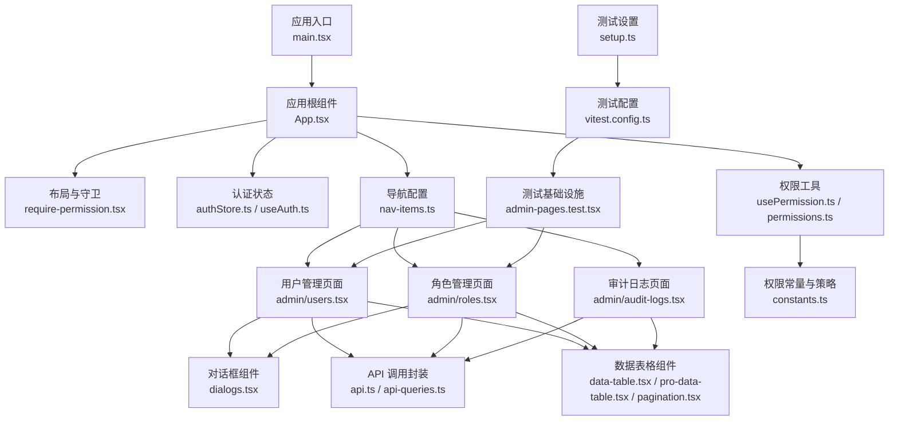
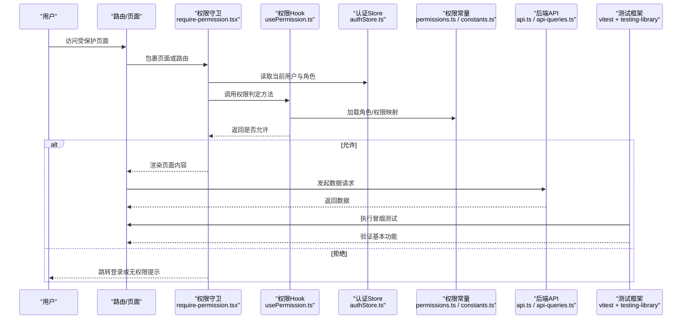
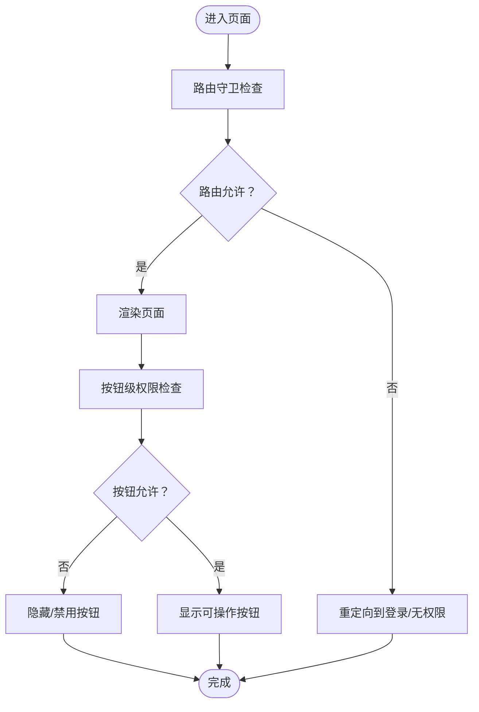
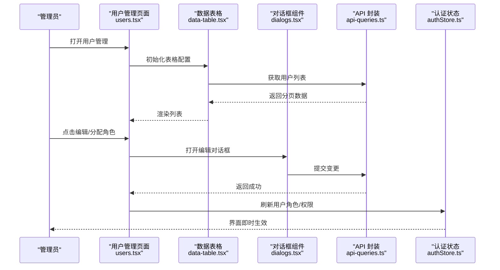
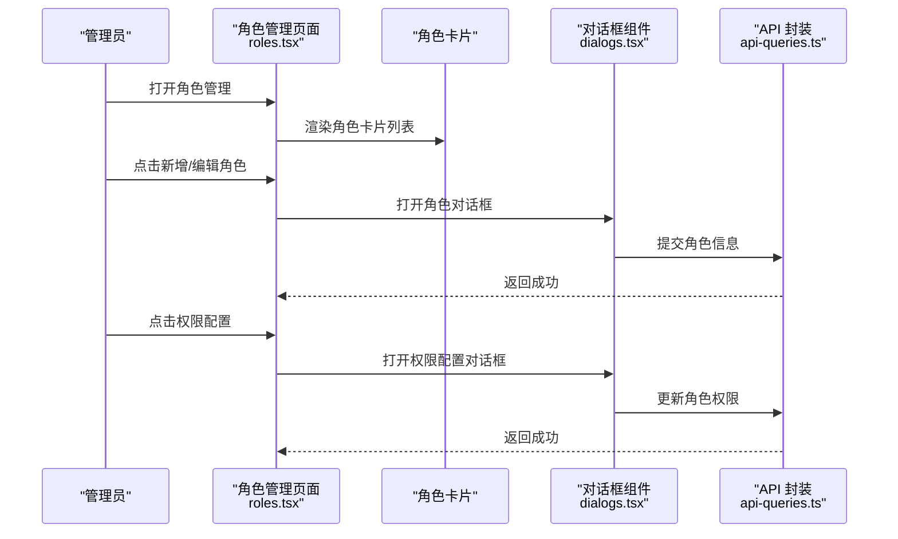
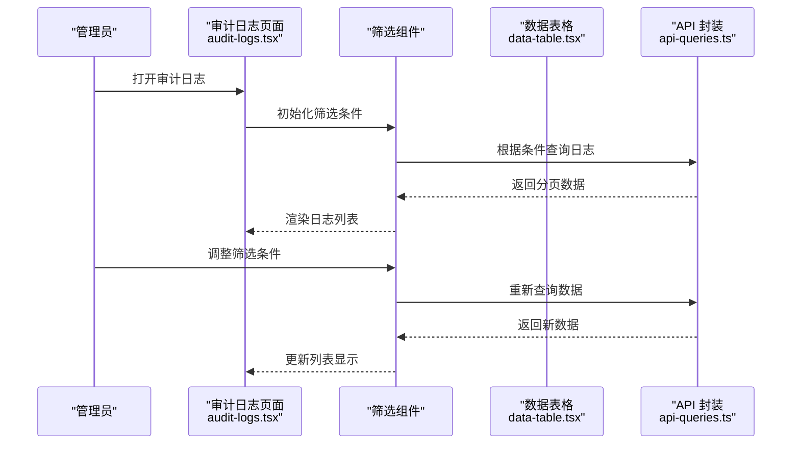
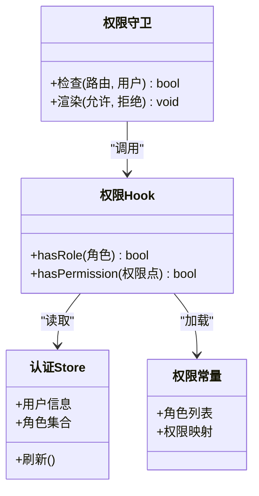
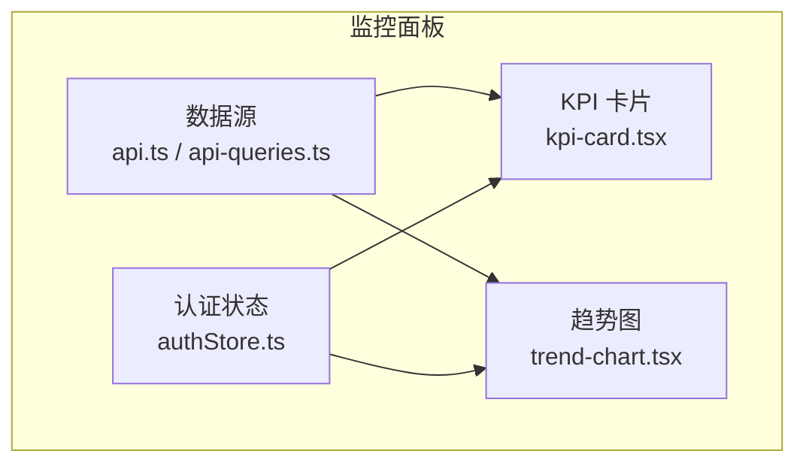
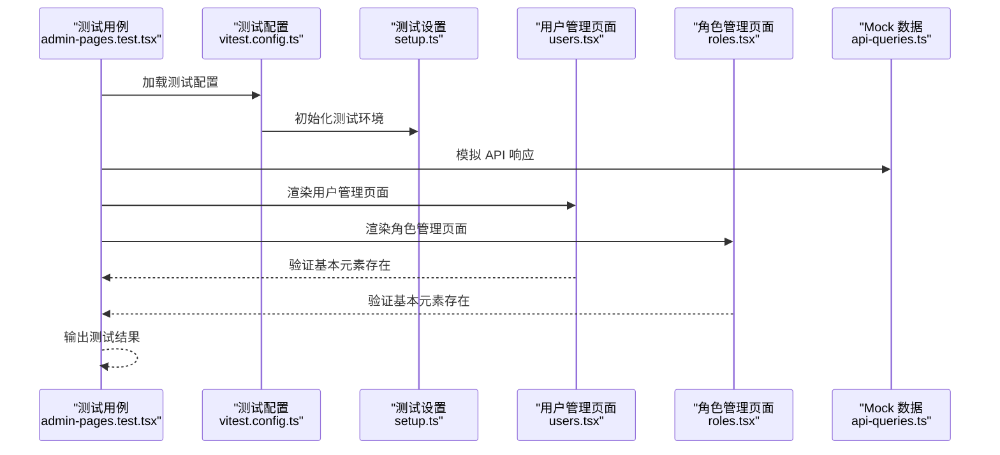
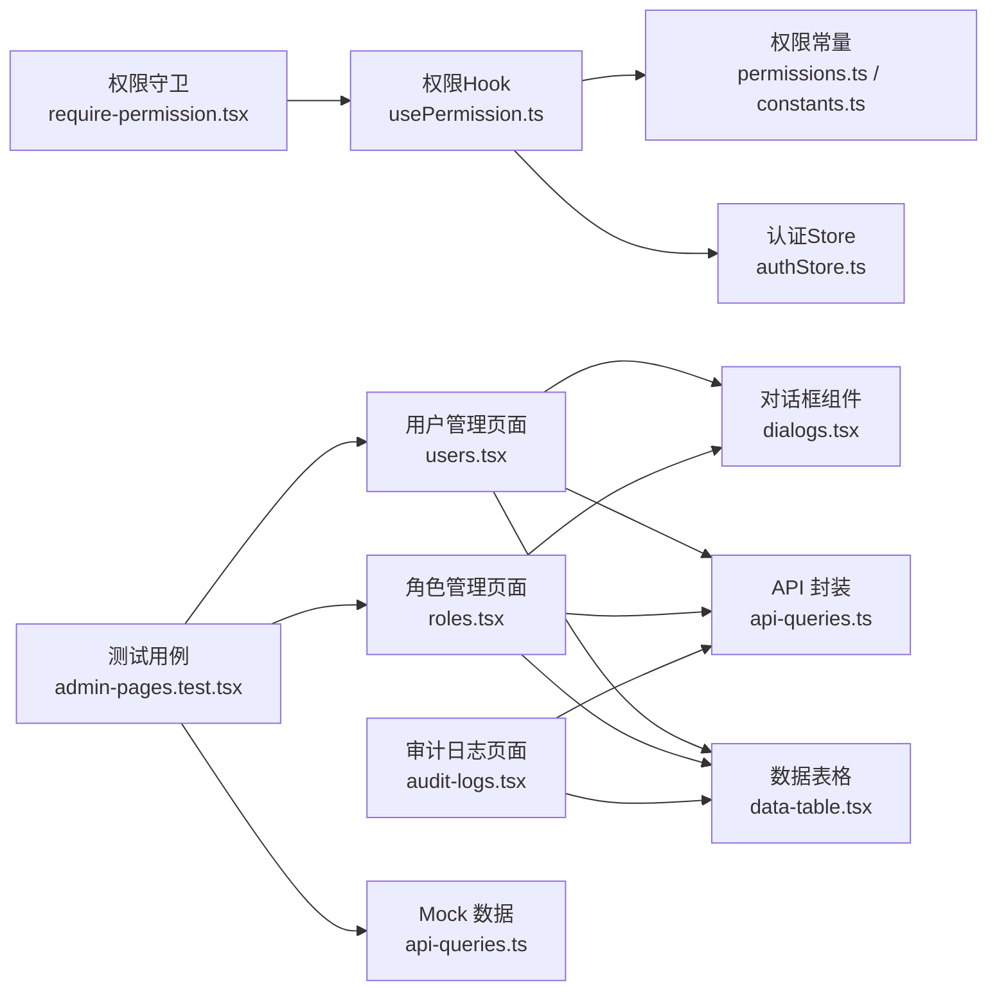

# 管理系统页面

<cite>
**本文引用的文件**   
- [App.tsx](file://web/src/App.tsx)
- [nav-items.ts](file://web/src/components/layout/nav-items.ts)
- [require-permission.tsx](file://web/src/components/layout/require-permission.tsx)
- [usePermission.ts](file://web/src/hooks/usePermission.ts)
- [permissions.ts](file://web/src/lib/permissions.ts)
- [authStore.ts](file://web/src/stores/authStore.ts)
- [useAuth.ts](file://web/src/hooks/useAuth.ts)
- [users.tsx](file://web/src/pages/admin/users.tsx)
- [roles.tsx](file://web/src/pages/admin/roles.tsx)
- [audit-logs.tsx](file://web/src/pages/admin/audit-logs.tsx)
- [dialogs.tsx](file://web/src/pages/admin/dialogs.tsx)
- [api-queries.ts](file://web/src/hooks/api-queries.ts)
- [data-table.tsx](file://web/src/components/data-table/data-table.tsx)
- [pro-data-table.tsx](file://web/src/components/data-table/pro-data-table.tsx)
- [pagination.tsx](file://web/src/components/data-table/pagination.tsx)
- [kpi-card.tsx](file://web/src/components/charts/kpi-card.tsx)
- [trend-chart.tsx](file://web/src/components/charts/trend-chart.tsx)
- [constants.ts](file://web/src/lib/constants.ts)
- [api.ts](file://web/src/lib/api.ts)
- [admin-pages.test.tsx](file://web/src/pages/admin/__tests__/admin-pages.test.tsx)
- [vitest.config.ts](file://web/vitest.config.ts)
- [setup.ts](file://web/src/test/setup.ts)
</cite>

## 更新摘要
**变更内容**   
- 管理系统从单体index.tsx重构为三个独立页面：用户管理(users.tsx)、角色管理(roles.tsx)、审计日志(audit-logs.tsx)
- 每个页面拥有独立的权限控制、数据管理和交互逻辑
- 新增统一的对话框组件模块(dialogs.tsx)，统一管理用户增删改查、角色配置等弹窗交互
- 保持统一的权限验证架构和组件复用模式
- 优化了用户体验，提供更清晰的职责分离和更好的维护性
- **新增管理页面测试基础设施**：包含用户和角色管理页面的冒烟测试，确保导出失败或模块链接问题能在导入或渲染阶段被捕获

## 目录
1. [简介](#简介)
2. [项目结构](#项目结构)
3. [核心组件](#核心组件)
4. [架构总览](#架构总览)
5. [详细组件分析](#详细组件分析)
6. [测试基础设施](#测试基础设施)
7. [依赖关系分析](#依赖关系分析)
8. [性能考虑](#性能考虑)
9. [故障排查指南](#故障排查指南)
10. [结论](#结论)
11. [附录](#附录)

## 简介
本文件面向"管理系统页面"的权限控制与功能实现，系统性阐述基于角色的访问控制（RBAC）在路由层、组件层与按钮层的分层防护机制；说明用户管理模块的用户列表展示、信息编辑与角色分配等关键流程；梳理从路由访问到组件渲染的完整权限校验链路；介绍系统监控面板的设计模式，包括实时数据更新、异常告警与性能指标展示；并提供管理员操作的最佳实践，涵盖批量操作处理、操作日志记录与数据安全保护。

**更新** 管理系统已重构为三个独立页面，分别专注于用户管理、角色管理和审计日志功能，提供更好的用户体验和维护性。每个页面都实现了细粒度的权限控制，确保只有授权用户才能执行相应的操作。**新增的测试基础设施确保了管理页面的稳定性和可靠性**。

## 项目结构
前端采用模块化组织方式：
- 应用入口与路由：位于 web/src/main.tsx 与 web/src/App.tsx
- 权限与认证：hooks 与 store 提供统一鉴权能力，lib 提供权限常量与工具
- 布局与守卫：layout 下提供页面容器与权限守卫组件
- 业务页面：pages 下包含 admin、dashboard 等管理相关页面
- 通用组件：components 下提供数据表格、图表、UI 基础控件等
- **测试基础设施**：__tests__ 目录下包含管理页面的冒烟测试，vitest 配置文件提供测试环境支持

**图示来源**
- [App.tsx](file://web/src/App.tsx)
- [nav-items.ts](file://web/src/components/layout/nav-items.ts)
- [users.tsx](file://web/src/pages/admin/users.tsx)
- [roles.tsx](file://web/src/pages/admin/roles.tsx)
- [audit-logs.tsx](file://web/src/pages/admin/audit-logs.tsx)
- [dialogs.tsx](file://web/src/pages/admin/dialogs.tsx)
- [api-queries.ts](file://web/src/hooks/api-queries.ts)
- [admin-pages.test.tsx](file://web/src/pages/admin/__tests__/admin-pages.test.tsx)
- [vitest.config.ts](file://web/vitest.config.ts)
- [setup.ts](file://web/src/test/setup.ts)

**章节来源**
- [App.tsx](file://web/src/App.tsx)
- [nav-items.ts](file://web/src/components/layout/nav-items.ts)

## 核心组件
- 权限守卫组件：用于在路由或页面层级进行访问控制，未通过校验时阻止渲染并引导至登录或无权限页。
- 权限 Hook：提供便捷方法判断当前用户是否具备某角色或权限点，供页面与按钮级控制使用。
- 权限常量与策略：集中定义角色集合、权限标识及映射规则，便于统一维护与扩展。
- 认证 Store 与 Hook：集中管理登录态、用户信息与角色，提供响应式读取与更新。
- 数据表格组件：提供分页、筛选、排序与批量操作的通用能力，适配管理员高频操作场景。
- 图表组件：提供 KPI 卡片与趋势图，支撑监控面板的数据可视化。
- 对话框组件：统一管理用户管理、角色管理等复杂交互的弹窗界面，支持表单验证和数据提交。
- **测试基础设施**：包含冒烟测试和测试配置，确保管理页面的基本功能和稳定性。

**更新** 新增统一的对话框组件模块和测试基础设施，集中管理所有管理页面的弹窗交互和测试用例，提高代码复用性和可维护性。

**章节来源**
- [require-permission.tsx](file://web/src/components/layout/require-permission.tsx)
- [usePermission.ts](file://web/src/hooks/usePermission.ts)
- [permissions.ts](file://web/src/lib/permissions.ts)
- [authStore.ts](file://web/src/stores/authStore.ts)
- [useAuth.ts](file://web/src/hooks/useAuth.ts)
- [data-table.tsx](file://web/src/components/data-table/data-table.tsx)
- [pro-data-table.tsx](file://web/src/components/data-table/pro-data-table.tsx)
- [pagination.tsx](file://web/src/components/data-table/pagination.tsx)
- [dialogs.tsx](file://web/src/pages/admin/dialogs.tsx)
- [admin-pages.test.tsx](file://web/src/pages/admin/__tests__/admin-pages.test.tsx)

## 架构总览
下图展示了 RBAC 在路由层、组件层与按钮层的分层防护，以及认证状态与权限工具之间的协作关系。

**图示来源**
- [require-permission.tsx](file://web/src/components/layout/require-permission.tsx)
- [usePermission.ts](file://web/src/hooks/usePermission.ts)
- [authStore.ts](file://web/src/stores/authStore.ts)
- [permissions.ts](file://web/src/lib/permissions.ts)
- [api.ts](file://web/src/lib/api.ts)
- [api-queries.ts](file://web/src/hooks/api-queries.ts)
- [admin-pages.test.tsx](file://web/src/pages/admin/__tests__/admin-pages.test.tsx)

## 详细组件分析

### 权限控制架构（RBAC）
- 角色与权限模型
  - 角色集合与权限标识在常量中集中定义，便于统一管理与审计。
  - 权限判定逻辑通过 Hook 暴露，支持按角色或具体权限点进行细粒度控制。
- 路由级守卫
  - 在路由或页面入口处使用权限守卫组件，拦截无权限访问，确保最小权限原则。
- 组件级与按钮级控制
  - 在页面内部，结合权限 Hook 对敏感操作按钮进行显隐或禁用控制，避免越权操作。

**图示来源**
- [require-permission.tsx](file://web/src/components/layout/require-permission.tsx)
- [usePermission.ts](file://web/src/hooks/usePermission.ts)
- [permissions.ts](file://web/src/lib/permissions.ts)
- [constants.ts](file://web/src/lib/constants.ts)

**章节来源**
- [require-permission.tsx](file://web/src/components/layout/require-permission.tsx)
- [usePermission.ts](file://web/src/hooks/usePermission.ts)
- [permissions.ts](file://web/src/lib/permissions.ts)
- [constants.ts](file://web/src/lib/constants.ts)

### 用户管理功能
- 用户列表展示
  - 使用数据表格组件承载用户列表，支持分页、筛选与排序，提升大数据量下的交互体验。
  - 支持按角色、状态筛选，以及用户名和姓名的关键字搜索。
  - 前端分页限制最大获取数量为500条，超出时提示使用搜索缩小范围。
- 用户信息编辑
  - 通过统一的对话框组件进行用户信息修改，提交前进行输入校验，失败时给出明确反馈。
  - 支持密码重置、角色分配和数据范围设置。
  - 数据范围支持多选单体公司和汇总主体，提供搜索过滤功能。
- 角色分配
  - 在用户详情或列表行内提供角色选择器，保存后同步至认证状态，以便后续权限生效。
  - 支持防提权机制，非 superadmin 不可分配 superadmin 角色。
- 高级功能
  - 支持用户导出功能，将筛选后的用户数据导出为Excel文件。
  - 提供停用、启用、彻底删除等用户状态管理操作。

**图示来源**
- [users.tsx](file://web/src/pages/admin/users.tsx)
- [dialogs.tsx](file://web/src/pages/admin/dialogs.tsx)
- [api-queries.ts](file://web/src/hooks/api-queries.ts)
- [authStore.ts](file://web/src/stores/authStore.ts)

**章节来源**
- [users.tsx](file://web/src/pages/admin/users.tsx)
- [dialogs.tsx](file://web/src/pages/admin/dialogs.tsx)
- [api-queries.ts](file://web/src/hooks/api-queries.ts)
- [authStore.ts](file://web/src/stores/authStore.ts)

### 角色管理功能
- 角色列表展示
  - 以卡片形式展示所有角色，包含角色名称、描述和系统标识。
  - 支持角色克隆、编辑、删除和权限配置操作。
- 角色创建与编辑
  - 通过统一的对话框组件进行角色的创建和编辑，支持编码、名称和描述的设置。
  - 系统预置角色只读，自定义角色可完全编辑。
- 权限配置
  - 提供权限配置对话框，支持按模块分组勾选权限项。
  - 支持全选、全不选和模块内批量操作。
  - 超级管理员角色权限固定，不可修改。
  - 高危权限标记显示，增强安全性提示。

**图示来源**
- [roles.tsx](file://web/src/pages/admin/roles.tsx)
- [dialogs.tsx](file://web/src/pages/admin/dialogs.tsx)
- [api-queries.ts](file://web/src/hooks/api-queries.ts)

**章节来源**
- [roles.tsx](file://web/src/pages/admin/roles.tsx)
- [dialogs.tsx](file://web/src/pages/admin/dialogs.tsx)
- [api-queries.ts](file://web/src/hooks/api-queries.ts)

### 审计日志功能
- 日志列表展示
  - 使用数据表格组件展示系统操作日志，包含时间、用户、模块、操作和详情等信息。
  - 支持按角色、模块、用户关键字和时间范围筛选。
- 高级筛选功能
  - 支持多条件组合筛选，包括角色、模块、用户名、开始时间和结束时间。
  - 筛选条件变化时自动重置到第一页，保证数据一致性。
- 日志详情查看
  - 每条日志包含详细的操作信息，便于问题追溯和安全审计。
  - 模块和操作类型提供中文标签映射，提升可读性。

**图示来源**
- [audit-logs.tsx](file://web/src/pages/admin/audit-logs.tsx)
- [api-queries.ts](file://web/src/hooks/api-queries.ts)

**章节来源**
- [audit-logs.tsx](file://web/src/pages/admin/audit-logs.tsx)
- [api-queries.ts](file://web/src/hooks/api-queries.ts)

### 权限验证流程（从路由到组件）
- 路由层：在进入受保护路由时，先执行权限守卫，依据当前用户角色与目标路由所需权限进行判定。
- 组件层：页面内部根据权限结果动态渲染或隐藏敏感区域。
- 按钮层：对高风险操作按钮进行二次校验，防止误触与越权。

**图示来源**
- [require-permission.tsx](file://web/src/components/layout/require-permission.tsx)
- [usePermission.ts](file://web/src/hooks/usePermission.ts)
- [authStore.ts](file://web/src/stores/authStore.ts)
- [permissions.ts](file://web/src/lib/permissions.ts)

**章节来源**
- [require-permission.tsx](file://web/src/components/layout/require-permission.tsx)
- [usePermission.ts](file://web/src/hooks/usePermission.ts)
- [authStore.ts](file://web/src/stores/authStore.ts)
- [permissions.ts](file://web/src/lib/permissions.ts)

### 系统监控面板设计模式
- 实时数据更新
  - 通过定时轮询或事件驱动的方式拉取最新指标，并在图表组件中增量更新，减少全量刷新带来的抖动。
- 异常告警
  - 当指标超过阈值时触发告警提示，支持声音或视觉提醒，并记录告警上下文以便追溯。
- 性能指标展示
  - 使用 KPI 卡片与趋势图组合呈现关键指标，如错误率、延迟分布、资源占用等，帮助快速定位问题。

**图示来源**
- [kpi-card.tsx](file://web/src/components/charts/kpi-card.tsx)
- [trend-chart.tsx](file://web/src/components/charts/trend-chart.tsx)
- [api.ts](file://web/src/lib/api.ts)
- [api-queries.ts](file://web/src/hooks/api-queries.ts)
- [authStore.ts](file://web/src/stores/authStore.ts)

**章节来源**
- [kpi-card.tsx](file://web/src/components/charts/kpi-card.tsx)
- [trend-chart.tsx](file://web/src/components/charts/trend-chart.tsx)
- [api.ts](file://web/src/lib/api.ts)
- [api-queries.ts](file://web/src/hooks/api-queries.ts)

## 测试基础设施

### 冒烟测试架构
管理系统新增了完整的测试基础设施，专门针对用户管理和角色管理页面进行冒烟测试，确保基本的页面渲染和功能可用性。

**测试覆盖范围**
- 用户管理页面：验证标题、新增按钮和基本内容的渲染
- 角色管理页面：验证标题、角色列表和基本功能的渲染
- 权限控制：模拟管理员会话，确保权限正确应用
- 模块导入：检测静态导入链接失败导致的白屏问题

**测试环境配置**
- 使用 Vitest 作为测试框架，配合 jsdom 环境模拟浏览器
- 集成 React Testing Library 进行组件渲染和断言
- 配置全局 Mock，隔离外部 API 依赖
- 自动化测试执行，集成到开发工作流

**图示来源**
- [admin-pages.test.tsx](file://web/src/pages/admin/__tests__/admin-pages.test.tsx)
- [vitest.config.ts](file://web/vitest.config.ts)
- [setup.ts](file://web/src/test/setup.ts)
- [users.tsx](file://web/src/pages/admin/users.tsx)
- [roles.tsx](file://web/src/pages/admin/roles.tsx)

### 测试用例设计
**用户管理页面测试**
- 验证页面标题"用户管理"正确显示
- 检查"新增用户"按钮是否存在且可点击
- 确认空数据状态下显示"暂无用户"提示
- 模拟管理员权限，确保功能按钮正常显示

**角色管理页面测试**
- 验证页面标题"角色管理"正确显示
- 检查预置角色"查看者"是否正确渲染
- 验证角色卡片的基本信息显示
- 确认权限控制下的按钮可见性

**Mock 策略**
- 使用 `vi.hoisted` 创建 mutation 函数桩
- Mock 所有 API 查询钩子，返回预设数据结构
- 模拟认证状态，设置管理员权限集合
- 隔离外部依赖，确保测试稳定性

**章节来源**
- [admin-pages.test.tsx](file://web/src/pages/admin/__tests__/admin-pages.test.tsx)
- [vitest.config.ts](file://web/vitest.config.ts)
- [setup.ts](file://web/src/test/setup.ts)

## 依赖关系分析
- 低耦合高内聚
  - 权限逻辑集中在 hooks 与 lib 层，页面与组件仅消费接口，降低耦合度。
- 直接依赖
  - 权限守卫依赖认证状态与权限 Hook；页面依赖数据表格与 API 封装；监控面板依赖图表与 API。
- 潜在循环依赖
  - 需避免页面反向依赖权限工具造成循环引用，建议保持单向依赖链。
- **测试依赖**
  - 测试用例依赖页面组件和 Mock 数据，形成独立的测试依赖链。

**图示来源**
- [require-permission.tsx](file://web/src/components/layout/require-permission.tsx)
- [usePermission.ts](file://web/src/hooks/usePermission.ts)
- [authStore.ts](file://web/src/stores/authStore.ts)
- [permissions.ts](file://web/src/lib/permissions.ts)
- [constants.ts](file://web/src/lib/constants.ts)
- [users.tsx](file://web/src/pages/admin/users.tsx)
- [roles.tsx](file://web/src/pages/admin/roles.tsx)
- [audit-logs.tsx](file://web/src/pages/admin/audit-logs.tsx)
- [data-table.tsx](file://web/src/components/data-table/data-table.tsx)
- [dialogs.tsx](file://web/src/pages/admin/dialogs.tsx)
- [api-queries.ts](file://web/src/hooks/api-queries.ts)
- [admin-pages.test.tsx](file://web/src/pages/admin/__tests__/admin-pages.test.tsx)

**章节来源**
- [require-permission.tsx](file://web/src/components/layout/require-permission.tsx)
- [usePermission.ts](file://web/src/hooks/usePermission.ts)
- [authStore.ts](file://web/src/stores/authStore.ts)
- [permissions.ts](file://web/src/lib/permissions.ts)
- [constants.ts](file://web/src/lib/constants.ts)
- [users.tsx](file://web/src/pages/admin/users.tsx)
- [roles.tsx](file://web/src/pages/admin/roles.tsx)
- [audit-logs.tsx](file://web/src/pages/admin/audit-logs.tsx)
- [data-table.tsx](file://web/src/components/data-table/data-table.tsx)
- [dialogs.tsx](file://web/src/pages/admin/dialogs.tsx)
- [api-queries.ts](file://web/src/hooks/api-queries.ts)
- [admin-pages.test.tsx](file://web/src/pages/admin/__tests__/admin-pages.test.tsx)

## 性能考虑
- 列表与分页
  - 合理设置每页条数与懒加载，避免一次性渲染大量 DOM。
  - 用户列表采用前端分页，限制最大获取数量为500条，超出时提示使用搜索缩小范围。
- 图表更新
  - 使用增量更新与防抖策略，降低频繁重绘开销。
- 权限计算缓存
  - 对常用权限判定结果进行短期缓存，减少重复计算。
- 网络请求优化
  - 合并请求、去重与重试策略，提高稳定性与用户体验。
- 数据缓存
  - 使用 React Query 进行数据缓存，减少重复请求，提升响应速度。
- **测试性能**
  - 冒烟测试专注于基本功能验证，避免复杂的异步操作，确保测试执行效率。

**更新** 用户管理页面增加了前端分页和数量限制，优化大数据量下的性能表现。对话框组件也进行了性能优化，支持大列表的搜索过滤。**新增的测试基础设施确保页面基本功能的稳定性，避免回归问题影响性能**。

## 故障排查指南
- 权限相关问题
  - 确认认证状态是否正确加载，角色与权限映射是否一致。
  - 检查路由守卫是否被正确包裹，权限 Hook 返回值是否符合预期。
- 数据表格问题
  - 核对分页参数与后端返回结构是否匹配，筛选条件是否有效传递。
- 监控面板异常
  - 检查数据源接口可用性，确认告警阈值配置与渲染逻辑。
- 对话框交互问题
  - 检查对话框状态管理，确保弹窗正确打开和关闭。
  - 验证表单验证逻辑，确保数据完整性。
  - 确认权限控制是否正确应用到对话框内的操作按钮。
- **测试相关问题**
  - 运行冒烟测试检查页面基本功能是否正常渲染。
  - 检查 Mock 数据是否与真实 API 响应结构匹配。
  - 确认测试环境配置正确，jsdom 环境可用。
  - 验证权限 Mock 是否正确设置管理员权限。

**更新** 新增测试相关问题的排查指导，特别关注冒烟测试的执行和 Mock 数据的配置。

**章节来源**
- [require-permission.tsx](file://web/src/components/layout/require-permission.tsx)
- [usePermission.ts](file://web/src/hooks/usePermission.ts)
- [authStore.ts](file://web/src/stores/authStore.ts)
- [data-table.tsx](file://web/src/components/data-table/data-table.tsx)
- [kpi-card.tsx](file://web/src/components/charts/kpi-card.tsx)
- [trend-chart.tsx](file://web/src/components/charts/trend-chart.tsx)
- [dialogs.tsx](file://web/src/pages/admin/dialogs.tsx)
- [admin-pages.test.tsx](file://web/src/pages/admin/__tests__/admin-pages.test.tsx)

## 结论
本管理系统通过 RBAC 的分层防护机制，实现了从路由到按钮的多维度权限控制；用户管理模块借助通用数据表格与 API 封装，提供了高效稳定的管理能力；监控面板以图表为核心，结合实时数据与告警机制，提升了运维效率。

**更新** 管理系统重构为三个独立页面后，职责更加清晰，维护性显著提升。每个页面专注于特定功能领域，降低了代码复杂度，提高了开发效率和用户体验。统一的对话框组件模块进一步提高了代码复用性。**新增的测试基础设施确保了管理页面的基本功能稳定性，能够在导入或渲染阶段及时发现和修复问题**。建议在后续迭代中持续完善权限常量与策略的可配置性，增强批量操作的安全性与可审计性，并引入更完善的日志与监控体系。

## 附录
- 最佳实践建议
  - 批量操作：增加二次确认与撤销机制，记录操作日志与责任人。
  - 数据安全：对敏感字段进行脱敏展示，传输加密与存储加密并重。
  - 操作审计：统一记录关键操作的时间、IP、前后快照，便于回溯与合规。
  - 权限治理：定期审查角色与权限映射，清理冗余与过期权限。
  - 页面拆分：将复杂的管理功能拆分为独立页面，提高可维护性和用户体验。
  - 组件复用：通过统一的对话框组件管理复杂的弹窗交互，提高代码复用性。
  - **测试覆盖**：为关键页面添加冒烟测试，确保基本功能的稳定性。
  - **Mock 策略**：使用合理的 Mock 数据隔离外部依赖，提高测试可靠性。

**更新** 新增测试相关的最佳实践建议，强调冒烟测试的重要性和 Mock 策略的使用。