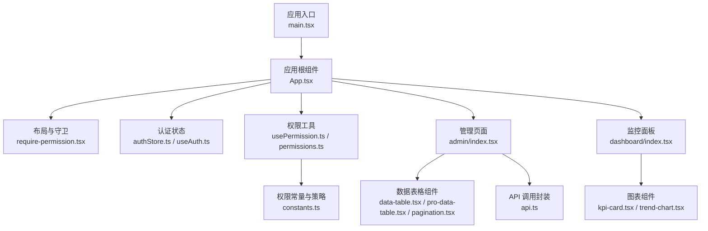
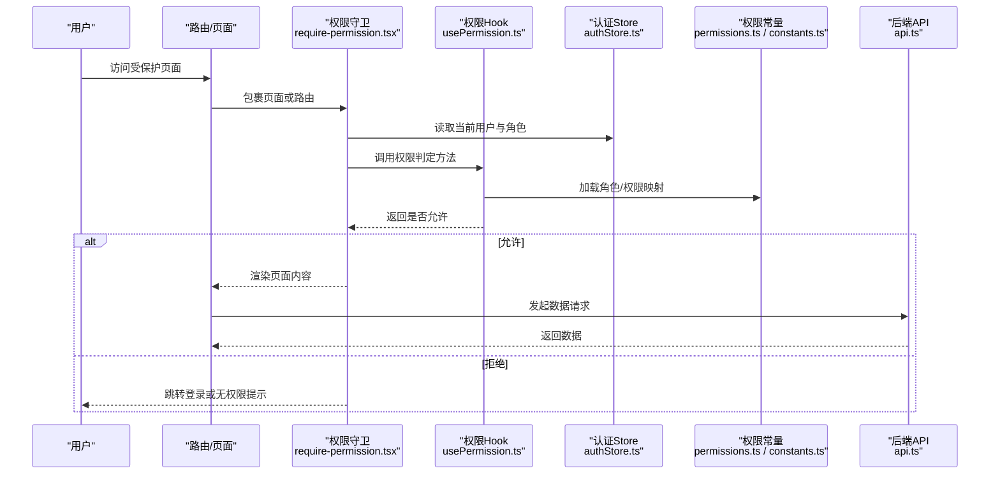
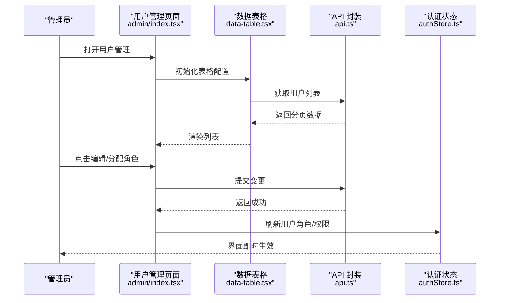
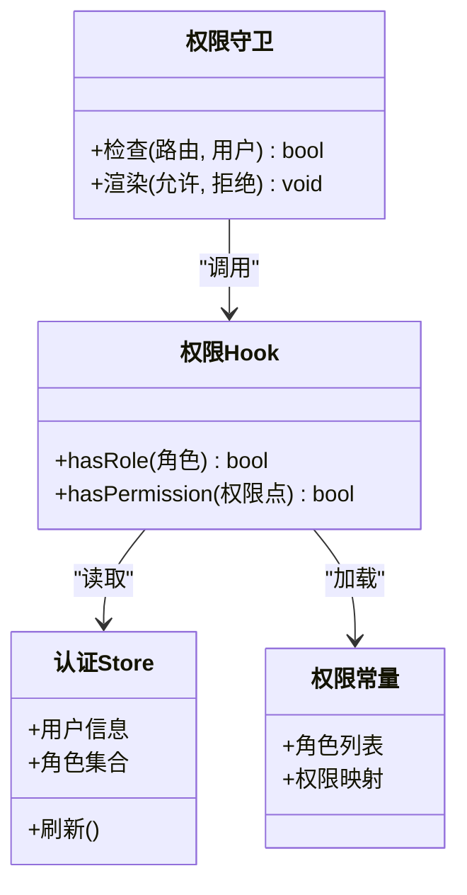
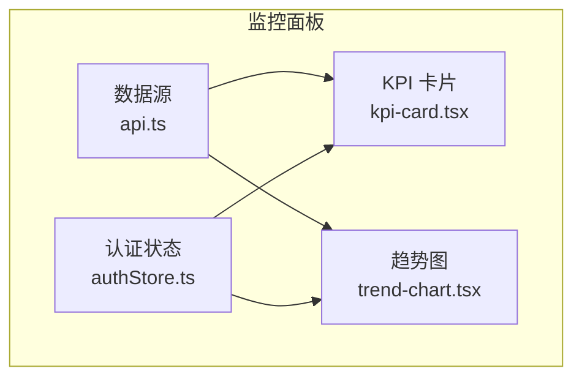
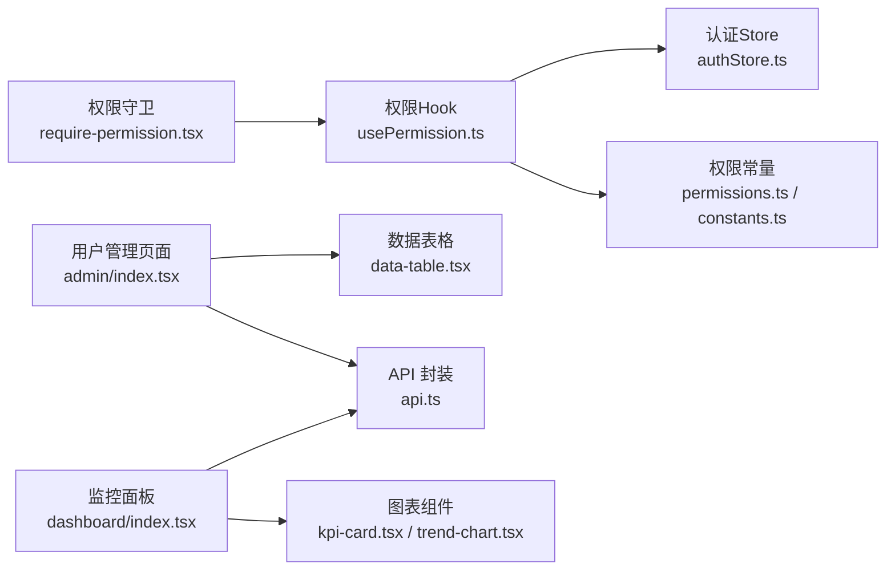

# 管理系统页面

<cite>
**本文引用的文件**   
- [main.tsx](file://web/src/main.tsx)
- [App.tsx](file://web/src/App.tsx)
- [require-permission.tsx](file://web/src/components/layout/require-permission.tsx)
- [usePermission.ts](file://web/src/hooks/usePermission.ts)
- [permissions.ts](file://web/src/lib/permissions.ts)
- [authStore.ts](file://web/src/stores/authStore.ts)
- [useAuth.ts](file://web/src/hooks/useAuth.ts)
- [admin/index.tsx](file://web/src/pages/admin/index.tsx)
- [dashboard/index.tsx](file://web/src/pages/dashboard/index.tsx)
- [data-table.tsx](file://web/src/components/data-table/data-table.tsx)
- [pro-data-table.tsx](file://web/src/components/data-table/pro-data-table.tsx)
- [pagination.tsx](file://web/src/components/data-table/pagination.tsx)
- [kpi-card.tsx](file://web/src/components/charts/kpi-card.tsx)
- [trend-chart.tsx](file://web/src/components/charts/trend-chart.tsx)
- [constants.ts](file://web/src/lib/constants.ts)
- [api.ts](file://web/src/lib/api.ts)
</cite>

## 目录
1. [简介](#简介)
2. [项目结构](#项目结构)
3. [核心组件](#核心组件)
4. [架构总览](#架构总览)
5. [详细组件分析](#详细组件分析)
6. [依赖关系分析](#依赖关系分析)
7. [性能考虑](#性能考虑)
8. [故障排查指南](#故障排查指南)
9. [结论](#结论)
10. [附录](#附录)

## 简介
本文件面向“管理系统页面”的权限控制与功能实现，系统性阐述基于角色的访问控制（RBAC）在路由层、组件层与按钮层的分层防护机制；说明用户管理模块的用户列表展示、信息编辑与角色分配等关键流程；梳理从路由访问到组件渲染的完整权限校验链路；介绍系统监控面板的设计模式，包括实时数据更新、异常告警与性能指标展示；并提供管理员操作的最佳实践，涵盖批量操作处理、操作日志记录与数据安全保护。

## 项目结构
前端采用模块化组织方式：
- 应用入口与路由：位于 web/src/main.tsx 与 web/src/App.tsx
- 权限与认证：hooks 与 store 提供统一鉴权能力，lib 提供权限常量与工具
- 布局与守卫：layout 下提供页面容器与权限守卫组件
- 业务页面：pages 下包含 admin、dashboard 等管理相关页面
- 通用组件：components 下提供数据表格、图表、UI 基础控件等

**图示来源**
- [main.tsx](file://web/src/main.tsx)
- [App.tsx](file://web/src/App.tsx)
- [require-permission.tsx](file://web/src/components/layout/require-permission.tsx)
- [usePermission.ts](file://web/src/hooks/usePermission.ts)
- [permissions.ts](file://web/src/lib/permissions.ts)
- [authStore.ts](file://web/src/stores/authStore.ts)
- [useAuth.ts](file://web/src/hooks/useAuth.ts)
- [admin/index.tsx](file://web/src/pages/admin/index.tsx)
- [dashboard/index.tsx](file://web/src/pages/dashboard/index.tsx)
- [data-table.tsx](file://web/src/components/data-table/data-table.tsx)
- [pro-data-table.tsx](file://web/src/components/data-table/pro-data-table.tsx)
- [pagination.tsx](file://web/src/components/data-table/pagination.tsx)
- [kpi-card.tsx](file://web/src/components/charts/kpi-card.tsx)
- [trend-chart.tsx](file://web/src/components/charts/trend-chart.tsx)
- [constants.ts](file://web/src/lib/constants.ts)
- [api.ts](file://web/src/lib/api.ts)

**章节来源**
- [main.tsx](file://web/src/main.tsx)
- [App.tsx](file://web/src/App.tsx)

## 核心组件
- 权限守卫组件：用于在路由或页面层级进行访问控制，未通过校验时阻止渲染并引导至登录或无权限页。
- 权限 Hook：提供便捷方法判断当前用户是否具备某角色或权限点，供页面与按钮级控制使用。
- 权限常量与策略：集中定义角色集合、权限标识及映射规则，便于统一维护与扩展。
- 认证 Store 与 Hook：集中管理登录态、用户信息与角色，提供响应式读取与更新。
- 数据表格组件：提供分页、筛选、排序与批量操作的通用能力，适配管理员高频操作场景。
- 图表组件：提供 KPI 卡片与趋势图，支撑监控面板的数据可视化。

**章节来源**
- [require-permission.tsx](file://web/src/components/layout/require-permission.tsx)
- [usePermission.ts](file://web/src/hooks/usePermission.ts)
- [permissions.ts](file://web/src/lib/permissions.ts)
- [authStore.ts](file://web/src/stores/authStore.ts)
- [useAuth.ts](file://web/src/hooks/useAuth.ts)
- [data-table.tsx](file://web/src/components/data-table/data-table.tsx)
- [pro-data-table.tsx](file://web/src/components/data-table/pro-data-table.tsx)
- [pagination.tsx](file://web/src/components/data-table/pagination.tsx)
- [kpi-card.tsx](file://web/src/components/charts/kpi-card.tsx)
- [trend-chart.tsx](file://web/src/components/charts/trend-chart.tsx)

## 架构总览
下图展示了 RBAC 在路由层、组件层与按钮层的分层防护，以及认证状态与权限工具之间的协作关系。

**图示来源**
- [require-permission.tsx](file://web/src/components/layout/require-permission.tsx)
- [usePermission.ts](file://web/src/hooks/usePermission.ts)
- [authStore.ts](file://web/src/stores/authStore.ts)
- [permissions.ts](file://web/src/lib/permissions.ts)
- [constants.ts](file://web/src/lib/constants.ts)
- [api.ts](file://web/src/lib/api.ts)

## 详细组件分析

### 权限控制架构（RBAC）
- 角色与权限模型
  - 角色集合与权限标识在常量中集中定义，便于统一管理与审计。
  - 权限判定逻辑通过 Hook 暴露，支持按角色或具体权限点进行细粒度控制。
- 路由级守卫
  - 在路由或页面入口处使用权限守卫组件，拦截无权限访问，确保最小权限原则。
- 组件级与按钮级控制
  - 在页面内部，结合权限 Hook 对敏感操作按钮进行显隐或禁用控制，避免越权操作。

**图示来源**
- [require-permission.tsx](file://web/src/components/layout/require-permission.tsx)
- [usePermission.ts](file://web/src/hooks/usePermission.ts)
- [permissions.ts](file://web/src/lib/permissions.ts)
- [constants.ts](file://web/src/lib/constants.ts)

**章节来源**
- [require-permission.tsx](file://web/src/components/layout/require-permission.tsx)
- [usePermission.ts](file://web/src/hooks/usePermission.ts)
- [permissions.ts](file://web/src/lib/permissions.ts)
- [constants.ts](file://web/src/lib/constants.ts)

### 用户管理功能
- 用户列表展示
  - 使用数据表格组件承载用户列表，支持分页、筛选与排序，提升大数据量下的交互体验。
- 用户信息编辑
  - 通过弹窗或表单组件进行用户信息修改，提交前进行输入校验，失败时给出明确反馈。
- 角色分配
  - 在用户详情或列表行内提供角色选择器，保存后同步至认证状态，以便后续权限生效。

**图示来源**
- [admin/index.tsx](file://web/src/pages/admin/index.tsx)
- [data-table.tsx](file://web/src/components/data-table/data-table.tsx)
- [pro-data-table.tsx](file://web/src/components/data-table/pro-data-table.tsx)
- [pagination.tsx](file://web/src/components/data-table/pagination.tsx)
- [api.ts](file://web/src/lib/api.ts)
- [authStore.ts](file://web/src/stores/authStore.ts)

**章节来源**
- [admin/index.tsx](file://web/src/pages/admin/index.tsx)
- [data-table.tsx](file://web/src/components/data-table/data-table.tsx)
- [pro-data-table.tsx](file://web/src/components/data-table/pro-data-table.tsx)
- [pagination.tsx](file://web/src/components/data-table/pagination.tsx)
- [api.ts](file://web/src/lib/api.ts)
- [authStore.ts](file://web/src/stores/authStore.ts)

### 权限验证流程（从路由到组件）
- 路由层：在进入受保护路由时，先执行权限守卫，依据当前用户角色与目标路由所需权限进行判定。
- 组件层：页面内部根据权限结果动态渲染或隐藏敏感区域。
- 按钮层：对高风险操作按钮进行二次校验，防止误触与越权。

**图示来源**
- [require-permission.tsx](file://web/src/components/layout/require-permission.tsx)
- [usePermission.ts](file://web/src/hooks/usePermission.ts)
- [authStore.ts](file://web/src/stores/authStore.ts)
- [permissions.ts](file://web/src/lib/permissions.ts)

**章节来源**
- [require-permission.tsx](file://web/src/components/layout/require-permission.tsx)
- [usePermission.ts](file://web/src/hooks/usePermission.ts)
- [authStore.ts](file://web/src/stores/authStore.ts)
- [permissions.ts](file://web/src/lib/permissions.ts)

### 系统监控面板设计模式
- 实时数据更新
  - 通过定时轮询或事件驱动的方式拉取最新指标，并在图表组件中增量更新，减少全量刷新带来的抖动。
- 异常告警
  - 当指标超过阈值时触发告警提示，支持声音或视觉提醒，并记录告警上下文以便追溯。
- 性能指标展示
  - 使用 KPI 卡片与趋势图组合呈现关键指标，如错误率、延迟分布、资源占用等，帮助快速定位问题。

**图示来源**
- [kpi-card.tsx](file://web/src/components/charts/kpi-card.tsx)
- [trend-chart.tsx](file://web/src/components/charts/trend-chart.tsx)
- [api.ts](file://web/src/lib/api.ts)
- [authStore.ts](file://web/src/stores/authStore.ts)

**章节来源**
- [dashboard/index.tsx](file://web/src/pages/dashboard/index.tsx)
- [kpi-card.tsx](file://web/src/components/charts/kpi-card.tsx)
- [trend-chart.tsx](file://web/src/components/charts/trend-chart.tsx)
- [api.ts](file://web/src/lib/api.ts)

## 依赖关系分析
- 低耦合高内聚
  - 权限逻辑集中在 hooks 与 lib 层，页面与组件仅消费接口，降低耦合度。
- 直接依赖
  - 权限守卫依赖认证状态与权限 Hook；页面依赖数据表格与 API 封装；监控面板依赖图表与 API。
- 潜在循环依赖
  - 需避免页面反向依赖权限工具造成循环引用，建议保持单向依赖链。

**图示来源**
- [require-permission.tsx](file://web/src/components/layout/require-permission.tsx)
- [usePermission.ts](file://web/src/hooks/usePermission.ts)
- [authStore.ts](file://web/src/stores/authStore.ts)
- [permissions.ts](file://web/src/lib/permissions.ts)
- [constants.ts](file://web/src/lib/constants.ts)
- [admin/index.tsx](file://web/src/pages/admin/index.tsx)
- [data-table.tsx](file://web/src/components/data-table/data-table.tsx)
- [dashboard/index.tsx](file://web/src/pages/dashboard/index.tsx)
- [kpi-card.tsx](file://web/src/components/charts/kpi-card.tsx)
- [trend-chart.tsx](file://web/src/components/charts/trend-chart.tsx)
- [api.ts](file://web/src/lib/api.ts)

**章节来源**
- [require-permission.tsx](file://web/src/components/layout/require-permission.tsx)
- [usePermission.ts](file://web/src/hooks/usePermission.ts)
- [authStore.ts](file://web/src/stores/authStore.ts)
- [permissions.ts](file://web/src/lib/permissions.ts)
- [constants.ts](file://web/src/lib/constants.ts)
- [admin/index.tsx](file://web/src/pages/admin/index.tsx)
- [data-table.tsx](file://web/src/components/data-table/data-table.tsx)
- [dashboard/index.tsx](file://web/src/pages/dashboard/index.tsx)
- [kpi-card.tsx](file://web/src/components/charts/kpi-card.tsx)
- [trend-chart.tsx](file://web/src/components/charts/trend-chart.tsx)
- [api.ts](file://web/src/lib/api.ts)

## 性能考虑
- 列表与分页
  - 合理设置每页条数与懒加载，避免一次性渲染大量 DOM。
- 图表更新
  - 使用增量更新与防抖策略，降低频繁重绘开销。
- 权限计算缓存
  - 对常用权限判定结果进行短期缓存，减少重复计算。
- 网络请求优化
  - 合并请求、去重与重试策略，提高稳定性与用户体验。

[本节为通用指导，不直接分析具体文件]

## 故障排查指南
- 权限相关问题
  - 确认认证状态是否正确加载，角色与权限映射是否一致。
  - 检查路由守卫是否被正确包裹，权限 Hook 返回值是否符合预期。
- 数据表格问题
  - 核对分页参数与后端返回结构是否匹配，筛选条件是否有效传递。
- 监控面板异常
  - 检查数据源接口可用性，确认告警阈值配置与渲染逻辑。

**章节来源**
- [require-permission.tsx](file://web/src/components/layout/require-permission.tsx)
- [usePermission.ts](file://web/src/hooks/usePermission.ts)
- [authStore.ts](file://web/src/stores/authStore.ts)
- [data-table.tsx](file://web/src/components/data-table/data-table.tsx)
- [kpi-card.tsx](file://web/src/components/charts/kpi-card.tsx)
- [trend-chart.tsx](file://web/src/components/charts/trend-chart.tsx)

## 结论
本管理系统通过 RBAC 的分层防护机制，实现了从路由到按钮的多维度权限控制；用户管理模块借助通用数据表格与 API 封装，提供了高效稳定的管理能力；监控面板以图表为核心，结合实时数据与告警机制，提升了运维效率。建议在后续迭代中持续完善权限常量与策略的可配置性，增强批量操作的安全性与可审计性，并引入更完善的日志与监控体系。

[本节为总结性内容，不直接分析具体文件]

## 附录
- 最佳实践建议
  - 批量操作：增加二次确认与撤销机制，记录操作日志与责任人。
  - 数据安全：对敏感字段进行脱敏展示，传输加密与存储加密并重。
  - 操作审计：统一记录关键操作的时间、IP、前后快照，便于回溯与合规。
  - 权限治理：定期审查角色与权限映射，清理冗余与过期权限。

[本节为通用指导，不直接分析具体文件]