# 页面组件

<cite>
**本文引用的文件**   
- [web/src/main.tsx](file://web/src/main.tsx)
- [web/src/App.tsx](file://web/src/App.tsx)
- [web/src/pages/dashboard/index.tsx](file://web/src/pages/dashboard/index.tsx)
- [web/src/pages/admin/index.tsx](file://web/src/pages/admin/index.tsx)
- [web/src/pages/reports/index.tsx](file://web/src/pages/reports/index.tsx)
- [web/src/pages/inventory/index.tsx](file://web/src/pages/inventory/index.tsx)
- [web/src/pages/transactions/index.tsx](file://web/src/pages/transactions/index.tsx)
- [web/src/pages/data/index.tsx](file://web/src/pages/data/index.tsx)
- [web/src/pages/indicators/index.tsx](file://web/src/pages/indicators/index.tsx)
- [web/src/pages/login/index.tsx](file://web/src/pages/login/index.tsx)
- [web/src/components/layout/main-layout.tsx](file://web/src/components/layout/main-layout.tsx)
- [web/src/components/layout/page-container.tsx](file://web/src/components/layout/page-container.tsx)
- [web/src/components/layout/header.tsx](file://web/src/components/layout/header.tsx)
- [web/src/components/layout/require-permission.tsx](file://web/src/components/layout/require-permission.tsx)
- [web/src/hooks/useAuth.ts](file://web/src/hooks/useAuth.ts)
- [web/src/hooks/usePermission.ts](file://web/src/hooks/usePermission.ts)
- [web/src/stores/authStore.ts](file://web/src/stores/authStore.ts)
- [web/src/lib/api.ts](file://web/src/lib/api.ts)
- [web/src/lib/constants.ts](file://web/src/lib/constants.ts)
- [web/src/lib/permissions.ts](file://web/src/lib/permissions.ts)
- [web/src/types/index.ts](file://web/src/types/index.ts)
- [web/vite.config.ts](file://web/vite.config.ts)
</cite>

## 目录
1. [简介](#简介)
2. [项目结构](#项目结构)
3. [核心组件](#核心组件)
4. [架构总览](#架构总览)
5. [详细组件分析](#详细组件分析)
6. [依赖分析](#依赖分析)
7. [性能考虑](#性能考虑)
8. [故障排查指南](#故障排查指南)
9. [结论](#结论)
10. [附录](#附录)

## 简介
本文件面向pj3项目的页面组件体系，聚焦仪表板、管理系统、报表中心、库存管理等核心业务页面的架构设计与实现。文档从分层组织（布局层、业务逻辑层、数据绑定层）出发，系统阐述页面间的数据流转机制（路由传参、全局状态共享、本地存储）、权限控制（路由守卫、按钮级权限、数据级权限），以及性能优化策略（懒加载、代码分割、缓存）。最后提供新页面创建的标准化流程与最佳实践，帮助开发者快速扩展与定制。

## 项目结构
前端采用基于Vite的React工程，页面按功能域划分在src/pages下，通用布局与UI能力沉淀在src/components，全局状态与权限相关逻辑集中在stores与hooks，API与常量等基础能力位于lib，类型定义集中于types。入口文件负责应用初始化与根组件挂载，App负责顶层路由与布局装配，main-layout与page-container提供统一的页面壳与内容容器，require-permission作为权限装饰器贯穿页面与按钮。

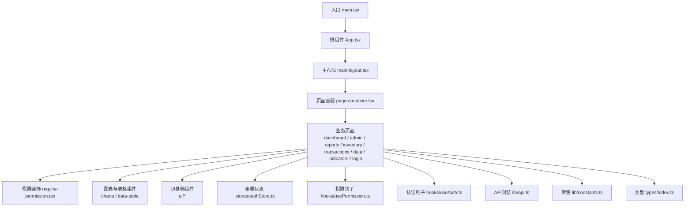

图示来源
- [web/src/main.tsx](file://web/src/main.tsx)
- [web/src/App.tsx](file://web/src/App.tsx)
- [web/src/components/layout/main-layout.tsx](file://web/src/components/layout/main-layout.tsx)
- [web/src/components/layout/page-container.tsx](file://web/src/components/layout/page-container.tsx)
- [web/src/components/layout/require-permission.tsx](file://web/src/components/layout/require-permission.tsx)
- [web/src/stores/authStore.ts](file://web/src/stores/authStore.ts)
- [web/src/hooks/usePermission.ts](file://web/src/hooks/usePermission.ts)
- [web/src/hooks/useAuth.ts](file://web/src/hooks/useAuth.ts)
- [web/src/lib/api.ts](file://web/src/lib/api.ts)
- [web/src/lib/constants.ts](file://web/src/lib/constants.ts)
- [web/src/types/index.ts](file://web/src/types/index.ts)

章节来源
- [web/src/main.tsx](file://web/src/main.tsx)
- [web/src/App.tsx](file://web/src/App.tsx)
- [web/src/components/layout/main-layout.tsx](file://web/src/components/layout/main-layout.tsx)
- [web/src/components/layout/page-container.tsx](file://web/src/components/layout/page-container.tsx)
- [web/src/components/layout/require-permission.tsx](file://web/src/components/layout/require-permission.tsx)
- [web/src/stores/authStore.ts](file://web/src/stores/authStore.ts)
- [web/src/hooks/usePermission.ts](file://web/src/hooks/usePermission.ts)
- [web/src/hooks/useAuth.ts](file://web/src/hooks/useAuth.ts)
- [web/src/lib/api.ts](file://web/src/lib/api.ts)
- [web/src/lib/constants.ts](file://web/src/lib/constants.ts)
- [web/src/types/index.ts](file://web/src/types/index.ts)

## 核心组件
- 布局组件
  - main-layout：提供侧边导航、顶部栏与主内容区，统一承载各业务页面。
  - page-container：为页面提供标准内边距、标题区与操作区，保证视觉一致性。
  - header：展示用户信息、通知与快捷入口，并与认证状态联动。
- 权限组件
  - require-permission：用于页面或按钮级别的权限校验，支持“无权限时降级显示”和“拒绝访问跳转”。
- 业务页面
  - dashboard：聚合关键指标卡片、趋势图与概览数据，强调可视化与实时性。
  - admin：管理后台入口，承载用户、角色、菜单等管理功能。
  - reports：报表中心，提供筛选、导出与分页查询。
  - inventory：库存管理，包含商品列表、入库出库记录与库存预警。
  - transactions：交易流水，支持多维筛选、批量操作与导出。
  - data：数据看板与数据源配置入口。
  - indicators：指标管理与自定义指标维护。
  - login：登录页，处理认证流程与错误提示。
- 通用能力
  - charts：KPI卡片、迷你折线、趋势图等可视化组件。
  - data-table：可排序、可筛选、可分页的表格组件族。
  - ui：原子化UI组件（按钮、输入、选择、对话框等）。

章节来源
- [web/src/components/layout/main-layout.tsx](file://web/src/components/layout/main-layout.tsx)
- [web/src/components/layout/page-container.tsx](file://web/src/components/layout/page-container.tsx)
- [web/src/components/layout/header.tsx](file://web/src/components/layout/header.tsx)
- [web/src/components/layout/require-permission.tsx](file://web/src/components/layout/require-permission.tsx)
- [web/src/pages/dashboard/index.tsx](file://web/src/pages/dashboard/index.tsx)
- [web/src/pages/admin/index.tsx](file://web/src/pages/admin/index.tsx)
- [web/src/pages/reports/index.tsx](file://web/src/pages/reports/index.tsx)
- [web/src/pages/inventory/index.tsx](file://web/src/pages/inventory/index.tsx)
- [web/src/pages/transactions/index.tsx](file://web/src/pages/transactions/index.tsx)
- [web/src/pages/data/index.tsx](file://web/src/pages/data/index.tsx)
- [web/src/pages/indicators/index.tsx](file://web/src/pages/indicators/index.tsx)
- [web/src/pages/login/index.tsx](file://web/src/pages/login/index.tsx)

## 架构总览
整体采用“布局壳 + 业务页 + 能力层”的分层设计：
- 布局壳层：main-layout与page-container负责页面骨架与样式规范。
- 业务页层：各业务页面组合图表、表格与表单，完成具体场景交互。
- 能力层：
  - 状态与权限：authStore集中保存认证态；useAuth与usePermission提供便捷Hook；require-permission进行声明式权限控制。
  - 数据访问：api封装HTTP请求与拦截器，constants提供全局常量，types约束数据结构。
  - UI与图表：ui与charts提供可复用视图能力，data-table支撑复杂列表场景。

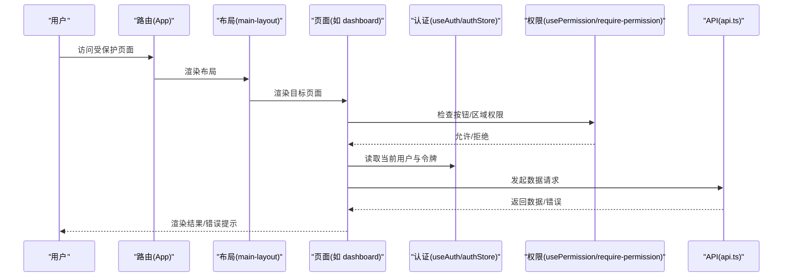

图示来源
- [web/src/App.tsx](file://web/src/App.tsx)
- [web/src/components/layout/main-layout.tsx](file://web/src/components/layout/main-layout.tsx)
- [web/src/components/layout/require-permission.tsx](file://web/src/components/layout/require-permission.tsx)
- [web/src/hooks/useAuth.ts](file://web/src/hooks/useAuth.ts)
- [web/src/stores/authStore.ts](file://web/src/stores/authStore.ts)
- [web/src/hooks/usePermission.ts](file://web/src/hooks/usePermission.ts)
- [web/src/lib/api.ts](file://web/src/lib/api.ts)

## 详细组件分析

### 布局与页面容器
- main-layout
  - 职责：统一侧边导航、顶部栏与主内容区；根据认证状态切换可见性与菜单项。
  - 关键点：与header联动展示用户信息；与路由结合高亮当前菜单；在需要时包裹权限检查。
- page-container
  - 职责：为页面提供一致的标题、副标题、操作区与内容区；便于统一设置内边距与响应式行为。
- header
  - 职责：展示用户头像、名称、退出登录入口；与认证状态同步更新。

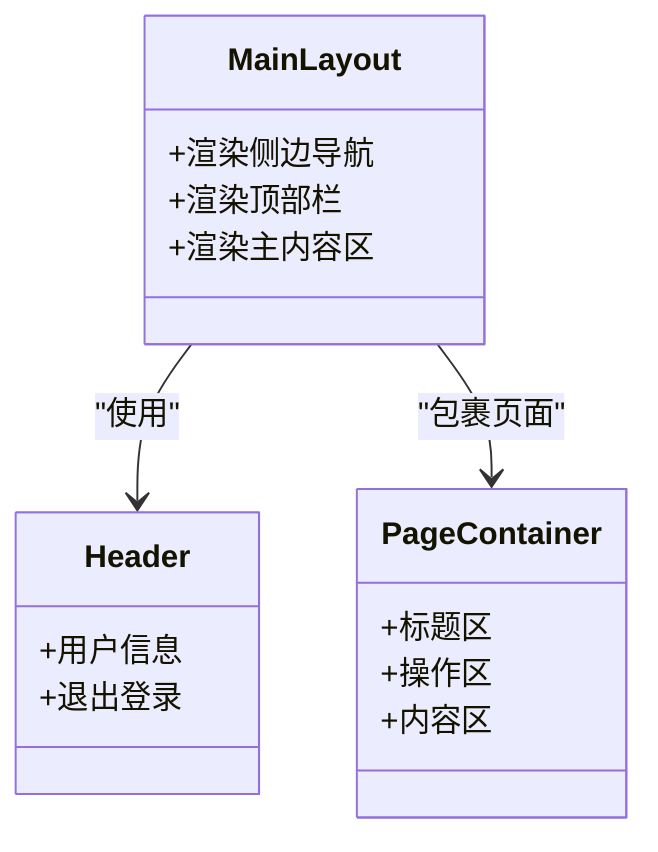

图示来源
- [web/src/components/layout/main-layout.tsx](file://web/src/components/layout/main-layout.tsx)
- [web/src/components/layout/page-container.tsx](file://web/src/components/layout/page-container.tsx)
- [web/src/components/layout/header.tsx](file://web/src/components/layout/header.tsx)

章节来源
- [web/src/components/layout/main-layout.tsx](file://web/src/components/layout/main-layout.tsx)
- [web/src/components/layout/page-container.tsx](file://web/src/components/layout/page-container.tsx)
- [web/src/components/layout/header.tsx](file://web/src/components/layout/header.tsx)

### 权限控制体系
- 路由级守卫
  - 通过App层的路由配置对受保护路径进行前置判断，未登录或未授权时重定向至登录页或空白页。
- 组件级权限
  - require-permission用于页面区块或按钮的细粒度控制，依据当前用户权限集合判定是否渲染。
- 数据级权限
  - 在页面内部结合usePermission与后端返回的字段权限，动态隐藏敏感列或禁用危险操作。

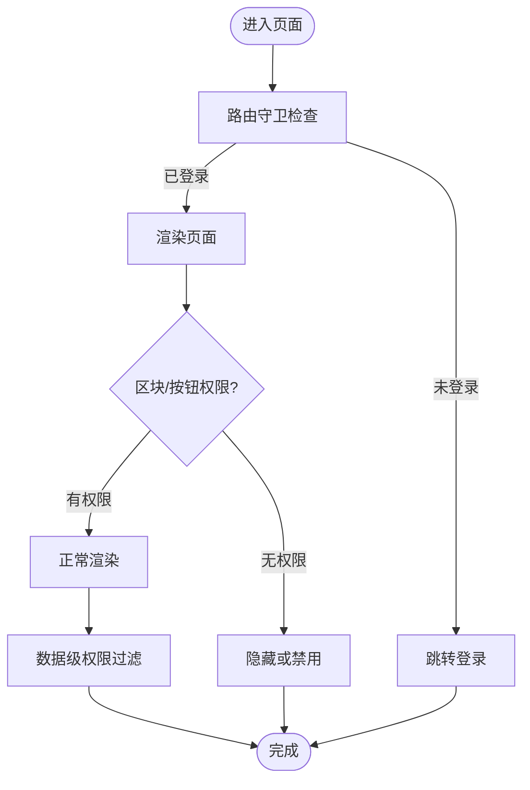

图示来源
- [web/src/App.tsx](file://web/src/App.tsx)
- [web/src/components/layout/require-permission.tsx](file://web/src/components/layout/require-permission.tsx)
- [web/src/hooks/usePermission.ts](file://web/src/hooks/usePermission.ts)
- [web/src/hooks/useAuth.ts](file://web/src/hooks/useAuth.ts)
- [web/src/stores/authStore.ts](file://web/src/stores/authStore.ts)

章节来源
- [web/src/components/layout/require-permission.tsx](file://web/src/components/layout/require-permission.tsx)
- [web/src/hooks/usePermission.ts](file://web/src/hooks/usePermission.ts)
- [web/src/hooks/useAuth.ts](file://web/src/hooks/useAuth.ts)
- [web/src/stores/authStore.ts](file://web/src/stores/authStore.ts)

### 认证与全局状态
- authStore
  - 集中管理用户信息、令牌与过期时间；提供登录、登出、刷新令牌等方法；可与本地存储持久化。
- useAuth
  - 暴露当前用户、是否登录、登录/登出动作等便捷方法，供页面与组件订阅。
- 本地存储
  - 将认证态与必要配置写入本地存储，提升首屏体验与离线可用性；注意敏感信息的加密与清理策略。

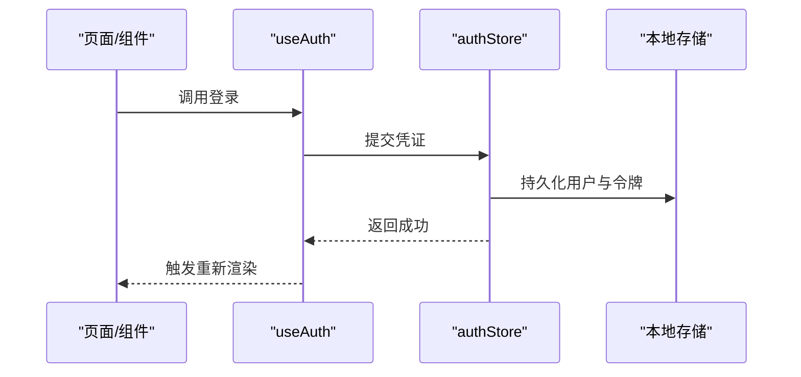

图示来源
- [web/src/stores/authStore.ts](file://web/src/stores/authStore.ts)
- [web/src/hooks/useAuth.ts](file://web/src/hooks/useAuth.ts)

章节来源
- [web/src/stores/authStore.ts](file://web/src/stores/authStore.ts)
- [web/src/hooks/useAuth.ts](file://web/src/hooks/useAuth.ts)

### 数据访问与类型契约
- api
  - 统一封装请求与响应拦截，处理鉴权头、错误码映射与重试策略；提供RESTful方法与工具函数。
- constants
  - 集中管理接口前缀、分页默认值、枚举字典等常量，避免硬编码。
- types
  - 定义用户、权限、分页、图表数据等核心类型，确保前后端契约一致。

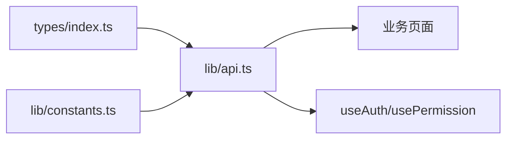

图示来源
- [web/src/lib/api.ts](file://web/src/lib/api.ts)
- [web/src/lib/constants.ts](file://web/src/lib/constants.ts)
- [web/src/types/index.ts](file://web/src/types/index.ts)

章节来源
- [web/src/lib/api.ts](file://web/src/lib/api.ts)
- [web/src/lib/constants.ts](file://web/src/lib/constants.ts)
- [web/src/types/index.ts](file://web/src/types/index.ts)

### 核心业务页面

#### 仪表板（Dashboard）
- 功能要点
  - 聚合KPI卡片、趋势图与关键指标；支持时间范围筛选与自动刷新。
  - 通过图表组件与数据表格组合呈现多维度数据。
- 数据流
  - 页面加载时调用API获取指标与趋势数据；失败时回退到空状态或上次缓存数据。
- 权限
  - 页面入口受路由守卫保护；部分指标可能受数据级权限控制。

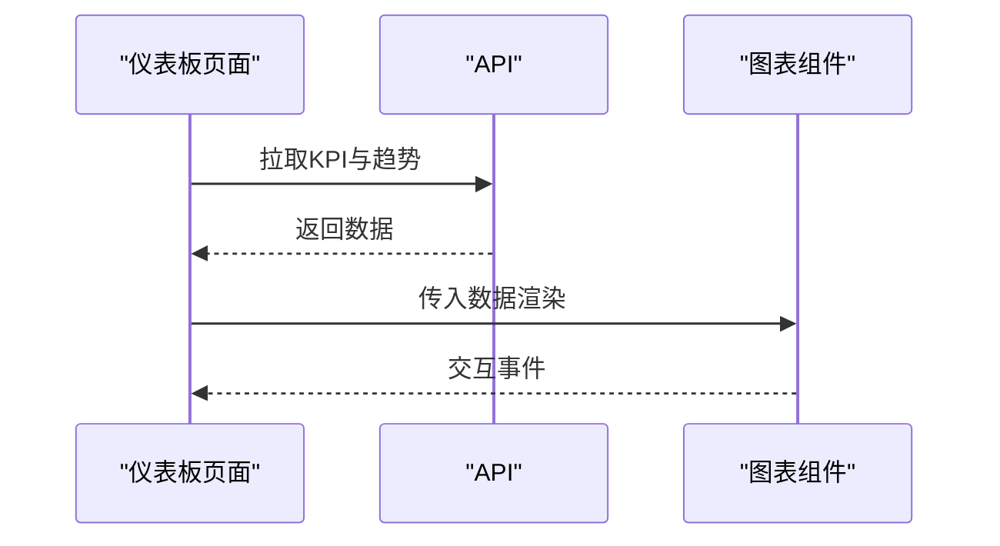

图示来源
- [web/src/pages/dashboard/index.tsx](file://web/src/pages/dashboard/index.tsx)
- [web/src/lib/api.ts](file://web/src/lib/api.ts)

章节来源
- [web/src/pages/dashboard/index.tsx](file://web/src/pages/dashboard/index.tsx)

#### 管理系统（Admin）
- 功能要点
  - 用户、角色、菜单等资源的管理；支持增删改查与批量操作。
- 数据流
  - 列表页使用data-table实现分页、排序与筛选；编辑弹窗复用表单与校验。
- 权限
  - 路由级保护；新增/编辑/删除按钮通过require-permission控制。

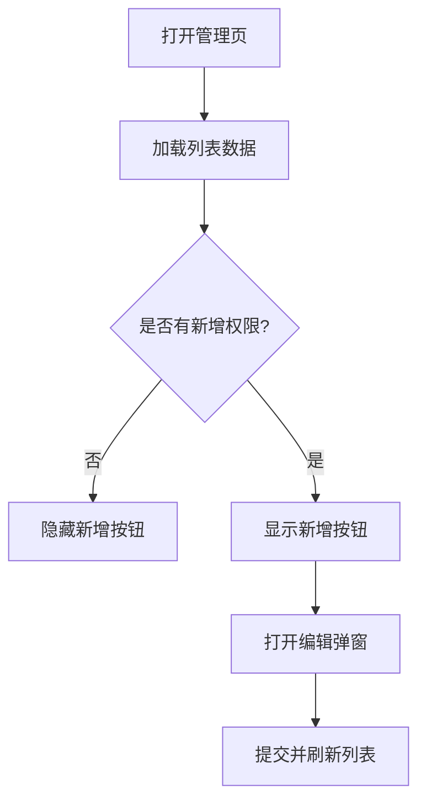

图示来源
- [web/src/pages/admin/index.tsx](file://web/src/pages/admin/index.tsx)
- [web/src/components/layout/require-permission.tsx](file://web/src/components/layout/require-permission.tsx)

章节来源
- [web/src/pages/admin/index.tsx](file://web/src/pages/admin/index.tsx)
- [web/src/components/layout/require-permission.tsx](file://web/src/components/layout/require-permission.tsx)

#### 报表中心（Reports）
- 功能要点
  - 多条件筛选、分页查询、导出Excel/PDF；支持定时任务与历史报表查看。
- 数据流
  - 构建查询参数对象，调用API获取报表数据；导出走独立下载接口。
- 性能
  - 大报表采用服务端分页与增量加载；导出异步处理与进度反馈。

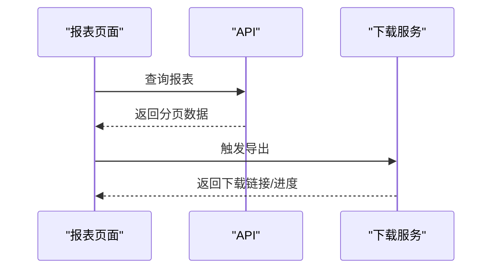

图示来源
- [web/src/pages/reports/index.tsx](file://web/src/pages/reports/index.tsx)
- [web/src/lib/api.ts](file://web/src/lib/api.ts)

章节来源
- [web/src/pages/reports/index.tsx](file://web/src/pages/reports/index.tsx)
- [web/src/lib/api.ts](file://web/src/lib/api.ts)

#### 库存管理（Inventory）
- 功能要点
  - 商品台账、入库单、出库单、库存预警；支持扫码录入与批次管理。
- 数据流
  - 列表与详情分离；变更操作后局部刷新或全量刷新。
- 权限
  - 出入库操作需具备相应权限；敏感字段按数据级权限隐藏。

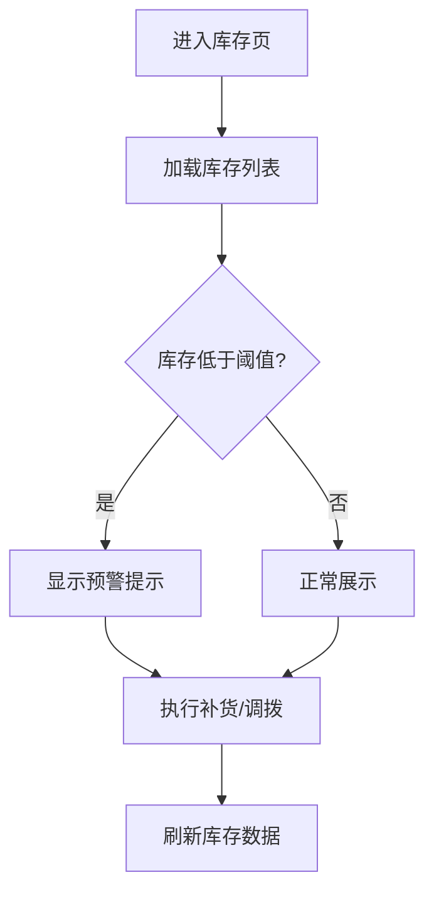

图示来源
- [web/src/pages/inventory/index.tsx](file://web/src/pages/inventory/index.tsx)

章节来源
- [web/src/pages/inventory/index.tsx](file://web/src/pages/inventory/index.tsx)

#### 交易流水（Transactions）
- 功能要点
  - 交易明细查询、对账、异常标记与导出；支持时间区间与账户维度筛选。
- 数据流
  - 大数据量采用虚拟滚动与服务端分页；导出异步处理。
- 权限
  - 仅授权用户可查看完整金额与账号信息。

章节来源
- [web/src/pages/transactions/index.tsx](file://web/src/pages/transactions/index.tsx)

#### 数据看板（Data）
- 功能要点
  - 数据源连接、指标定义与看板拼装；支持拖拽布局与主题切换。
- 数据流
  - 看板配置持久化至本地存储与后端；按需加载图表与表格。

章节来源
- [web/src/pages/data/index.tsx](file://web/src/pages/data/index.tsx)

#### 指标管理（Indicators）
- 功能要点
  - 指标字典、计算规则与阈值配置；版本管理与灰度发布。
- 数据流
  - 指标变更触发缓存失效与看板热更新。

章节来源
- [web/src/pages/indicators/index.tsx](file://web/src/pages/indicators/index.tsx)

#### 登录（Login）
- 功能要点
  - 用户名密码/短信验证码登录；记住我与会话保持；错误提示与防抖。
- 数据流
  - 登录成功后写入authStore与本地存储，并重定向至首页或上一路由。

章节来源
- [web/src/pages/login/index.tsx](file://web/src/pages/login/index.tsx)

## 依赖分析
- 组件耦合
  - 页面与布局低耦合，通过props与上下文传递状态；权限组件以装饰器形式嵌入，降低侵入性。
- 外部依赖
  - Vite负责构建与开发服务器；TailwindCSS提供样式能力；图表与表格组件为内部封装，减少第三方耦合。
- 潜在循环依赖
  - 建议避免页面直接引用布局，布局也不应反向依赖具体页面；通过路由与插槽解耦。

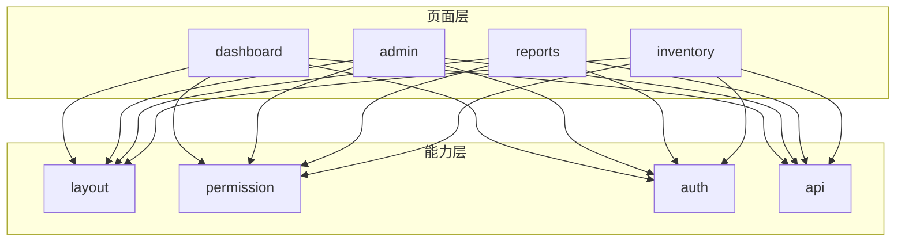

图示来源
- [web/src/pages/dashboard/index.tsx](file://web/src/pages/dashboard/index.tsx)
- [web/src/pages/admin/index.tsx](file://web/src/pages/admin/index.tsx)
- [web/src/pages/reports/index.tsx](file://web/src/pages/reports/index.tsx)
- [web/src/pages/inventory/index.tsx](file://web/src/pages/inventory/index.tsx)
- [web/src/components/layout/main-layout.tsx](file://web/src/components/layout/main-layout.tsx)
- [web/src/components/layout/require-permission.tsx](file://web/src/components/layout/require-permission.tsx)
- [web/src/hooks/useAuth.ts](file://web/src/hooks/useAuth.ts)
- [web/src/lib/api.ts](file://web/src/lib/api.ts)

章节来源
- [web/src/pages/dashboard/index.tsx](file://web/src/pages/dashboard/index.tsx)
- [web/src/pages/admin/index.tsx](file://web/src/pages/admin/index.tsx)
- [web/src/pages/reports/index.tsx](file://web/src/pages/reports/index.tsx)
- [web/src/pages/inventory/index.tsx](file://web/src/pages/inventory/index.tsx)
- [web/src/components/layout/main-layout.tsx](file://web/src/components/layout/main-layout.tsx)
- [web/src/components/layout/require-permission.tsx](file://web/src/components/layout/require-permission.tsx)
- [web/src/hooks/useAuth.ts](file://web/src/hooks/useAuth.ts)
- [web/src/lib/api.ts](file://web/src/lib/api.ts)

## 性能考虑
- 路由懒加载与代码分割
  - 使用Vite的动态导入对页面进行按需加载，减少首屏体积。
- 组件级懒加载
  - 对重型图表与表格使用懒加载与占位骨架屏，提升感知速度。
- 缓存机制
  - 对热点数据（如字典、指标定义）实施内存缓存与本地缓存；结合版本号或时间戳控制失效。
- 请求优化
  - 合并重复请求、去抖与节流、失败重试与超时控制；列表分页与增量加载。
- 渲染优化
  - 列表虚拟化、memo化与key稳定；避免不必要的重渲染。

[本节为通用指导，不直接分析具体文件]

## 故障排查指南
- 常见问题
  - 未登录被重定向：检查路由守卫与认证状态是否正确初始化。
  - 按钮不可见：确认权限标识与当前用户权限集合匹配。
  - 数据不更新：检查缓存键与失效策略；确认API返回结构与类型定义一致。
  - 导出失败：确认导出接口权限与文件大小限制；检查异步回调与下载链接有效性。
- 定位步骤
  - 打开浏览器控制台与网络面板，观察请求与错误堆栈。
  - 在权限组件处打印当前权限集合，比对期望权限。
  - 在API拦截器中打印请求头与响应体，验证鉴权与错误码。

章节来源
- [web/src/components/layout/require-permission.tsx](file://web/src/components/layout/require-permission.tsx)
- [web/src/hooks/usePermission.ts](file://web/src/hooks/usePermission.ts)
- [web/src/hooks/useAuth.ts](file://web/src/hooks/useAuth.ts)
- [web/src/lib/api.ts](file://web/src/lib/api.ts)

## 结论
pj3页面组件体系以“布局壳 + 业务页 + 能力层”的分层架构为核心，配合声明式权限与统一数据访问，实现了高内聚、低耦合的可扩展前端工程。通过路由守卫、组件级与数据级权限的多层次防护，以及懒加载、代码分割与缓存等性能优化手段，系统在安全性与用户体验之间取得良好平衡。遵循本文档提供的标准化流程与最佳实践，可高效扩展新页面并保持整体一致性。

## 附录

### 新页面创建标准化流程
- 新建页面文件
  - 在对应功能域目录下创建index.tsx，使用page-container包裹页面主体。
- 接入权限
  - 在页面入口或按钮处使用require-permission进行权限控制。
- 数据获取
  - 通过api封装发起请求，结合types定义数据结构，使用constants管理常量。
- 状态与缓存
  - 使用authStore与useAuth管理认证态；对热点数据实施缓存与失效策略。
- 路由注册
  - 在App层添加路由配置，必要时加入路由守卫与懒加载。
- 测试与自测
  - 编写单元测试覆盖权限与数据流；进行端到端冒烟测试。

章节来源
- [web/src/pages/dashboard/index.tsx](file://web/src/pages/dashboard/index.tsx)
- [web/src/components/layout/page-container.tsx](file://web/src/components/layout/page-container.tsx)
- [web/src/components/layout/require-permission.tsx](file://web/src/components/layout/require-permission.tsx)
- [web/src/lib/api.ts](file://web/src/lib/api.ts)
- [web/src/lib/constants.ts](file://web/src/lib/constants.ts)
- [web/src/types/index.ts](file://web/src/types/index.ts)
- [web/src/stores/authStore.ts](file://web/src/stores/authStore.ts)
- [web/src/hooks/useAuth.ts](file://web/src/hooks/useAuth.ts)
- [web/src/App.tsx](file://web/src/App.tsx)

### 最佳实践清单
- 将公共逻辑下沉至hooks与components，避免页面内重复实现。
- 使用类型约束与常量管理，减少魔法字符串与硬编码。
- 对敏感操作增加二次确认与日志审计。
- 对大数据列表启用分页与虚拟化，避免长列表卡顿。
- 对导出与耗时操作提供进度反馈与取消能力。
- 严格区分只读与写权限，最小化授予原则。

[本节为通用指导，不直接分析具体文件]