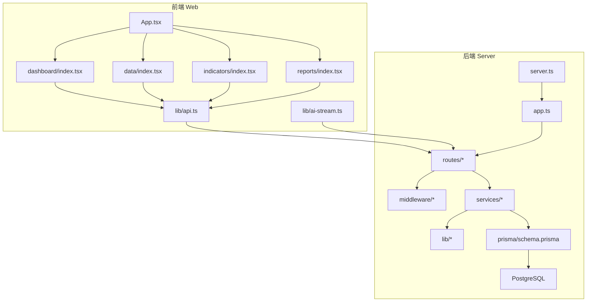
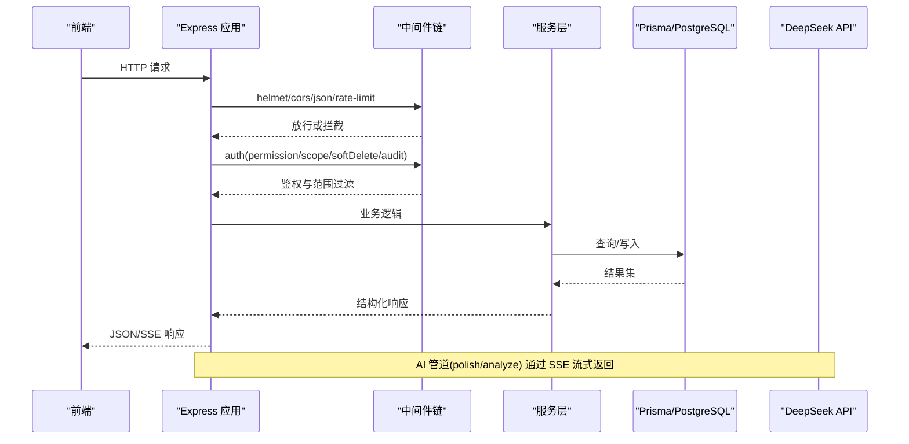
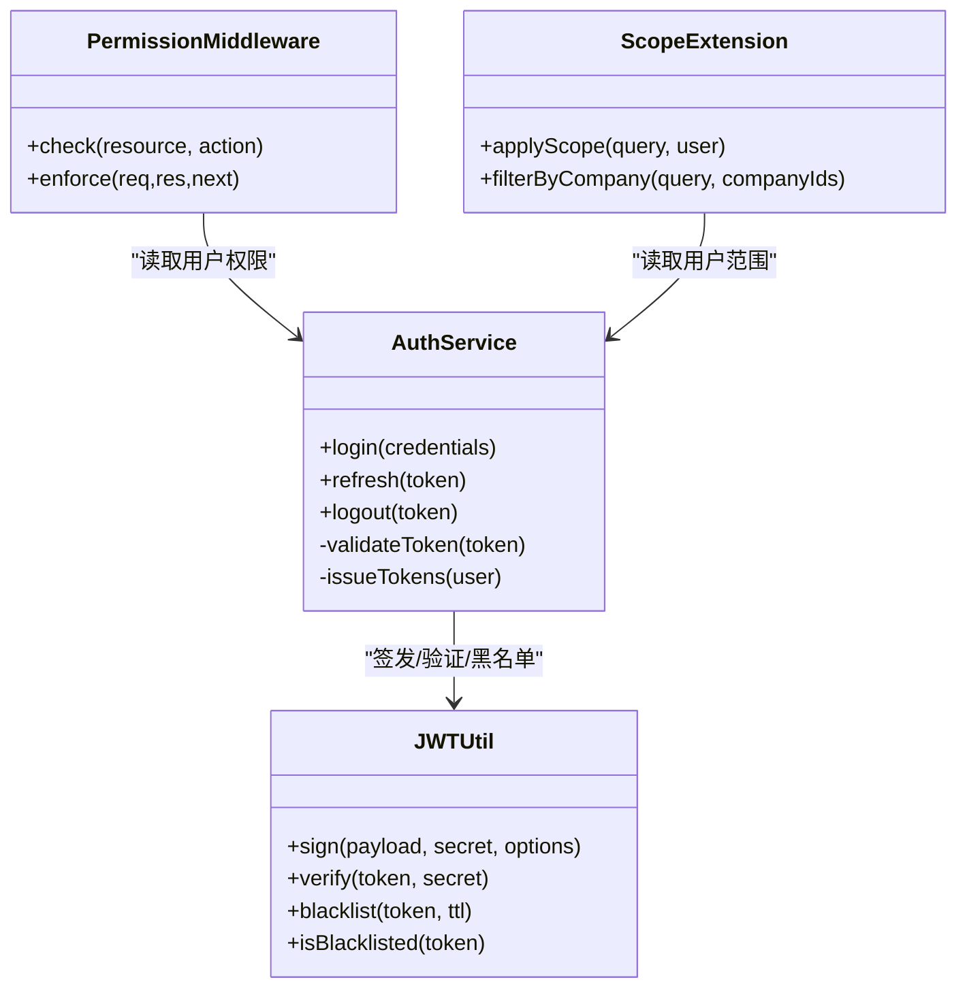
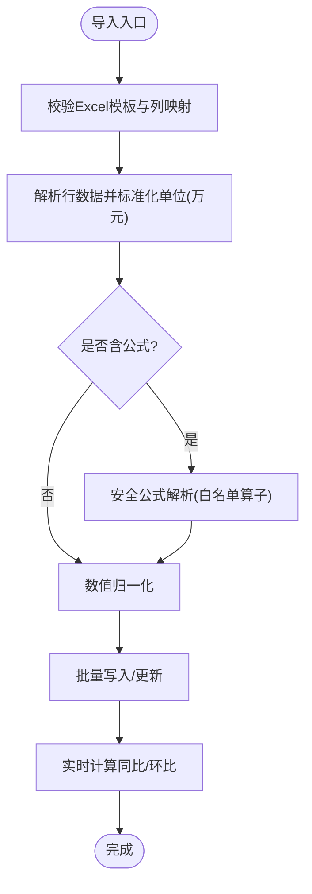
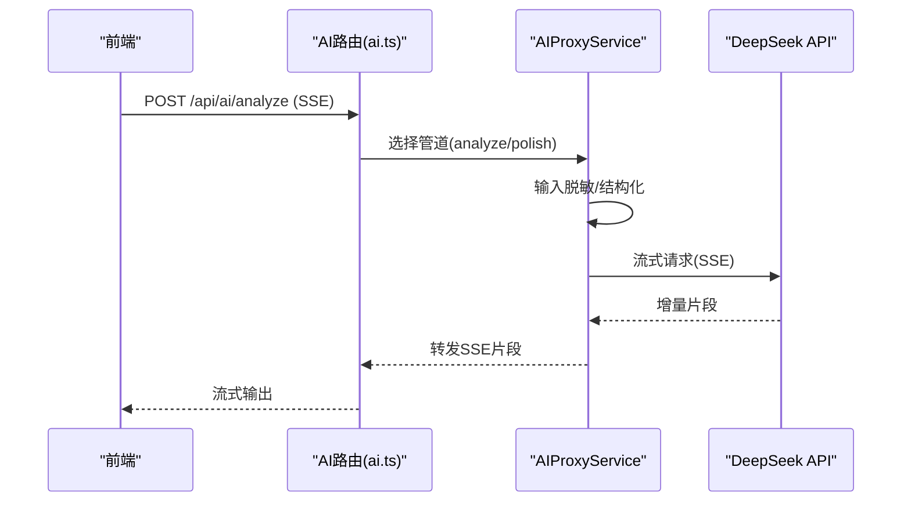
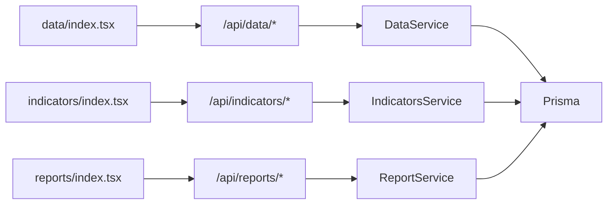
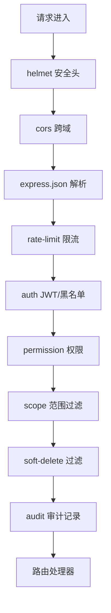
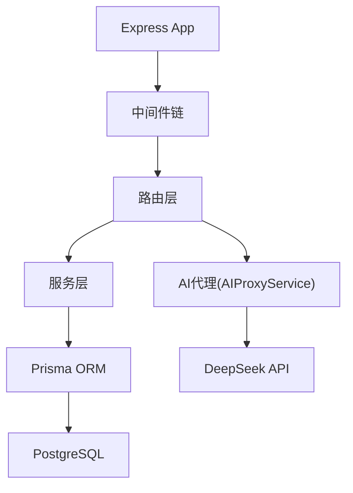

# 项目概览

<cite>
**本文引用的文件**   
- [server/src/app.ts](file://server/src/app.ts)
- [server/src/server.ts](file://server/src/server.ts)
- [server/src/config/env.ts](file://server/src/config/env.ts)
- [server/prisma/schema.prisma](file://server/prisma/schema.prisma)
- [server/src/middleware/helmet.ts](file://server/src/middleware/helmet.ts)
- [server/src/middleware/cors.ts](file://server/src/middleware/cors.ts)
- [server/src/middleware/rate-limit.ts](file://server/src/middleware/rate-limit.ts)
- [server/src/middleware/auth.ts](file://server/src/middleware/auth.ts)
- [server/src/middleware/permission.ts](file://server/src/middleware/permission.ts)
- [server/src/middleware/scope.ts](file://server/src/middleware/scope.ts)
- [server/src/middleware/soft-delete.ts](file://server/src/middleware/soft-delete.ts)
- [server/src/middleware/audit.ts](file://server/src/middleware/audit.ts)
- [server/src/lib/jwt.ts](file://server/src/lib/jwt.ts)
- [server/src/lib/deepseek.ts](file://server/src/lib/deepseek.ts)
- [server/src/services/AIProxyService.ts](file://server/src/services/AIProxyService.ts)
- [server/src/routes/auth.ts](file://server/src/routes/auth.ts)
- [server/src/routes/data.ts](file://server/src/routes/data.ts)
- [server/src/routes/indicators.ts](file://server/src/routes/indicators.ts)
- [server/src/routes/reports.ts](file://server/src/routes/reports.ts)
- [server/src/routes/ai.ts](file://server/src/routes/ai.ts)
- [server/src/lib/excel-import.ts](file://server/src/lib/excel-import.ts)
- [server/src/lib/formula.ts](file://server/src/lib/formula.ts)
- [web/src/pages/dashboard/index.tsx](file://web/src/pages/dashboard/index.tsx)
- [web/src/pages/data/index.tsx](file://web/src/pages/data/index.tsx)
- [web/src/pages/indicators/index.tsx](file://web/src/pages/indicators/index.tsx)
- [web/src/pages/reports/index.tsx](file://web/src/pages/reports/index.tsx)
- [web/src/lib/api.ts](file://web/src/lib/api.ts)
- [web/src/lib/ai-stream.ts](file://web/src/lib/ai-stream.ts)
</cite>

## 目录
1. [简介](#简介)
2. [项目结构](#项目结构)
3. [核心组件](#核心组件)
4. [架构总览](#架构总览)
5. [详细组件分析](#详细组件分析)
6. [依赖关系分析](#依赖关系分析)
7. [性能考量](#性能考量)
8. [故障排查指南](#故障排查指南)
9. [结论](#结论)
10. [附录：快速开始](#附录快速开始)

## 简介
本项目为FY200财年经营数据分析平台，定位“Excel进、看板/报表出”的内部管理口径财务数据平台，单位统一为万元/人民币。后端采用Node.js + Express + Prisma + PostgreSQL，前端使用React + TypeScript；认证采用JWT双令牌（access与refresh）轮转机制；AI能力通过DeepSeek API以SSE流式响应提供。系统围绕财务数据导入、多维度指标分析、AI智能分析、权限管理与审计追踪等核心功能构建，服务于管理层对经营数据的实时洞察与决策。

## 项目结构
仓库采用前后端分离的双工程结构：
- server：Express服务、Prisma数据层、中间件链、路由与服务层、AI代理与工具库
- web：React应用、页面与组件、API客户端、AI流式处理、权限与主题样式
- prisma：数据库模型与迁移、种子数据
- docs/.wiki：开发文档与参考

**图表来源** 
- [server/src/server.ts](file://server/src/server.ts)
- [server/src/app.ts](file://server/src/app.ts)
- [web/src/App.tsx](file://web/src/App.tsx)
- [web/src/lib/api.ts](file://web/src/lib/api.ts)

**章节来源**
- [server/src/server.ts](file://server/src/server.ts)
- [server/src/app.ts](file://server/src/app.ts)
- [web/src/App.tsx](file://web/src/App.tsx)

## 核心组件
- 数据导入与校验：Excel模板解析、字段映射、单位换算（万元）、公式规则校验
- 指标计算引擎：安全公式解析（白名单算子），同比/环比实时计算不入库
- AI智能分析：双管道（polish/analyze），SSE流式输出，脱敏与还原策略
- 认证与授权：JWT双令牌（access 15分钟、refresh 7天）+ 黑名单 + 权限控制
- 审计与可观测性：请求链路追踪、操作审计日志、错误与限流
- 前端看板与报表：多页签视图、表格与图表、导出与交互

**章节来源**
- [server/src/lib/excel-import.ts](file://server/src/lib/excel-import.ts)
- [server/src/lib/formula.ts](file://server/src/lib/formula.ts)
- [server/src/lib/deepseek.ts](file://server/src/lib/deepseek.ts)
- [server/src/services/AIProxyService.ts](file://server/src/services/AIProxyService.ts)
- [server/src/lib/jwt.ts](file://server/src/lib/jwt.ts)
- [server/src/middleware/auth.ts](file://server/src/middleware/auth.ts)
- [server/src/middleware/permission.ts](file://server/src/middleware/permission.ts)
- [server/src/middleware/audit.ts](file://server/src/middleware/audit.ts)

## 架构总览
系统遵循“中间件执行链顺序：helmet → cors → express.json → rate-limit → auth(JWT+黑名单) → permission(默认拒绝) → scope(Prisma extension) → softDelete → audit → Service → Prisma → PostgreSQL”。AI调用通过代理服务封装SSE流式响应，前端基于事件流进行增量渲染。

**图表来源** 
- [server/src/app.ts](file://server/src/app.ts)
- [server/src/middleware/helmet.ts](file://server/src/middleware/helmet.ts)
- [server/src/middleware/cors.ts](file://server/src/middleware/cors.ts)
- [server/src/middleware/rate-limit.ts](file://server/src/middleware/rate-limit.ts)
- [server/src/middleware/auth.ts](file://server/src/middleware/auth.ts)
- [server/src/middleware/permission.ts](file://server/src/middleware/permission.ts)
- [server/src/middleware/scope.ts](file://server/src/middleware/scope.ts)
- [server/src/middleware/soft-delete.ts](file://server/src/middleware/soft-delete.ts)
- [server/src/middleware/audit.ts](file://server/src/middleware/audit.ts)
- [server/src/services/AIProxyService.ts](file://server/src/services/AIProxyService.ts)
- [server/src/lib/deepseek.ts](file://server/src/lib/deepseek.ts)

## 详细组件分析

### 认证与授权（JWT双令牌 + 权限控制）
- 双令牌机制：access token短期有效（约15分钟），refresh token长期有效（约7天），支持刷新与黑名单吊销
- 权限模型：默认拒绝，按角色/资源粒度控制访问
- 作用域过滤：通过Prisma扩展在查询层注入公司/组织范围
- 软删除：查询自动排除已删除记录

**图表来源** 
- [server/src/lib/jwt.ts](file://server/src/lib/jwt.ts)
- [server/src/middleware/auth.ts](file://server/src/middleware/auth.ts)
- [server/src/middleware/permission.ts](file://server/src/middleware/permission.ts)
- [server/src/middleware/scope.ts](file://server/src/middleware/scope.ts)

**章节来源**
- [server/src/lib/jwt.ts](file://server/src/lib/jwt.ts)
- [server/src/middleware/auth.ts](file://server/src/middleware/auth.ts)
- [server/src/middleware/permission.ts](file://server/src/middleware/permission.ts)
- [server/src/middleware/scope.ts](file://server/src/middleware/scope.ts)

### 数据导入与指标计算（Excel进、公式解析、同比环比）
- Excel导入：模板校验、列映射、单位统一为万元、批量入库
- 公式引擎：白名单算子（加减乘除括号），禁止eval，保障安全
- 指标计算：同比/环比由后端实时计算，不持久化，保证一致性

**图表来源** 
- [server/src/lib/excel-import.ts](file://server/src/lib/excel-import.ts)
- [server/src/lib/formula.ts](file://server/src/lib/formula.ts)

**章节来源**
- [server/src/lib/excel-import.ts](file://server/src/lib/excel-import.ts)
- [server/src/lib/formula.ts](file://server/src/lib/formula.ts)

### AI智能分析（SSE流式 + 双管道）
- 双管道：
  - polish：文本→脱敏→LLM→还原
  - analyze：结构化→计算→脱敏→LLM→生成
- 脱敏规则：绝对金额→区间，公司名→动态映射
- 流式响应：SSE推送增量内容，前端逐步渲染

**图表来源** 
- [server/src/routes/ai.ts](file://server/src/routes/ai.ts)
- [server/src/services/AIProxyService.ts](file://server/src/services/AIProxyService.ts)
- [server/src/lib/deepseek.ts](file://server/src/lib/deepseek.ts)

**章节来源**
- [server/src/routes/ai.ts](file://server/src/routes/ai.ts)
- [server/src/services/AIProxyService.ts](file://server/src/services/AIProxyService.ts)
- [server/src/lib/deepseek.ts](file://server/src/lib/deepseek.ts)

### 数据与报表（看板/报表出）
- 数据模块：导入、维护、公式规则管理
- 指标模块：多维度筛选、聚合、趋势与对比
- 报表模块：模板编辑、导出、版本历史

**图表来源** 
- [web/src/pages/data/index.tsx](file://web/src/pages/data/index.tsx)
- [web/src/pages/indicators/index.tsx](file://web/src/pages/indicators/index.tsx)
- [web/src/pages/reports/index.tsx](file://web/src/pages/reports/index.tsx)
- [server/src/routes/data.ts](file://server/src/routes/data.ts)
- [server/src/routes/indicators.ts](file://server/src/routes/indicators.ts)
- [server/src/routes/reports.ts](file://server/src/routes/reports.ts)

**章节来源**
- [web/src/pages/data/index.tsx](file://web/src/pages/data/index.tsx)
- [web/src/pages/indicators/index.tsx](file://web/src/pages/indicators/index.tsx)
- [web/src/pages/reports/index.tsx](file://web/src/pages/reports/index.tsx)
- [server/src/routes/data.ts](file://server/src/routes/data.ts)
- [server/src/routes/indicators.ts](file://server/src/routes/indicators.ts)
- [server/src/routes/reports.ts](file://server/src/routes/reports.ts)

### 审计与安全（中间件链）
- 安全头：helmet配置
- 跨域：cors策略
- 限流：rate-limit保护接口
- 审计：audit记录关键操作
- 软删除：避免误删影响统计

**图表来源** 
- [server/src/middleware/helmet.ts](file://server/src/middleware/helmet.ts)
- [server/src/middleware/cors.ts](file://server/src/middleware/cors.ts)
- [server/src/middleware/rate-limit.ts](file://server/src/middleware/rate-limit.ts)
- [server/src/middleware/auth.ts](file://server/src/middleware/auth.ts)
- [server/src/middleware/permission.ts](file://server/src/middleware/permission.ts)
- [server/src/middleware/scope.ts](file://server/src/middleware/scope.ts)
- [server/src/middleware/soft-delete.ts](file://server/src/middleware/soft-delete.ts)
- [server/src/middleware/audit.ts](file://server/src/middleware/audit.ts)

**章节来源**
- [server/src/middleware/helmet.ts](file://server/src/middleware/helmet.ts)
- [server/src/middleware/cors.ts](file://server/src/middleware/cors.ts)
- [server/src/middleware/rate-limit.ts](file://server/src/middleware/rate-limit.ts)
- [server/src/middleware/auth.ts](file://server/src/middleware/auth.ts)
- [server/src/middleware/permission.ts](file://server/src/middleware/permission.ts)
- [server/src/middleware/scope.ts](file://server/src/middleware/scope.ts)
- [server/src/middleware/soft-delete.ts](file://server/src/middleware/soft-delete.ts)
- [server/src/middleware/audit.ts](file://server/src/middleware/audit.ts)

## 依赖关系分析
- 运行时依赖：Node.js、Express、Prisma、PostgreSQL、DeepSeek API
- 前端依赖：React、TypeScript、Vite、TailwindCSS
- 关键耦合点：
  - 中间件链顺序严格，任何环节失败将短路返回
  - AI代理与SSE流式传输需保持连接稳定
  - 权限与范围过滤贯穿所有数据读写

**图表来源** 
- [server/src/app.ts](file://server/src/app.ts)
- [server/src/server.ts](file://server/src/server.ts)
- [server/src/services/AIProxyService.ts](file://server/src/services/AIProxyService.ts)
- [server/prisma/schema.prisma](file://server/prisma/schema.prisma)

**章节来源**
- [server/src/app.ts](file://server/src/app.ts)
- [server/src/server.ts](file://server/src/server.ts)
- [server/prisma/schema.prisma](file://server/prisma/schema.prisma)

## 性能考量
- 指标计算实时化：同比/环比在后端计算，避免冗余存储与同步成本
- 公式解析安全且高效：白名单算子限制，降低解析开销与安全风险
- 中间件链优化：限流与缓存策略可减少无效请求
- 流式AI响应：SSE增量输出提升用户体验，降低首屏等待时间
- 数据库索引与分页：建议对高频查询字段建立索引，合理分页减少内存占用

[本节为通用指导，不直接分析具体文件]

## 故障排查指南
- 认证失败：检查JWT签名、过期时间、黑名单状态
- 权限不足：确认用户角色与资源动作的映射
- 数据导入异常：核对模板列名、单位换算、公式合法性
- AI流中断：检查网络连通性与SSE事件处理
- 审计缺失：确认audit中间件生效与日志落盘

**章节来源**
- [server/src/lib/jwt.ts](file://server/src/lib/jwt.ts)
- [server/src/middleware/auth.ts](file://server/src/middleware/auth.ts)
- [server/src/middleware/permission.ts](file://server/src/middleware/permission.ts)
- [server/src/lib/excel-import.ts](file://server/src/lib/excel-import.ts)
- [server/src/lib/deepseek.ts](file://server/src/lib/deepseek.ts)
- [server/src/middleware/audit.ts](file://server/src/middleware/audit.ts)

## 结论
本平台以“Excel进、看板/报表出”为核心目标，结合严谨的中间件链、安全的公式解析、实时的指标计算与流式AI能力，构建了面向内部管理口径的财务数据分析体系。通过双令牌认证与权限控制，确保数据安全与合规；通过审计与可观测性，保障运行稳定性与问题可追溯。

[本节为总结性内容，不直接分析具体文件]

## 附录：快速开始
- 环境要求
  - Node.js LTS
  - PostgreSQL 15
  - DeepSeek API密钥（用于AI功能）
- 安装步骤
  - 初始化数据库与迁移
  - 启动后端服务
  - 启动前端开发服务器
- 基本使用示例
  - 登录获取双令牌
  - 导入Excel模板数据
  - 查看看板与指标
  - 使用AI智能分析（SSE流式）

[本节为概念性指引，不直接分析具体文件]