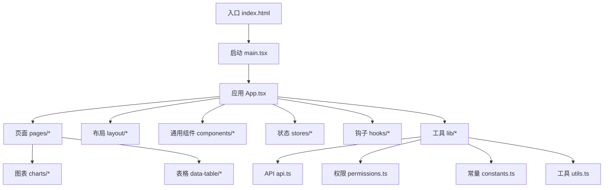
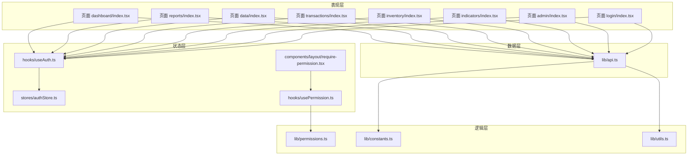
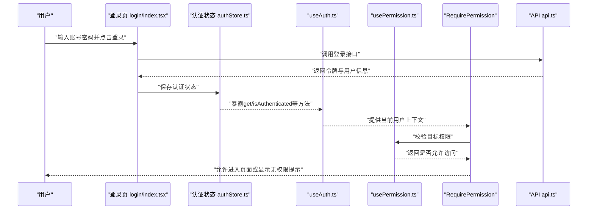
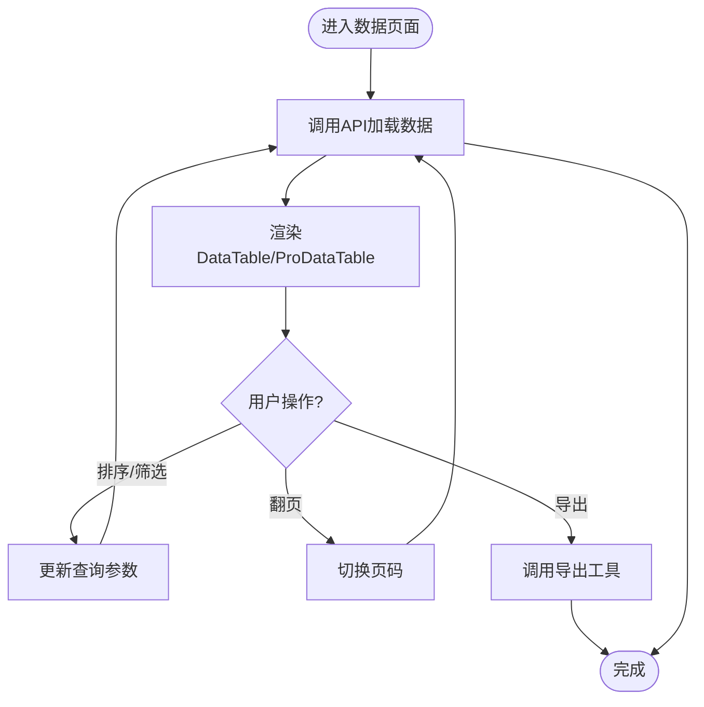
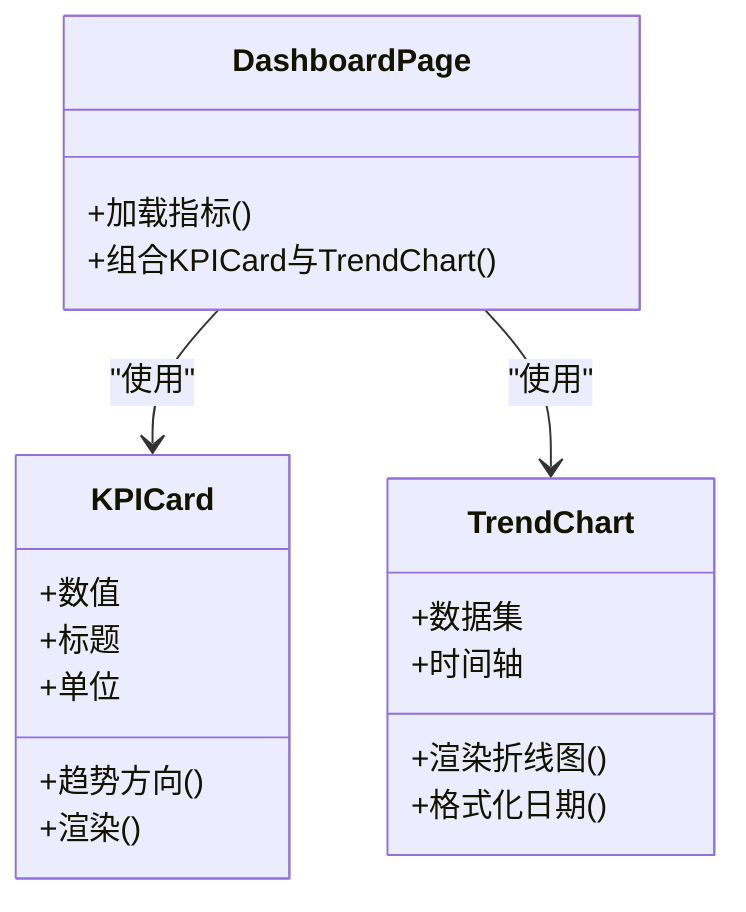
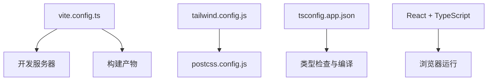

# 项目概述

<cite>
**本文引用的文件**   
- [package.json](file://web/package.json)
- [vite.config.ts](file://web/vite.config.ts)
- [tailwind.config.js](file://web/tailwind.config.js)
- [postcss.config.js](file://web/postcss.config.js)
- [tsconfig.app.json](file://web/tsconfig.app.json)
- [index.html](file://web/index.html)
- [main.tsx](file://web/src/main.tsx)
- [App.tsx](file://web/src/App.tsx)
- [authStore.ts](file://web/src/stores/authStore.ts)
- [useAuth.ts](file://web/src/hooks/useAuth.ts)
- [usePermission.ts](file://web/src/hooks/usePermission.ts)
- [require-permission.tsx](file://web/src/components/layout/require-permission.tsx)
- [api.ts](file://web/src/lib/api.ts)
- [constants.ts](file://web/src/lib/constants.ts)
- [permissions.ts](file://web/src/lib/permissions.ts)
- [utils.ts](file://web/src/lib/utils.ts)
- [data-table.tsx](file://web/src/components/data-table/data-table.tsx)
- [pro-data-table.tsx](file://web/src/components/data-table/pro-data-table.tsx)
- [pagination.tsx](file://web/src/components/data-table/pagination.tsx)
- [kpi-card.tsx](file://web/src/components/charts/kpi-card.tsx)
- [trend-chart.tsx](file://web/src/components/charts/trend-chart.tsx)
- [dashboard/index.tsx](file://web/src/pages/dashboard/index.tsx)
- [reports/index.tsx](file://web/src/pages/reports/index.tsx)
- [data/index.tsx](file://web/src/pages/data/index.tsx)
- [transactions/index.tsx](file://web/src/pages/transactions/index.tsx)
- [inventory/index.tsx](file://web/src/pages/inventory/index.tsx)
- [indicators/index.tsx](file://web/src/pages/indicators/index.tsx)
- [admin/index.tsx](file://web/src/pages/admin/index.tsx)
- [login/index.tsx](file://web/src/pages/login/index.tsx)
</cite>

## 目录
1. [简介](#简介)
2. [项目结构](#项目结构)
3. [核心组件](#核心组件)
4. [架构总览](#架构总览)
5. [详细组件分析](#详细组件分析)
6. [依赖分析](#依赖分析)
7. [性能考虑](#性能考虑)
8. [故障排查指南](#故障排查指南)
9. [结论](#结论)
10. [附录：快速开始](#附录快速开始)

## 简介
pj3企业级数据管理平台是一个面向企业场景的前端应用，聚焦于数据可视化、权限控制与报表生成等核心能力。项目采用现代化前端技术栈，基于React + TypeScript构建，使用Vite作为构建工具，Tailwind CSS进行样式开发，Zustand管理全局状态，并通过统一的API层与后端服务交互。整体设计强调模块化、可维护性与可扩展性，旨在为企业用户提供高效、安全、直观的数据管理与决策支持体验。

## 项目结构
项目位于web目录下，遵循“功能域+通用能力”的目录组织方式：
- src/pages：按业务页面划分（仪表盘、报表、数据、交易、库存、指标、管理员、登录）
- src/components：通用UI组件、图表组件、表格组件、布局与权限相关组件
- src/stores：基于Zustand的全局状态（如认证状态）
- src/hooks：自定义Hook（认证、权限判断）
- src/lib：公共库（API封装、常量、权限策略、工具函数、导出等）
- src/types：类型定义
- src/styles：全局样式
- public：静态资源
- 根配置：Vite、Tailwind、PostCSS、TypeScript、测试等

**图示来源**
- [index.html:1-20](file://web/index.html#L1-L20)
- [main.tsx:1-40](file://web/src/main.tsx#L1-L40)
- [App.tsx:1-80](file://web/src/App.tsx#L1-L80)

**章节来源**
- [index.html:1-20](file://web/index.html#L1-L20)
- [main.tsx:1-40](file://web/src/main.tsx#L1-L40)
- [App.tsx:1-80](file://web/src/App.tsx#L1-L80)

## 核心组件
- 认证与权限
  - Zustand认证状态：集中管理用户会话与角色信息，提供获取、更新与校验方法
  - useAuth Hook：在组件中便捷访问认证状态
  - usePermission Hook：根据当前用户角色与目标权限进行判定
  - RequirePermission 组件：在路由或页面级别进行权限拦截与降级展示
- 数据表格
  - DataTable：基础表格组件，支持分页、排序、筛选
  - ProDataTable：增强版表格，集成高级筛选、批量操作、列配置
  - Pagination：分页控件，与表格联动
- 图表与KPI
  - KPICard：关键指标卡片，展示数值与趋势
  - TrendChart：趋势折线图，用于时间序列数据展示
- 布局与容器
  - MainLayout：主布局框架，包含头部、侧边栏与内容区
  - PageContainer：页面容器，统一内边距与背景风格

这些组件共同支撑了数据可视化、权限控制与报表生成的核心能力，并在各业务页面中被复用。

**章节来源**
- [authStore.ts:1-120](file://web/src/stores/authStore.ts#L1-L120)
- [useAuth.ts:1-60](file://web/src/hooks/useAuth.ts#L1-L60)
- [usePermission.ts:1-80](file://web/src/hooks/usePermission.ts#L1-L80)
- [require-permission.tsx:1-100](file://web/src/components/layout/require-permission.tsx#L1-L100)
- [data-table.tsx:1-120](file://web/src/components/data-table/data-table.tsx#L1-L120)
- [pro-data-table.tsx:1-150](file://web/src/components/data-table/pro-data-table.tsx#L1-L150)
- [pagination.tsx:1-80](file://web/src/components/data-table/pagination.tsx#L1-L80)
- [kpi-card.tsx:1-80](file://web/src/components/charts/kpi-card.tsx#L1-L80)
- [trend-chart.tsx:1-100](file://web/src/components/charts/trend-chart.tsx#L1-L100)

## 架构总览
系统采用分层架构：
- 表现层：React组件与页面，负责UI渲染与用户交互
- 状态层：Zustand store与自定义Hook，管理认证与权限状态
- 逻辑层：权限策略与工具函数，处理业务规则与数据处理
- 数据层：统一API封装，负责请求发送、错误处理与响应转换
- 构建与样式：Vite构建、Tailwind CSS样式、PostCSS插件链

**图示来源**
- [dashboard/index.tsx:1-120](file://web/src/pages/dashboard/index.tsx#L1-L120)
- [reports/index.tsx:1-120](file://web/src/pages/reports/index.tsx#L1-L120)
- [data/index.tsx:1-120](file://web/src/pages/data/index.tsx#L1-L120)
- [transactions/index.tsx:1-120](file://web/src/pages/transactions/index.tsx#L1-L120)
- [inventory/index.tsx:1-120](file://web/src/pages/inventory/index.tsx#L1-L120)
- [indicators/index.tsx:1-120](file://web/src/pages/indicators/index.tsx#L1-L120)
- [admin/index.tsx:1-120](file://web/src/pages/admin/index.tsx#L1-L120)
- [login/index.tsx:1-120](file://web/src/pages/login/index.tsx#L1-L120)
- [authStore.ts:1-120](file://web/src/stores/authStore.ts#L1-L120)
- [useAuth.ts:1-60](file://web/src/hooks/useAuth.ts#L1-L60)
- [usePermission.ts:1-80](file://web/src/hooks/usePermission.ts#L1-L80)
- [require-permission.tsx:1-100](file://web/src/components/layout/require-permission.tsx#L1-L100)
- [api.ts:1-120](file://web/src/lib/api.ts#L1-L120)
- [permissions.ts:1-100](file://web/src/lib/permissions.ts#L1-L100)
- [constants.ts:1-80](file://web/src/lib/constants.ts#L1-L80)
- [utils.ts:1-100](file://web/src/lib/utils.ts#L1-L100)

## 详细组件分析

### 认证与权限流程
认证与权限是平台的核心安全机制。用户登录后，认证状态写入Zustand store；页面通过useAuth读取状态，结合usePermission与RequirePermission实现细粒度权限控制。

**图示来源**
- [login/index.tsx:1-120](file://web/src/pages/login/index.tsx#L1-L120)
- [authStore.ts:1-120](file://web/src/stores/authStore.ts#L1-L120)
- [useAuth.ts:1-60](file://web/src/hooks/useAuth.ts#L1-L60)
- [usePermission.ts:1-80](file://web/src/hooks/usePermission.ts#L1-L80)
- [require-permission.tsx:1-100](file://web/src/components/layout/require-permission.tsx#L1-L100)
- [api.ts:1-120](file://web/src/lib/api.ts#L1-L120)

**章节来源**
- [login/index.tsx:1-120](file://web/src/pages/login/index.tsx#L1-L120)
- [authStore.ts:1-120](file://web/src/stores/authStore.ts#L1-L120)
- [useAuth.ts:1-60](file://web/src/hooks/useAuth.ts#L1-L60)
- [usePermission.ts:1-80](file://web/src/hooks/usePermission.ts#L1-L80)
- [require-permission.tsx:1-100](file://web/src/components/layout/require-permission.tsx#L1-L100)
- [api.ts:1-120](file://web/src/lib/api.ts#L1-L120)

### 数据表格与分页
数据表格模块提供基础与增强两种表格能力，配合分页组件实现大数据集的高效浏览与操作。

**图示来源**
- [data-table.tsx:1-120](file://web/src/components/data-table/data-table.tsx#L1-L120)
- [pro-data-table.tsx:1-150](file://web/src/components/data-table/pro-data-table.tsx#L1-L150)
- [pagination.tsx:1-80](file://web/src/components/data-table/pagination.tsx#L1-L80)
- [api.ts:1-120](file://web/src/lib/api.ts#L1-L120)
- [export.ts:1-100](file://web/src/lib/export.ts#L1-L100)

**章节来源**
- [data-table.tsx:1-120](file://web/src/components/data-table/data-table.tsx#L1-L120)
- [pro-data-table.tsx:1-150](file://web/src/components/data-table/pro-data-table.tsx#L1-L150)
- [pagination.tsx:1-80](file://web/src/components/data-table/pagination.tsx#L1-L80)
- [api.ts:1-120](file://web/src/lib/api.ts#L1-L120)
- [export.ts:1-100](file://web/src/lib/export.ts#L1-L100)

### 图表与KPI展示
图表与KPI组件用于数据可视化，提升用户对关键指标的感知与洞察。

**图示来源**
- [kpi-card.tsx:1-80](file://web/src/components/charts/kpi-card.tsx#L1-L80)
- [trend-chart.tsx:1-100](file://web/src/components/charts/trend-chart.tsx#L1-L100)
- [dashboard/index.tsx:1-120](file://web/src/pages/dashboard/index.tsx#L1-L120)

**章节来源**
- [kpi-card.tsx:1-80](file://web/src/components/charts/kpi-card.tsx#L1-L80)
- [trend-chart.tsx:1-100](file://web/src/components/charts/trend-chart.tsx#L1-L100)
- [dashboard/index.tsx:1-120](file://web/src/pages/dashboard/index.tsx#L1-L120)

## 依赖分析
项目依赖关系清晰，构建与样式链路独立且稳定：
- 构建：Vite配置文件定义开发服务器、插件与输出产物
- 样式：Tailwind CSS与PostCSS协同工作，提供原子化样式与插件扩展
- 类型：TypeScript配置确保类型安全与编译质量
- 运行时：React生态与Zustand状态管理

**图示来源**
- [vite.config.ts:1-120](file://web/vite.config.ts#L1-L120)
- [tailwind.config.js:1-120](file://web/tailwind.config.js#L1-L120)
- [postcss.config.js:1-80](file://web/postcss.config.js#L1-L80)
- [tsconfig.app.json:1-80](file://web/tsconfig.app.json#L1-L80)

**章节来源**
- [vite.config.ts:1-120](file://web/vite.config.ts#L1-L120)
- [tailwind.config.js:1-120](file://web/tailwind.config.js#L1-L120)
- [postcss.config.js:1-80](file://web/postcss.config.js#L1-L80)
- [tsconfig.app.json:1-80](file://web/tsconfig.app.json#L1-L80)

## 性能考虑
- 构建优化：Vite按需加载与缓存策略，缩短冷启动与热更新时延
- 样式优化：Tailwind CSS仅生成使用到的样式类，减少包体体积
- 状态管理：Zustand轻量高效，避免不必要的重渲染
- 数据加载：分页与懒加载结合，降低首屏压力
- 图表渲染：大数据量时使用虚拟滚动或采样聚合，避免卡顿

[本节为通用指导，不直接分析具体文件]

## 故障排查指南
- 认证失败
  - 检查登录接口返回与令牌存储
  - 确认useAuth是否正确读取状态
  - 验证RequirePermission的权限策略
- 权限异常
  - 核对permissions.ts中的角色与权限映射
  - 检查usePermission的判定逻辑
- 数据加载问题
  - 查看api.ts的错误处理与重试策略
  - 确认分页参数与后端接口一致性
- 样式未生效
  - 检查Tailwind配置与PostCSS插件链
  - 确认全局样式引入顺序

**章节来源**
- [api.ts:1-120](file://web/src/lib/api.ts#L1-L120)
- [permissions.ts:1-100](file://web/src/lib/permissions.ts#L1-L100)
- [usePermission.ts:1-80](file://web/src/hooks/usePermission.ts#L1-L80)
- [require-permission.tsx:1-100](file://web/src/components/layout/require-permission.tsx#L1-L100)
- [tailwind.config.js:1-120](file://web/tailwind.config.js#L1-L120)
- [postcss.config.js:1-80](file://web/postcss.config.js#L1-L80)

## 结论
pj3企业级数据管理平台以React + TypeScript为核心，结合Vite、Tailwind CSS与Zustand，构建了高可用、易扩展的企业级前端架构。通过统一的认证与权限体系、强大的数据表格与图表能力，平台有效提升了数据可视化管理效率与用户体验。建议后续持续完善错误监控、性能度量与自动化测试，进一步提升稳定性与可维护性。

[本节为总结性内容，不直接分析具体文件]

## 附录：快速开始
- 环境准备
  - Node.js版本要求见package.json
  - 安装依赖：npm install
- 启动开发服务器
  - npm run dev
  - 默认端口与代理配置见vite.config.ts
- 构建生产包
  - npm run build
- 运行测试
  - npm test
- 代码规范与检查
  - ESLint与Oxlint配置在项目根目录
- 常用命令
  - 开发：npm run dev
  - 构建：npm run build
  - 预览：npm run preview
  - 测试：npm test

**章节来源**
- [package.json:1-120](file://web/package.json#L1-L120)
- [vite.config.ts:1-120](file://web/vite.config.ts#L1-L120)