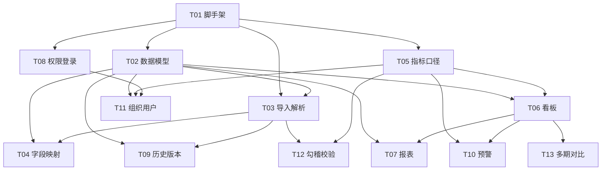

# 浙江壹品慧 · 财年经营数据分析 Web 平台
## 系统架构设计 & 任务分解（规划稿 v1.0）

> ⚠️ **[已废止]** 原始架构设计文档。技术选型（MUI→AntD、SQLite→PostgreSQL）、数据模型（通用FactRecord→3张事实表）、中间件链（2层→8层）均已大幅更新。AI Agent 请 Read `../CLAUDE.md` + `../整体方案v3.md`。本文档中的精华内容（命名规范、API错误码、14个设计问题、项目文件结构、6项技术难点）已提取到新文档体系。

> **文档属性**：本文件为「架构规划」交付物，仅含设计结论与任务分解，**不含实现代码**。
> **作者**：架构师 高见远（software-architect）
> **读者**：主理人 齐活林（汇总用）；下游 工程师（排期用）
> **约定**：正文中 ✅ = 已落定设计结论；🔶 = **ASSUMPTION 假设项**（客户未拍板，给出「推荐默认 + 替代方案」）；⚠️ = 需客户确认但已给出默认处理。

---

## 0. 设计总览与结论

| 维度 | 结论 |
|------|------|
| 产品本质 | "Excel 进、看板/报表出" 的内部财务管理口径分析平台 |
| 推荐默认技术栈 | ✅ Vite + React + MUI + Tailwind（前端）；Node/Express + Prisma + SQLite（轻量后端） |
| 是否需要后端 | 🔶 **ASSUMPTION：需要后端**（历史版本、指标口径、权限管理均强依赖持久化与多用户） |
| MVP 范围 | ✅ 仅实现 PRD 的 **P0** 全部项（导入/映射/口径/看板/下钻/报表/权限/版本） |
| 部署 | 🔶 **ASSUMPTION：内网私有化 Docker 单机部署**（替代：公有云 SaaS） |
| 多语言/多主体 | 🔶 **ASSUMPTION：单主体、简体中文、单币种**（i18n 预留接口，不实现） |

---

## 1. 实现方案 + 框架选型

### 1.1 核心难点分析

1. **Excel 字段校验 + 逐行错误定位**：需在上传后即时给出"第 N 行第 M 列"的错误，要求前端解析 + schema 校验能力。
2. **列到标准指标的灵活映射**：用户 Excel 列名千变万化，需"自动猜+手动改+方案复用"。
3. **派生指标与口径一致性**：预算执行率 = 实际/预算 等派生指标需集中定义、版本留痕、可解释。
4. **多维聚合与下钻**：事业部×区域×期间×指标 的灵活聚合与穿透，性能与灵活性平衡。
5. **按角色+事业部的数据可见范围**：同一套数据，不同人看到不同事业部。
6. **导入版本留痕与差异比对**：多次导入需可比对（同指标不同版本数值差）。

### 1.2 推荐默认方案（技术栈）

| 层 | 选型 | 用途 / 理由 |
|----|------|------------|
| 构建 | ✅ **Vite 5 + React 18 + TypeScript** | PRD 建议栈，启动快、生态成熟 |
| UI 组件 | ✅ **MUI 5（@mui/material）+ Emotion** | 企业后台组件齐全、表格/表单开箱即用 |
| 样式 | ✅ **Tailwind CSS 3** | 原子化样式，与 MUI 互补（布局/间距微调） |
| 路由 | ✅ **React Router v6** | 信息架构 4 页面 + 登录守卫 |
| 状态 | ✅ **Zustand**（轻量） | 按 feature 切 store；鉴权用 AuthContext |
| 图表 | ✅ **ECharts + echarts-for-react** | 财务看板趋势/同环比/下钻图最强；替代：Recharts |
| Excel 读 | ✅ **SheetJS（xlsx）** | 前端解析 Excel/CSV，行级错误定位 |
| Excel 写 | ✅ **ExcelJS** | 带样式导出（替代纯 xlsx 社区版写能力退化） |
| PDF 导出 | ✅ **jsPDF + jspdf-autotable** | 报表 PDF；替代：pdfmake |
| 校验 | ✅ **Zod** | 前后端共享校验 schema（模板/映射/入参） |
| 表单 | ✅ **react-hook-form + @hookform/resolvers** | 导入/映射/管理后台表单 |
| 日期/财年 | ✅ **dayjs** | 期间格式化、财年计算 |
| 表格 | ✅ **@tanstack/react-table** | 报表中心交叉表/穿透（替代：MUI X DataGrid） |

**后端（🔶 ASSUMPTION 采用轻量后端）**

| 层 | 选型 | 用途 / 理由 |
|----|------|------------|
| 运行时 | ✅ **Node.js + Express 5 + TypeScript** | 与前端同语言，降低协作成本；替代：Fastify（更高性能） |
| ORM | ✅ **Prisma** | schema 即文档，迁移/seed 方便；替代：TypeORM / Drizzle |
| 存储 | 🔶 **ASSUMPTION：SQLite（单文件）** | 内部小数据量零运维；**替代方案：PostgreSQL**（多用户并发/未来上云） |
| 鉴权 | ✅ **JWT（jsonwebtoken）+ bcryptjs** | 无状态登录；替代：Session + Redis |
| 文件上传 | ✅ **multer** | 接收 Excel 临时落盘/内存解析 |
| 校验 | ✅ **Zod**（与前端同一 schema 文件） | 服务端二次校验 |
| 配置 | ✅ **dotenv** | 环境变量 |

### 1.3 10 项未决项：推荐默认 + 替代方案（均已标 ASSUMPTION）

| # | PRD 待确认问题 | 🔶 推荐默认（ASSUMPTION） | 替代方案 | 对设计的影响 |
|---|---------------|--------------------------|----------|--------------|
| 1 | 技术栈 | Vite+React+MUI+Tailwind ✅已采纳 | 客户指定 Vue/Ant Design 等 | 仅前端组件层替换，架构分层不变 |
| 2 | 纯前端 or 后端持久化 / 数据量 | 后端持久化；🔶 MVP 数据量 < 100 万行/年 | 纯前端+IndexedDB（无后端） | 决定是否有 Server/DB 层（本设计按有后端） |
| 3 | 内网/公有云 + SSO | 🔶 内网私有化 Docker；🔶 无 SSO，本地账号 | 公有云；AD/LDAP/钉钉/企微 SSO | AuthService 预留 SSO 适配位；默认 JWT 本地登录 |
| 4 | 仅手工导入 or 对接 ERP | 🔶 仅 Excel 手工导入（P0） | 定时拉取 ERP（P2） | ImportService 预留 connector 接口 |
| 5 | 事业部/区域/财年 层级与编码 | 🔶 由 IT 管理员在"维度管理"中自定义录入；编码规则 `BU001/REG01/FY2024/P06` | 客户给固定主数据 | Dimension+DimensionMember 表可配置即为此设计 |
| 6 | 权限粒度 | 🔶 角色 + 事业部数据范围（够用）；期间范围可选 | 字段级/脱敏 | Policy 表含 scopeType/scopeValue，可扩展字段级 |
| 7 | 指标公式定义文档/审批人 | 🔶 平台内 Metric 表 + MetricDefinitionHistory 留痕；owner 维护、IT 管理员审批 | 外部 Excel 文档 | Metric 实体即"口径文档"载体 |
| 8 | 导出格式 | ✅ Excel + PDF（P0） | Word/PPT/打印套打（P2） | ExportUtil 预留插件式导出器 |
| 9 | 数据保留时长/内审留痕 | 🔶 保留 ≥ 3 财年；ImportBatch 全留痕；操作审计 P2 | 法定 7~10 年 | 增加 AuditLog 表（P2）不影响主模型 |
| 10 | 单主体/多币种/多语言 | 🔶 单主体、人民币、简体中文 | 多主体/多币种/多语言 | i18n + 币种字段预留；默认不实现 |

### 1.4 MVP 范围（基于 P0）

✅ 必须交付：标准模板下载、前端字段校验（必填/类型/范围/期间格式）、逐行错误定位；字段映射（手动/自动+方案复用）；指标/维度/口径管理；经营看板首页（核心指标卡+同环比趋势）；看板下钻；报表中心（交叉+导出）；权限基础（角色+事业部）；导入历史版本（列表+差异比对）。

🔶 P1 纳入本期可选增量：异动/超支预警、报表单元格穿透、组织用户管理后台、跨表勾稽校验、多财年对比（见任务 T10–T13）。

---

## 2. 文件列表及相对路径

```
yipinhui-finance/                      # 仓库根（前后端分离，可后续改 monorepo）
├─ package.json                        # 根（workspace 或仅说明）
├─ README.md
├─ .env.example
├─ docker-compose.yml                  # 🔶 内网私有化部署（前端 nginx + 后端 node + sqlite 卷）
├─ docs/
│  ├─ system_design.md
│  ├─ class-diagram.mermaid
│  └─ sequence-diagram.mermaid
├─ web/                                # ===== 前端 =====
│  ├─ package.json
│  ├─ vite.config.ts
│  ├─ tailwind.config.js
│  ├─ postcss.config.js
│  ├─ tsconfig.json
│  ├─ index.html
│  ├─ src/
│  │  ├─ main.tsx
│  │  ├─ App.tsx                       # 路由 + 主题 + 布局
│  │  ├─ theme.ts                      # MUI 主题
│  │  ├─ i18n/                         # 🔶 预留（默认 zh-CN）
│  │  │  └─ index.ts
│  │  ├─ lib/
│  │  │  ├─ api.ts                     # axios 实例 + 拦截器
│  │  │  ├─ schema.ts                  # 与后端共享的 Zod schema
│  │  │  └─ dayjs.ts                   # 财年/期间格式化
│  │  ├─ store/
│  │  │  ├─ authStore.ts               # 用户/scope
│  │  │  └─ dashboardStore.ts          # 看板缓存失效
│  │  ├─ features/
│  │  │  ├─ auth/                      # 登录/路由守卫
│  │  │  │  ├─ LoginPage.tsx
│  │  │  │  └─ RequireAuth.tsx
│  │  │  ├─ import/                    # 导入中心
│  │  │  │  ├─ ImportPage.tsx
│  │  │  │  ├─ UploadPanel.tsx
│  │  │  │  ├─ MappingPanel.tsx        # 字段映射
│  │  │  │  ├─ ValidationResult.tsx    # 逐行错误定位
│  │  │  │  ├─ HistoryPanel.tsx        # 历史版本 + 差异比对
│  │  │  │  └─ useImport.ts
│  │  │  ├─ dashboard/                 # 经营看板首页
│  │  │  │  ├─ DashboardPage.tsx
│  │  │  │  ├─ MetricCards.tsx
│  │  │  │  ├─ TrendChart.tsx
│  │  │  │  └─ DrillDown.tsx
│  │  │  ├─ report/                    # 报表中心
│  │  │  │  ├─ ReportPage.tsx
│  │  │  │  ├─ CrossTable.tsx
│  │  │  │  ├─ DimensionConfig.tsx
│  │  │  │  └─ exportUtil.ts           # Excel/PDF 导出
|  │  │  └─ admin/                     # 管理后台
│  │  │     ├─ AdminLayout.tsx
│  │  │     ├─ MetricManager.tsx       # 指标/口径
│  │  │     ├─ DimensionManager.tsx
│  │  │     ├─ UserManager.tsx
│  │  │     └─ RolePermission.tsx
│  │  └─ components/                   # 通用组件（Layout/Table/Dialog）
│  └─ public/
└─ server/                             # ===== 后端 =====
   ├─ package.json
   ├─ tsconfig.json
   ├─ prisma/
   │  ├─ schema.prisma                 # 全部实体
   │  └─ seed.ts                       # 维度/指标初始数据
   ├─ src/
   │  ├─ index.ts                      # Express 启动
   │  ├─ db.ts                         # Prisma client
   │  ├─ env.ts
   │  ├─ middleware/
   │  │  ├─ auth.ts                    # JWT 校验
   │  │  └─ scope.ts                   # 数据范围(事业部)过滤
   │  ├─ services/
   │  │  ├─ AuthService.ts
   │  │  ├─ ImportService.ts           # 解析落库 + 版本差异
   │  │  ├─ MappingService.ts
   │  │  ├─ MetricService.ts           # 指标/口径/历史
   │  │  ├─ AggregationService.ts      # 看板聚合/同环比
   │  │  ├─ ReportService.ts           # 交叉报表
   │  │  └─ AlertService.ts            # P1 预警
   │  ├─ routes/
   │  │  ├─ auth.routes.ts
   │  │  ├─ import.routes.ts
   │  │  ├─ mapping.routes.ts
   │  │  ├─ metric.routes.ts
   │  │  ├─ dashboard.routes.ts
   │  │  ├─ report.routes.ts
   │  │  ├─ admin.routes.ts
   │  │  └─ alert.routes.ts
   │  └─ lib/
   │     └─ schema.ts                  # 与前端共享 Zod（可 symlink/copy）
```

---

## 3. 数据结构与接口（类图）

> 详见 `docs/class-diagram.mermaid`，核心实体与关系如下（已用 Mermaid classDiagram 表达，含数据实体 + 服务层）。

**关键关系说明**
- `User 1—1 Role`，`Role 1—* Permission`（权限规则：resource/action/scope）。
- `User.orgScopeBU` 记录该用户可看的事业部范围（🔶 默认单值，可扩展为多值 JSON）。
- `Dimension 1—* DimensionMember`：维度（财年/期间/事业部/区域）+ 维度成员（具体编码与名称，支持层级 parentCode）。
- `Metric 1—* MetricDefinitionHistory`：指标主表 + 口径变更历史（公式/说明/变更人/审批人），支撑"口径可解释、变更可比对"。
- `ImportBatch 1—* FactRecord`：一次导入版本 = 多条事实记录。
- `FactRecord *—1 Metric`：长表格式，`{batchId, businessUnitCode, regionCode, periodCode, metricCode, value}` —— 聚合灵活、下钻友好。
- `ImportBatch *—1 MappingScheme`：本次导入使用的映射方案。
- `Alert *—1 Metric / *—1 User`：预警关联指标与接收人。

---

## 4. 程序调用流程（时序图）

> 详见 `docs/sequence-diagram.mermaid`，覆盖三条主流程：
> - **(a) Excel 导入 → 校验 → 映射 → 落库 → 看板刷新**
> - **(b) 打开看板 → 按权限取数 → 聚合计算 → 渲染（含下钻）**
> - **(c) 报表中心：交叉报表配置 → 取数聚合 → 穿透下钻 → 导出**

要点：
- 导入采用「前端解析+校验（即时逐行错误）→ 归一化后 POST 给后端 → 后端二次校验+落库」的双层校验策略（🔶 ASSUMPTION：前端解析优先以获得最佳 UX；大数据量时可在 `ImportService` 切到服务端解析）。
- 看板取数经 `scope.ts` 中间件按用户事业部范围过滤，保证 US-07「事业部负责人只看本事业部」。
- 派生指标（如预算执行率）在 `AggregationService` 按 `Metric.formula` 计算，公式定义唯一来源在 `Metric` 表。

---

## 5. 任务列表（有序 + 依赖 + 排期粒度）

> 说明：按主理人要求拆分为**可直排期的细粒度任务 T01–T13**；同时提供「5 阶段归并」供里程碑评审（遵循"配置/基础设施→数据→功能模块"的分组原则）。

### 5.1 里程碑归并（5 阶段，供评审）

| 阶段 | 含任务 | 产出 |
|------|--------|------|
| P-1 基础设施 | T01 | 前后端可启动、可联调 |
| P-2 数据底座 | T02 | DB schema + seed |
| P-3 导入与口径 | T03, T04, T05, T09 | 导入→映射→口径→版本 |
| P-4 看数与分析 | T06, T07, T08 | 看板+报表+权限 |
| P-5 增量(P1) | T10, T11, T12, T13 | 预警+管理后台+勾稽+多期对比 |

### 5.2 详细任务（依赖关系）

| 任务 | 名称 | 依赖 | 优先级 | 主要产出文件 |
|------|------|------|--------|--------------|
| **T01** | 项目脚手架与基础设施 | 无 | P0 | web/package.json, vite.config.ts, tailwind.config.js, tsconfig.json, index.html, src/main.tsx, src/App.tsx, server/package.json, server/src/index.ts, server/prisma/schema.prisma(空), docker-compose.yml, .env.example |
| **T02** | 数据模型与数据库 | T01 | P0 | server/prisma/schema.prisma, server/src/db.ts, server/prisma/seed.ts, server/src/models/* |
| **T03** | Excel 导入与解析 | T01, T02 | P0 | src/features/import/UploadPanel.tsx, ValidationResult.tsx, useImport.ts, src/lib/schema.ts, server/src/services/ImportService.ts, server/src/routes/import.routes.ts |
| **T04** | 字段映射 | T03, T02 | P0 | src/features/import/MappingPanel.tsx, server/src/services/MappingService.ts, server/src/routes/mapping.routes.ts |
| **T05** | 指标/口径管理 | T02 | P0 | src/features/admin/MetricManager.tsx, DimensionManager.tsx, server/src/services/MetricService.ts, server/src/routes/metric.routes.ts, server/src/routes/admin.routes.ts |
| **T06** | 经营看板首页与下钻 | T02, T03, T05 | P0 | src/features/dashboard/*, server/src/services/AggregationService.ts, server/src/routes/dashboard.routes.ts |
| **T07** | 报表中心与导出 | T02, T06 | P0 | src/features/report/*, server/src/services/ReportService.ts, server/src/routes/report.routes.ts |
| **T08** | 权限与登录 | T02 | P0 | src/features/auth/*, server/src/middleware/auth.ts, scope.ts, server/src/services/AuthService.ts, server/src/routes/auth.routes.ts |
| **T09** | 导入历史版本与差异比对 | T03 | P0 | src/features/import/HistoryPanel.tsx, server/src/services/VersionDiffService.ts(并入 ImportService) |
| **T10** | 指标异动/超支预警（P1） | T05, T06 | P1 | src/features/dashboard/AlertBadge.tsx, server/src/services/AlertService.ts, server/src/routes/alert.routes.ts |
| **T11** | 组织与用户管理后台（P1） | T02, T05, T08 | P1 | src/features/admin/UserManager.tsx, RolePermission.tsx, server/src/routes/admin.routes.ts(扩展) |
| **T12** | 跨表勾稽校验/异常值标记（P1） | T03, T05 | P1 | src/features/import/Reconcile.tsx, server/src/services/ReconcileService.ts |
| **T13** | 多财年/多期间对比视图（P1） | T06 | P1 | src/features/dashboard/MultiPeriodCompare.tsx, AggregationService 扩展 |

### 5.3 任务依赖图



---

## 6. 依赖包列表

### 6.1 前端（`web/package.json`）

```
- react@^18.3.0 / react-dom@^18.3.0        # UI 框架
- vite@^5.4.0 / @vitejs/plugin-react@^4.3.0 / typescript@^5.5.0   # 构建
- @mui/material@^5.16.0 / @mui/icons-material@^5.16.0             # 组件库
- @emotion/react@^11.13.0 / @emotion/styled@^11.13.0              # MUI 样式引擎
- tailwindcss@^3.4.0 / postcss@^8.4.0 / autoprefixer@^10.4.0      # 原子样式
- react-router-dom@^6.26.0                 # 路由
- zustand@^4.5.0                           # 轻量状态
- echarts@^5.5.0 / echarts-for-react@^3.0.2   # 图表
- xlsx@^0.18.5                             # Excel 读（SheetJS）
- exceljs@^4.4.0                           # Excel 写（带样式）
- jspdf@^2.5.1 / jspdf-autotable@^3.8.2    # PDF 导出
- zod@^3.23.0                              # 校验 schema
- react-hook-form@^7.52.0 / @hookform/resolvers@^3.9.0   # 表单
- dayjs@^1.11.0                            # 日期/财年
- @tanstack/react-table@^8.20.0            # 交叉报表
- react-i18next@^14.1.0 / i18next@^23.12.0  # 🔶 多语言预留
- axios@^1.7.0                             # HTTP 客户端
- file-saver@^2.0.5                        # 文件下载
```

### 6.2 后端（`server/package.json`）

```
- express@^4.19.2                          # Web 框架（🔶 可升 5.x）
- typescript@^5.5.0 / tsx@^4.16.0          # TS 运行/编译
- @prisma/client@^5.18.0 / prisma@^5.18.0  # ORM + CLI
- sqlite3@^5.1.7                           # 🔶 存储（替代 pg + @prisma/client postgres）
- jsonwebtoken@^9.0.2 / bcryptjs@^2.4.3    # 鉴权
- zod@^3.23.0                              # 共享校验
- multer@^1.4.5-lts.1                      # 文件上传
- cors@^2.8.5 / dotenv@^16.4.5             # 跨域/配置
- exceljs@^4.4.0                           # 🔶 服务端解析（可选）
- dayjs@^1.11.0                            # 期间计算
```

---

## 7. 共享知识（跨文件约定）

| 主题 | 约定 |
|------|------|
| API 风格 | ✅ RESTful，`/api/v1/<resource>`；统一响应信封 `{code:0, data, message}`；`code≠0` 为错误 |
| 错误码 | `0` 成功；`401` 未登录；`403` 越权；`400` 参数/校验失败；`409` 冲突（如重复导入）；`500` 服务端 |
| 命名 | 前端 camelCase（变量/函数）；DB 列 snake_case（Prisma `@map`）；文件 kebab-case；组件 PascalCase |
| 状态管理 | 每个 feature 一个 Zustand store；鉴权信息放 `authStore` + `AuthContext`；看板用 `dashboardStore` 缓存并支持 `invalidateCache()` |
| i18n | 🔶 `react-i18next`，默认 `zh-CN`；所有用户可见文案走 `t()`，不硬编码（为未来多语言预留） |
| 日期/财年 | 🔶 财年编码 `FY2024`；期间 `P01..P12`（对应月份），存储 `YYYY-MM`；🔶 财年起始月默认 1 月（DimConfig 可配）；统一用 dayjs，存储 UTC ISO |
| 币种 | 🔶 默认人民币，金额 `decimal(18,2)`；多币种预留 `currency` 字段（暂不实现） |
| 权限模型 | 🔶 `role + businessUnit scope`；`scope.ts` 在查询层注入 `businessUnitCode IN (...)`；`period` 范围可选 |
| 指标计算 | 派生指标公式存 `Metric.formula`（安全子集：仅 +-*/ 与指标引用），由 `AggregationService.compute()` 解释执行；禁止 `eval` 任意代码 |
| 审计 | 🔶 P2 增加 `AuditLog` 表；当前仅在 `ImportBatch`/`MetricDefinitionHistory` 留痕 |
| 前端解析策略 | 🔶 默认前端 SheetJS 解析 + Zod 校验；后端二次校验后落库（大数据量可切服务端解析，接口不变） |
| 文件上传 | `multipart/form-data`，后端 multer 内存解析（🔶 MVP 单文件 < 20MB） |

---

## 8. 待明确事项（需客户确认清单）

> 汇总 PRD 第 3.3 节 10 项 + 本设计新发现项。**所有项均已给出推荐默认（ASSUMPTION），不阻塞开工**。

| 序号 | 待确认问题 | 推荐默认（已采用） | 替代方案 | 对设计的影响程度 |
|------|-----------|-------------------|----------|------------------|
| Q1 | 技术栈是否 Vite+React+MUI+Tailwind | ✅ 已采纳 | 客户指定栈 | 低（仅组件层） |
| Q2 | 纯前端 or 后端持久化 / 数据量 | 后端持久化；<100万行/年 | 纯前端+IndexedDB | **高**（决定有无 Server/DB） |
| Q3 | 内网/公有云 + SSO | 内网 Docker；本地账号 | 公有云；AD/LDAP/钉钉/企微 SSO | 中（AuthService 预留适配） |
| Q4 | 仅手工导入 or 对接 ERP | 仅 Excel 手工导入（P0） | ERP 定时取数（P2） | 低（预留 connector） |
| Q5 | 事业部/区域/财年 层级与编码 | 管理员在维度管理自定义；编码 `BU001/REG01/FY2024/P06` | 客户固定主数据 | 中（Dimension 表即为此设计） |
| Q6 | 权限粒度 | 角色+事业部范围 | 字段级/脱敏 | 低（Policy 可扩展） |
| Q7 | 指标公式文档/审批人 | 平台内 Metric+History 留痕，owner 维护、IT 审批 | 外部 Excel 文档 | 低（Metric 表承载） |
| Q8 | 导出格式 | Excel + PDF | Word/PPT/套打 | 低（ExportUtil 插件化） |
| Q9 | 数据保留时长/内审 | 保留≥3财年；全留痕；审计 P2 | 法定 7~10 年 | 低（加 AuditLog 表） |
| Q10 | 单主体/多币种/多语言 | 单主体/人民币/中文 | 多主体/多币种/多语言 | 中（i18n+币种预留） |
| **Q11**（新发现） | 财年起始月 | 🔶 默认 1 月（自然年=财年） | 如 4 月起始需配置 | 中（同环比/期间计算基准） |
| **Q12**（新发现） | 派生指标公式允许的算子范围 | 🔶 仅 `+-*/` 与指标引用，服务端解释执行 | 引入公式编辑器(P2) | 中（防注入） |
| **Q13**（新发现） | 历史版本差异比对维度 | 🔶 按 指标×事业部×期间 比对数值差 | 增加结构差异（新增列） | 低（VersionDiffService 扩展） |
| **Q14**（新发现） | 预警触达方式 | 🔶 站内通知 + 标记已读 | 钉钉/邮件/企微（P2） | 低（AlertService.notify 预留） |

---

## 9. 风险与取舍（架构师备注）

1. **前端解析 vs 服务端解析**：MVP 取前端解析以获得"逐行错误定位"最佳 UX；若单文件 > 20MB 或并发上传多，应在 T03 评审时切换服务端解析（接口契约不变）。
2. **SQLite vs PostgreSQL**：MVP 用 SQLite 零运维；一旦确认上云或并发用户 > 50，应在 T02 阶段将 Prisma provider 切 `postgresql`（schema 基本不变）。
3. **派生指标安全**：禁止前端传公式字符串由后端 `eval`；采用白名单算子解释器（Q12）。
4. **口径一致性**：所有派生计算唯一来源是 `Metric.formula` + `AggregationService`，避免看板与报表各算各的。
5. **范围蔓延**：P1/P2 功能（T10–T13、ERP 对接、移动端）本期建议仅做接口/表预留，不进入 MVP 排期，待客户确认后再立项。
