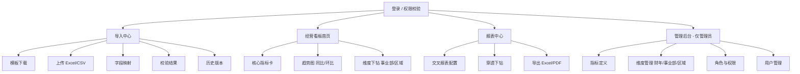

# 浙江壹品慧财年经营数据分析 Web 平台 — 简单 PRD（默认格式）

> ⚠️ **[已废止]** 原始 PRD（8模块版本）。8模块功能已完全融入 `../整体方案v3.md` §二。前端路由结构已提取到 v3 §六。AI Agent 请 Read `../整体方案v3.md`。

> 阶段说明：本 PRD 仅用于规划，不含实现代码。技术栈、部署、对接范围等以"待确认问题"为准。
> 作者：产品经理 许清楚（software-product-manager）

---

## 1. 项目信息

| 项 | 内容 |
|---|---|
| **Language（界面/文档）** | 简体中文 |
| **Programming Language（建议）** | Vite + React + MUI + Tailwind CSS（⚠️ 待确认，见第 5 节） |
| **Project Name** | `yipinhui_finance_analytics` |
| **客户** | 浙江壹品慧（Yipinhui），企业内部使用 |
| **产品定位** | 内部「财年经营数据分析 Web 平台」 |
| **核心本质** | **"Excel 进、看板/报表出"** —— 用户上传/导入 Excel 财务经营数据，系统在 Web 端呈现可视化经营看板与可导出报表 |
| **口径属性** | 内部管理口径（非审计/法定财报口径），强调灵活、可解释、可追溯 |

**原始需求复述**：为浙江壹品慧搭建一个内部 Web 平台，让用户以熟悉的 Excel/CSV 完成财务经营数据录入，由系统在 Web 端自动生成经营看板（收入、成本、毛利、费用、预算执行率、同比/环比等）与多维报表，支持穿透下钻和 Excel/PDF 导出；数据按事业部/区域/角色分级可见，关键指标异动与预算超支可预警；全链路以内部管理口径为准，注重口径统一、可解释、可追溯。

---

## 2. 产品定义

### 2.1 产品目标

**一句话定位**：浙江壹品慧内部使用的"Excel 进、看板/报表出"财年经营数据分析平台，让管理人员用熟悉的电子表格完成录入，在 Web 端获得可解释、可追溯的经营洞察。

**核心目标（解决痛点 / 服务谁）**：

1. **降低可视化门槛** —— 财务及非财务人员无需 SQL/BI 工具，上传 Excel 即得看板，服务财务分析师与一线管理者。
2. **统一管理口径** —— 集中维护指标定义与财年/事业部维度，避免各部门"各算各的"，服务全公司口径一致性。
3. **提升决策时效** —— 预算执行率、同比/环比、异动预警实时呈现，服务经营管理者/老板快速判断走势。
4. **保障可追溯** —— 导入版本留痕、指标口径可解释、变更可比对，支撑内部管理复盘与问责。
5. **灵活可导出** —— 多维度交叉报表支持穿透下钻与 Excel/PDF 导出，服务经营分析会与对外（管理口径）汇报。

### 2.2 用户故事（按角色，共 13 条）

**角色**：财务分析师、经营管理者/老板、事业部负责人、IT 管理员

- US-01 作为**财务分析师**，我希望上传符合模板的 Excel 并自动校验字段（必填/类型/格式），以便快速完成月度数据归集而不必反复核对格式。
- US-02 作为**财务分析师**，我希望将上传表格的列映射到系统标准指标（如"本月收入"→收入指标），以便兼容不同来源表格的字段命名。
- US-03 作为**财务分析师**，我希望保留每次导入的历史版本并可比对差异，以便追溯数据变更、定位口径调整。
- US-04 作为**经营管理者/老板**，我希望在首页看到收入、成本、毛利、费用、预算执行率的核心指标卡，以便一眼掌握整体经营健康度。
- US-05 作为**经营管理者/老板**，我希望查看核心指标的同比/环比趋势图，以便判断经营走势与季节性波动。
- US-06 作为**经营管理者/老板**，我希望点击指标卡下钻到事业部/区域明细，以便快速定位问题来源。
- US-07 作为**事业部负责人**，我希望只看到本事业部的经营看板与报表，以便聚焦自身业务而不被其他部门数据干扰。
- US-08 作为**事业部负责人**，我希望查看本事业部的预算执行率与超支预警，以便及时调整资源投放。
- US-09 作为**财务分析师**，我希望在报表中心生成按"事业部 × 期间 × 指标"的交叉报表，以便满足不同汇报场景。
- US-10 作为**财务分析师**，我希望将报表导出为 Excel/PDF，以便嵌入经营分析会材料与管理报告。
- US-11 作为**IT 管理员**，我希望配置指标定义、财年/期间维度与组织架构维度，以便统一全公司口径。
- US-12 作为**IT 管理员**，我希望按角色与事业部配置用户的看数权限，以便落实数据分级访问。
- US-13 作为**经营管理者**，我希望在关键指标异动（如毛利骤降、费用超预算）时收到提醒，以便尽早介入。

---

## 3. 技术规范

### 3.1 需求池（P0 / P1 / P2）

#### P0 — Must have（MVP 必须交付）
- **Excel/CSV 导入**
  - 标准导入模板下载（含字段说明与示例行）
  - 上传后前端字段校验：必填项、数据类型、数值范围、期间格式
  - 导入失败给出逐行错误定位与修正建议
- **字段映射**
  - 用户将上传列手动/自动映射到系统标准指标
  - 支持保存映射方案供下次复用
- **数据建模与口径管理**
  - 指标定义：收入、成本、毛利、费用、预算及其派生指标（如预算执行率 = 实际/预算）
  - 维度：财年 / 会计期间（月/季）、事业部、区域
  - 指标口径说明字段（公式/来源/负责人）可查看
- **经营看板首页**
  - 核心指标卡：收入、成本、毛利、费用、预算执行率
  - 同比 / 环比趋势图（折线/柱状）
- **看板下钻**
  - 按事业部 / 区域维度穿透查看明细
- **报表中心**
  - 多维度交叉报表（事业部 × 期间 × 指标）
  - 导出 Excel / PDF
- **权限基础**
  - 按角色 + 事业部的数据可见范围控制（管理员可见全部）
- **导入历史版本**
  - 保留每次导入版本、导入人、时间，支持版本列表与差异比对

#### P1 — Should have（应交付，增强价值）
- 指标异动预警（同比/环比超阈值触发提醒）
- 预算超支预警（执行率超 100% 或逼近阈值提醒）
- 报表单元格穿透下钻（从汇总值→明细记录）
- 组织与用户管理后台（管理员配置角色、维度、权限）
- 数据校验增强：跨表勾稽校验、异常值标记
- 多财年 / 多期间对比视图

#### P2 — Nice to have（可选，后续迭代）
- 与现有 ERP/财务系统对接（自动拉取，替代手工导入）
- 自定义指标公式编辑器（用户自助定义派生指标）
- 移动端 / 大屏看板适配
- 多人协同填报（在线数据录入而非仅导入）
- 操作审计日志
- 报表评论 / 批注

### 3.2 UI 设计稿

#### 总体信息架构（Mermaid）



#### 页面 1：导入中心（ASCII 布局）

```
┌──────────────────────────────────────────────────────────┐
│  导入中心                          [下载模板]  [上传文件]   │
├──────────────────────────────┬───────────────────────────┤
│  步骤指示                       │  右侧：映射/校验面板       │
│  ① 选文件 → ② 映射 → ③ 校验    │                           │
│                               │  上传列      系统指标       │
│  已选文件: 2025Q1_经营数据.xlsx │  ──────      ──────        │
│  大小: 248KB  行数: 1,204       │  本月收入  →  收入 ✓       │
│                               │  总成本    →  成本 ✓        │
│                               │  事业部    →  事业部维度 ✓  │
│                               │  ...                       │
│                               │  [开始校验]                 │
├──────────────────────────────┴───────────────────────────┤
│  校验结果：✅ 通过 1,198 行  ⚠️ 6 行异常（第 45/88/...行）   │
│  历史版本：v3(2025-04-01) v2(2025-03-01) v1(2025-02-01)     │
└──────────────────────────────────────────────────────────┘
```

#### 页面 2：经营看板首页（ASCII 布局）

```
┌──────────────────────────────────────────────────────────┐
│  经营看板  [财年:2025] [期间:Q1▾] [事业部:全部▾]            │
├──────────────────────────────────────────────────────────┤
│  ┌────────┐ ┌────────┐ ┌────────┐ ┌────────┐ ┌────────┐   │
│  │ 收入   │ │ 成本   │ │ 毛利   │ │ 费用   │ │预算执行│   │
│  │ 12,480 │ │ 8,320  │ │ 4,160  │ │ 1,240  │ │ 92.3% │   │
│  │ ▲+8.2% │ │ ▲+5.1% │ │ ▲+14%  │ │ ▲+3%   │ │ ⚠超支 │   │
│  └────────┘ └────────┘ └────────┘ └────────┘ └────────┘   │
├──────────────────────────────────────────────────────────┤
│  [收入趋势 同比/环比]            [毛利趋势]                  │
│   ▁▂▃▅▇█ (折线/柱状)            ▁▂▃▄▆█                     │
│                               （可点击指标卡下钻）          │
├──────────────────────────────────────────────────────────┤
│  事业部明细表（点击行 → 下钻该事业部看板）                  │
│  事业部A | 收入 | 成本 | 毛利 | 执行率                      │
│  事业部B | ...                                              │
└──────────────────────────────────────────────────────────┘
```

#### 页面 3：报表中心（ASCII 布局）

```
┌──────────────────────────────────────────────────────────┐
│  报表中心                                                   │
├──────────────────────────────────────────────────────────┤
│  维度配置： 行[事业部▾]  列[期间▾]  指标[收入,成本,毛利▾]   │
│            [+ 添加筛选]  [生成报表]                         │
├──────────────────────────────────────────────────────────┤
│  交叉报表（示例）              │ 点击单元格可穿透下钻明细    │
│          1月   2月   3月   Q1 │                            │
│  事业部A   x     x     x    x │                            │
│  事业部B   x     x     x    x │                            │
│  合计      X     X     X    X │                            │
├──────────────────────────────────────────────────────────┤
│  [导出 Excel]  [导出 PDF]                                 │
└──────────────────────────────────────────────────────────┘
```

#### 页面 4：管理后台（仅管理员，ASCII 布局）

```
┌──────────────────────────────────────────────────────────┐
│  管理后台                         角色: 系统管理员          │
├──────────┬───────────────────────────────────────────────┤
│ 导航     │  内容区                         │
│ ─────    │                                 │
│ 指标定义 │  指标名 | 公式 | 口径说明 | 负责人 │
│ 维度管理 │  收入 = 主营业务收入+其他收入    │
│ 角色权限 │  毛利 = 收入-成本                │
│ 用户管理 │  [+ 新建指标] [编辑] [停用]      │
│          │                                 │
│          │  维度：财年 / 期间 / 事业部 / 区域 │
│          │  角色：管理员 / 财务分析师 / 经营者 / 事业部负责人 │
└──────────┴───────────────────────────────────────────────┘
```

### 3.3 待确认问题（Open Questions，10 项，需客户/老板拍板）

1. **技术栈**：是否采用建议的 Vite + React + MUI + Tailwind CSS？还是客户已指定栈（如 Vue/Ant Design、Angular、低代码平台）？
2. **数据处理架构**：纯前端（浏览器解析 Excel + 本地/IndexedDB 存储）即可，还是必须后端持久化（数据库 + 服务端）？**预计数据量级**（单文件行数、文件大小、累计数据规模）？
3. **部署环境**：内网私有化部署还是公有云？是否需要与现有 AD/LDAP / 钉钉 / 企业微信 单点登录（SSO）？
4. **数据源**：是否仅 Excel/CSV 手工导入，还是需对接现有 ERP（用友/金蝶/SAP 等）自动取数？
5. **组织与维度**：事业部 / 区域 / 财年 的层级结构与编码规范？是否已有既定的维度主数据？
6. **权限模型**：按"角色 + 事业部 + 期间"分级是否足够？是否需要字段级权限、数据脱敏？
7. **指标口径**：核心指标（毛利、预算执行率等）的计算公式是否已有明确定义文档？由哪个岗位维护与审批？
8. **报表与导出**：导出仅 Excel/PDF，还是需 Word/PPT？是否需打印套打模板？
9. **合规与留存**：导入数据需保留多久？是否有内审留痕、操作日志要求？
10. **扩展边界**：是否仅中文、单公司主体？未来是否扩展多主体 / 多币种 / 多语言？

---

## 4. 交付说明（给架构师）

- 本 PRD 为**简单 PRD 默认格式**，聚焦规划所需信息密度，不含竞争分析（如需要完整 PRD 我再补充竞品象限图）。
- 架构师可基于"需求池 P0"确定 MVP 范围；P1/P2 作为迭代路线。
- 第 3.3 节 10 项开放问题建议在需求评审会前由客户/老板确认，将直接影响技术选型与工作量估算。
